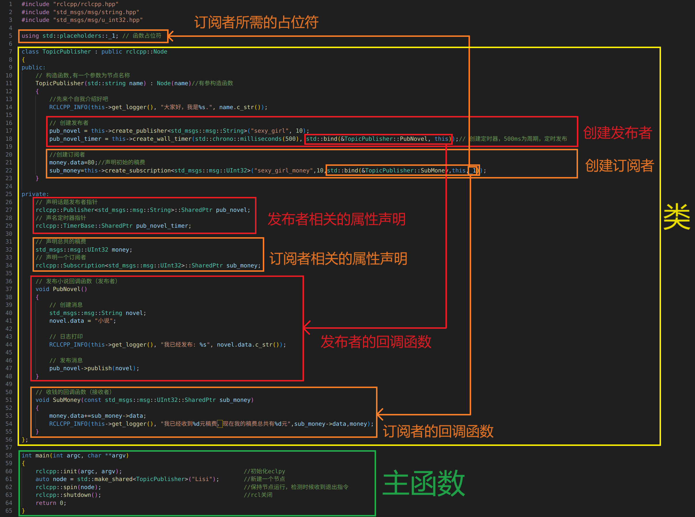
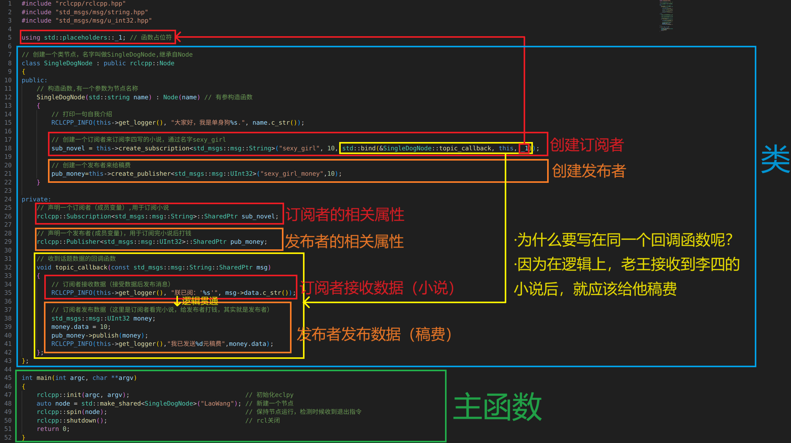

# 1 入门ROS2

## 1.1 ROS2的项目结构

```bash
ros2_project												# 工作目录
├── build														# 编译生成(colcon)，如果没有编译就不存在
├── install													# 编译生成(colcon)，如果没有编译就不存在
│   └── setup.bash									# 我们平时要添加环境变量时，source的文件就是install/setup.bash
├── log															# 编译生成(colcon)，如果没有编译就不存在
└── src															# src(即source-资源)，是我们要存放功能包的位置
    └── 1-1recognize_ament					# src下的功能包，该功能包下的文件组织跟C++项目一致
        ├── include									# 该功能包的include目录
        │   └── 1.1RecognizeAment
        ├── src											# src(即source-资源)，这是功能包下的src，即我们真正写代码的位置
        ├── CMakeLists.txt					# cmake相关
        └── package.xml							# cmake相关
```


### 1.1.1 认识package.xml

> [!NOTE]
>
> - package.xml是```ament_cmake```和```ament_python```都有的
>
> - 它的作用是让ROS2知道 **package.xml所在的文件夹** 是一个 **ROS功能包**
>
> - 在我们执行**colcon build**时，colcon 会先读 **所有包的 package.xml**，然后
>   - 构建依赖图并对依赖构建顺序进行排序
>   - 决定并行/串行构建

- package.xml的默认模板一般是这样：

  ```xml
  <?xml version="1.0"?>
  <?xml-model href="http://download.ros.org/schema/package_format3.xsd" schematypens="http://www.w3.org/2001/XMLSchema"?>
  <package format="3">
    <name>1-1recognize_ament</name>
    <version>0.0.0</version>
    <description>TODO: Package description</description>
    <maintainer email="amiya@todo.todo">amiya</maintainer>
    <license>TODO: License declaration</license>
  
    <!-- 构建工具本身需要的依赖 -->
    <buildtool_depend>ament_cmake</buildtool_depend>
  
    <!-- 只在运行测试时才需要的依赖 -->
    <test_depend>ament_lint_auto</test_depend>
    <test_depend>ament_lint_common</test_depend>
  	
    <!-- 告诉 ROS 和 colcon：👉 “这个包用的是什么构建系统(即ament_cmake、ament_python、cmake)” -->
    <export>
      <build_type>ament_cmake</build_type>
    </export>
  </package>
  ```

- 或许你会觉得这么多标签，我该看什么？其实我们真正需要写的只有```<depend>```标签，即依赖标签


#### ```<depend>```依赖标签

依赖标签有五种：

- ```<build_depend>```：节点编译时需要的依赖（如 C++ 代码中使用的头文件和链接库、消息/接口生成时用到的依赖等；⚠️ Python 文件中的 `import` 不属于 build 阶段，因为Python的import是在节点运行时才执行）
- ```<exec_depend>```：节点运行时需要的依赖（如节点运行时依赖的动态库、Python 文件中的 `import`、launch 文件和运行时资源等）

- ```<depend>```：把```<build_depend>```和```<exec_depend>```合在一起

  - 如：

    ```xml
    <depend>rclcpp</depend>
    ```

  - 等价于：

    ```xml
    <build_depend>rclcpp</build_depend>
    <exec_depend>rclcpp</exec_depend>
    ```

- ```<buildtool_depend>```：构建工具本身需要的依赖（即ament_cmake中CMakeLists.txt所需的依赖，和ament_python中setup.py所需的依赖）

  ```xml
  <buildtool_depend>ament_cmake</buildtool_depend>
  <buildtool_depend>ament_cmake_auto</buildtool_depend>
  ```

- ```<test_depend>```：只在运行测试时才需要的依赖**【不必理会】**


### 1.1.2 认识ament_cmake_auto

> [!IMPORTANT]
>
> - 在认识ament_cmake_auto之前，你必须对cmake有一些了解
>
> - ament_cmake_auto是ament_cmake的一个半自动版本，减少大量 **重复、模板化的cmake代码**
> - 当我们使用ament_cmake_auto时候，所有 **有关于ros2** 的依赖都只需要添加到```package.xml```，不过与ros2不相关的依赖就只能使用普通的cmake写法。下面会讲

ament_cmake_auto的最小可执行格式：

```cmake
cmake_minimum_required(VERSION 3.8)
project(myprojectname)

# 如果使用 GCC 或 Clang 编译器，开启常用的警告选项
if(CMAKE_COMPILER_IS_GNUCXX OR CMAKE_CXX_COMPILER_ID MATCHES "Clang")
  add_compile_options(-Wall -Wextra -Wpedantic)
endif()

find_package(ament_cmake_auto REQUIRED) # 查找 ament_cmake_auto（ament_cmake 的自动化封装）
ament_auto_find_build_dependencies()    # 根据 package.xml 中声明的依赖，自动查找构建依赖

# 添加可执行文件(注意必须有main函数，否则编译时会报错)
ament_auto_add_executable(mynode src/mynode.cpp)

# 测试与代码规范检查相关
if(BUILD_TESTING)
  find_package(ament_lint_auto REQUIRED)
  set(ament_cmake_copyright_FOUND TRUE)
  set(ament_cmake_cpplint_FOUND TRUE)
  ament_lint_auto_find_test_dependencies()
endif()

ament_auto_package()    # 自动完成 install、export，并调用 ament_package()
```


#### 自动从package.xml获取依赖`ament_auto_find_build_dependencies()`

- 作用：自动从 `package.xml` 中读取依赖并执行 `find_package()`

- 它会处理哪些依赖？

  - `<depend>`
  - `<build_depend>`

  ⚠️ **不会处理 `<exec_depend>`**


#### 自动为节点添加依赖`ament_auto_add_executable()`

- 使用：

  ```cmake
  ament_auto_add_executable(
  	my_node							# 节点名
    src/my_node.cpp			# 节点对应的cpp文件
  )
  ```

- 作用：添加可执行文件（即ros2 run中的节点）

-  自动完成：

  - `add_executable`
  - `ament_target_dependencies`
  - `install(TARGETS ...)`

- 等价于：

  ```cmake
  add_executable(my_node src/my_node.cpp)
  ament_target_dependencies(my_node rclcpp std_msgs)
  install(TARGETS my_node DESTINATION lib/${PROJECT_NAME})
  ```


#### 安装除src外的其他文件夹到install目录`ament_auto_package()`

- 作用：合并`ament_package()`和`install()`，帮助我们安装launch、config、urdf文件等到install目录中


#### 自动生成库`ament_auto_add_library()`

- **使用**：

  ```cmake
  ament_auto_add_library(
    my_lib          # 【参数1】库的名字（CMake target 名）
                    # - 生成的 target 叫 my_lib
                    # - 实际生成的文件通常是 libmy_lib.so
                    # - 其他包通过 ament_target_dependencies(... my_lib) 使用它
  
    SHARED          # 【参数2】库的类型
                    # - SHARED：动态库（.so）
                    # - STATIC：静态库（.a）
                    # - 如果不写，默认是 SHARED（ROS2 中几乎都用 SHARED）
  
    src/my_lib.cpp  # 【参数3】库的源文件列表
                    # - 可以写多个 cpp
                    # - 只写算法/逻辑代码
                    # - 不应该包含 main()
  )

- **作用**：如果我有一个**公共算法库**，需要

  - 被所在的功能包的 **可执行文件（即节点）** 使用
  - 还能够被**其他ROS2功能包**使用

  那么这个时候就需要把这个cpp文件变成一个```library（一组已经编译好的目标文件（.o）的集合）```

- **举个例子**：

  - **文件结构**：

    ```bash
    1-1-2ament_auto_add_library
    ├── recognizer												# ROS2功能包1,只用作算法库，没有逻辑代码
    │   ├── CMakeLists.txt
    │   ├── include
    │   │   └── recognizer
    │   │       └── recognizer.hpp
    │   ├── package.xml
    │   └── src
    │       └── recognizer.cpp
    └── use_recognizer										# ROS2功能包2,调用recognizer算法库来写逻辑代码
        ├── CMakeLists.txt
        ├── include
        │   └── use_recognizer
        ├── package.xml
        └── src
            └── use_recognize_node.cpp
    ```

    - 在 `recognizer` 功能包中，

      `recognizer.hpp` 声明函数 `run`，
      `recognizer.cpp` 实现该函数（内部包含打印“你好世界”的逻辑），
      并在 `CMakeLists.txt` 中将这些源文件**编译并导出为一个可复用的共享库（library target）**。

      - 其中`CMakeLists.txt`的写法：

        ```cmake
        cmake_minimum_required(VERSION 3.8)
        project(recognizer)
        
        # 如果使用 GCC 或 Clang 编译器，开启常用的警告选项【不必理会】
        if(CMAKE_COMPILER_IS_GNUCXX OR CMAKE_CXX_COMPILER_ID MATCHES "Clang")
          add_compile_options(-Wall -Wextra -Wpedantic)
        endif()
        
        find_package(ament_cmake_auto REQUIRED) # 查找 ament_cmake_auto（ament_cmake 的自动化封装）
        ament_auto_find_build_dependencies()    # 根据 package.xml 中声明的依赖，自动查找构建依赖
        
        # 定义一个库
        ament_auto_add_library(
                recognizer					# 库的名字（CMake target 名称）
                SHARED							# 库的类型
                src/recognizer.cpp	# 构成该库的源文件（实现算法逻辑）
        )
        
        # 测试与代码规范检查相关【不必理会】
        if(BUILD_TESTING)
          find_package(ament_lint_auto REQUIRED)
          set(ament_cmake_copyright_FOUND TRUE)
          set(ament_cmake_cpplint_FOUND TRUE)
          ament_lint_auto_find_test_dependencies()
        endif()
        
        ament_auto_package()    # 自动完成 install、export，并调用 ament_package()
        ```

    - 在 `use_recognizer` 功能包中，

      `use_recognize_node.cpp` 通过 **依赖 recognizer 包并链接其导出的库 target**，来调用 `recognizer` 中提供的算法接口，实现节点的逻辑代码。

    - 其中`CMakeLists.txt`的写法：

      ```cmake
      cmake_minimum_required(VERSION 3.8)
      project(use_recognizer)
      
      # 如果使用 GCC 或 Clang 编译器，开启常用的警告选项【不必理会】
      if(CMAKE_COMPILER_IS_GNUCXX OR CMAKE_CXX_COMPILER_ID MATCHES "Clang")
        add_compile_options(-Wall -Wextra -Wpedantic)
      endif()
      
      find_package(ament_cmake_auto REQUIRED) # 查找 ament_cmake_auto（ament_cmake 的自动化封装）
      ament_auto_find_build_dependencies()    # 根据 package.xml 中声明的依赖，自动查找构建依赖
      
      # 定义一个节点
      ament_auto_add_executable(
              use_recognize_node
              src/use_recognize_node.cpp
      )
      
      # 测试与代码规范检查相关【不必理会】
      if(BUILD_TESTING)
        find_package(ament_lint_auto REQUIRED)
        set(ament_cmake_copyright_FOUND TRUE)
        set(ament_cmake_cpplint_FOUND TRUE)
        ament_lint_auto_find_test_dependencies()
      endif()
      
      ament_auto_package()    # 自动完成 install、export，并调用 ament_package()
      
      ```

    - 其中`package.xml`的写法：

      ```xml
      <?xml version="1.0"?>
      <?xml-model href="http://download.ros.org/schema/package_format3.xsd" schematypens="http://www.w3.org/2001/XMLSchema"?>
      <package format="3">
        <name>use_recognizer</name>
        <version>0.0.0</version>
        <description>TODO: Package description</description>
        <maintainer email="amiya@todo.todo">amiya</maintainer>
        <license>TODO: License declaration</license>
      
        <buildtool_depend>ament_cmake_auto</buildtool_depend>
      
        <depend>rclcpp</depend>
        <depend>python3-opencv</depend>
        <depend>recognizer</depend>       <!-- 在这里添加自定义的算法库 -->
      
        <test_depend>ament_lint_auto</test_depend>
        <test_depend>ament_lint_common</test_depend>
      
        <export>
          <build_type>ament_cmake</build_type>
        </export>
      </package>
      ```


#### 查找非ROS2依赖`target_link_libraries()`

> [!WARNING]
>
> - 当我们引入的是通过源代码安装在系统的库时，这些依赖不需要写到`package.xml`中
> - 要搭配`find_package`使用

- **使用**：

  ```cmake
  # 寻找库
  find_package(Boost REQUIRED COMPONENTS system filesystem)
  
  # 链接库
  target_link_libraries(
  	my_node				# 节点名
  	my_lib				# 要链接的库名
  )
  ```

- **作用**：

  - 有时候我们可以需要使用一些 **通过源代码编译后安装在系统的C++库**，如我在系统安装了：[网络与低级I/O通讯库->boost库](https://www.boost.org/doc/libs/latest/doc/html/boost_asio.html)**（前提是boost库被安装到系统）**

  - 这个时候我们如果要在ROS2功能包引入这个 **通过源代码编译后安装在系统的C++库** 的话，就需要使用target_link_libraries()

- **举个例子**：

  - **文件结构**：

    ```bash
    1-1-2target_link_libraries						# 这就是一个ROS2功能包
    ├── CMakeLists.txt
    ├── include
    │   └── 1-1-2target_link_libraries
    ├── package.xml
    └── src
        └── use_boost.cpp									# 使用安装在系统的boost库
    ```

    - 在可执行文件`use_boost.cpp`中我们使用安装在系统的boost库

  - `CMakeLists.txt`的写法：

    ```cmake
    cmake_minimum_required(VERSION 3.8)
    project(1-1-2target_link_libraries)
    
    # 如果使用 GCC 或 Clang 编译器，开启常用的警告选项【不必理会】
    if(CMAKE_COMPILER_IS_GNUCXX OR CMAKE_CXX_COMPILER_ID MATCHES "Clang")
      add_compile_options(-Wall -Wextra -Wpedantic)
    endif()
    
    find_package(ament_cmake_auto REQUIRED) # 查找 ament_cmake_auto（ament_cmake 的自动化封装）
    ament_auto_find_build_dependencies()    # 根据 package.xml 中声明的依赖，自动查找构建依赖
    
    # 定义一个节点
    ament_auto_add_executable(
            use_boost_node
            src/use_boost.cpp
    )
    
    # 在Ubuntu系统查找boost依赖
    find_package(Boost REQUIRED COMPONENTS system filesystem)
    
    # 让use_boost_node链接boost库
    target_link_libraries(
            use_boost_node		  # 节点名
            Boost::system		  # 要链接的库1
            Boost::filesystem     # 要链接的库2
    )
    
    # 测试与代码规范检查相关【不必理会】
    if(BUILD_TESTING)
      find_package(ament_lint_auto REQUIRED)
      set(ament_cmake_copyright_FOUND TRUE)
      set(ament_cmake_cpplint_FOUND TRUE)
      ament_lint_auto_find_test_dependencies()
    endif()
    
    ament_auto_package()    # 自动完成 install、export，并调用 ament_package()
    ```


### 1.1.3 认识setup.py

> [!IMPORTANT]
>
> setup.py相当于是`ament_python`中的CMakeLists.txt

```python
# setuptools 是 Python 打包的核心工具
# find_packages 用来自动查找 Python 包目录
from setuptools import find_packages, setup

import os
from glob import glob

# ROS2 包名（必须和 package.xml 里的 <name> 一致）
package_name = '1-1-3setup-py'

setup(
    # 包名，ros2 pkg list / ros2 run 都靠它
    name=package_name,

    # 版本号（ROS2 不严格校验，但必须有）
    version='0.0.0',

    # 自动在package.xml中查找 Python 包
    # exclude=['test'] 表示 test 目录不是运行时包
    packages=find_packages(exclude=['test']),

    # 安装时需要拷贝的“非 Python 文件”
    # ROS2 强制要求这两项
    data_files=[
        # 注册 ROS2功能包 到 ament索引中（否则 ros2 找不到这个包）
        (
            'share/ament_index/resource_index/packages',	# ament索引的一部分，所有的包都要安装到这里
            ['resource/' + package_name],									# ROS2功能包名（在ament_python构建的ROS2功能包中表现为一个文件）
        ),

        # 安装 package.xml 到 share 目录
        (
            'share/' + package_name,
            ['package.xml']
        ),
      
      	# 安装 所有launch目录中的文件 到 'share/<package_name>/launch'中
      	(
            os.path.join('share', package_name, 'launch'),
            glob('launch/*.py')
        ),
    ],

    # Python 运行所需的 pip 依赖（不是 ROS2 依赖！）
    install_requires=['setuptools'],

    # 是否允许打成 zip 包（ROS2 一般设为 True）
    zip_safe=True,

    # 维护者信息（纯元数据）
    maintainer='amiya',
    maintainer_email='amiya@todo.todo',

    # 包描述（ros2 pkg info 会显示）
    description='TODO: Package description',

    # 许可证（和 package.xml 保持一致）
    license='TODO: License declaration',

    # 额外依赖：只在测试时使用
    # 对应 colcon test
    extras_require={
        'test': [
            'pytest',
        ],
    },

    # 生成可执行节点（ros2 run 用）
    entry_points={
        'console_scripts': [
            # 例子（你现在是空的）：
            # 'my_node = my_pkg.my_node:main',
        ],
    },
)
```


## 1.2 使用RCLCPP编写节点

### 1.2.1 创建工作空间

- 创建**工作空间**，并在工作空间中创建**名为src的文件夹**

  


### 1.1.2 创建功能包

> [!NOTE]
>
> 该演示中使用的编译类型是**ament_cmake**

- 在**src文件夹**里面打开**终端**，输入

  ```bash	
  ros2 pkg create 包名 --build-type 编译类型 --dependencies 功能包的依赖
  ```

  **参数：**

  - **包名**：要创建的功能包的包名。自定义。名字要唯一。
  
  
    - **编译类型**：
      - **ament_cmake**：这是**最常用的编译类型**，它使用CMake作为构建系统。
  
      - **ament_python**：如果你的包**只包含Python代码**，可以使用这个类型。
  
      - **cmake**：不常用，通常用于**不遵循ament构建系统**的包。
  
  
  - **功能包的依赖**：指定你的功能包依赖的其他功能包。依赖之间用空格分隔。常见的有```rclcpp```(用于C++)、```rclpy```(用于Python)、```std_msgs```(用于标准消息定义)
  


### 1.1.3 创建并编写C++文件

- 在**工作目录**下打开**终端**，进入 **工作目录/src/功能包/src** 中创建一个**.cpp文件**，并在里面写**C++代码**

  


### 1.1.4 配置CMakeLists.txt

> [!IMPORTANT]
>
> 因为现在普遍使用ament_cmake_auto形式，所以这里也使用ament_cmake_auto

- 在CMakeLists.txt最下面添加这几行代码：

  ```cmake
  ament_auto_add_executable(
  	my_node				# .cpp文件的映射名
      src/my_node.cpp		# .cpp文件存放的位置
  )
  ```

- 整个cmake文件采用ament_cmake_auto形式：

  ```cmake
  cmake_minimum_required(VERSION 3.10)
  
  # 定义包名（必须与 package.xml 中一致）
  project(my_auto_pkg)
  
  # 找到 ament_cmake_auto
  # 它是 ament_cmake 的“自动化封装版本”
  find_package(ament_cmake_auto REQUIRED)
  
  # 自动查找 package.xml 中声明的所有 build / exec 依赖
  # 等价于一堆 find_package(xxx REQUIRED)
  ament_auto_find_build_dependencies()
  
  # =========================
  # 添加可执行程序（node）
  # =========================
  ament_auto_add_executable(talker_node
    src/talker.cpp
  )
  
  # =========================
  # 生成 ament 包
  # =========================
  ament_auto_package()
  ```

  


### 1.1.5 编写package.xml

- 因为这里没有使用其他的依赖，所以不需要添加额外的`<depend>`标签，即使用默认模板就可以

  ```xml
  <?xml version="1.0"?>
  <?xml-model href="http://download.ros.org/schema/package_format3.xsd" schematypens="http://www.w3.org/2001/XMLSchema"?>
  <package format="3">
    <name>1-1-2target_link_libraries</name>
    <version>0.0.0</version>
    <description>TODO: Package description</description>
    <maintainer email="amiya@todo.todo">amiya</maintainer>
    <license>TODO: License declaration</license>
  	
    <!-- 注意这里改为ament_cmake_auto -->
    <buildtool_depend>ament_cmake_auto</buildtool_depend>
  
    <depend>rclcpp</depend>
  
    <test_depend>ament_lint_auto</test_depend>
    <test_depend>ament_lint_common</test_depend>
  
    <export>
      <build_type>ament_cmake</build_type>
    </export>
  </package>
  ```

  

### 1.1.6 编译运行


## 1.2 使用RCLPY编写节点

### 1.2.1 创建工作空间

- 创建**工作空间**，并在工作空间中创建**名为src的文件夹**

  

### 1.2.2 创建功能包

> [!NOTE] 
>
> 该演示中使用的编译类型是**ament_python**

- 在**src文件夹**里面打开**终端**，输入

  ```bash
  ros2 pkg create 包名 --build-type 编译类型 --dependencies 功能包的依赖
  ```

  **参数：**

  - **包名**：要创建的功能包的包名。自定义。名字要唯一。


  - **编译类型**：

    - **ament_cmake**：这是**最常用的编译类型**，它使用CMake作为构建系统。
    
    - **ament_python**：如果你的包**只包含Python代码**，可以使用这个类型。
    
    - **cmake**：不常用，通常用于**不遵循ament构建系统**的包。


  - **功能包的依赖**：指定你的功能包依赖的其他功能包。依赖之间用空格分隔。常见的有`rclcpp`(用于C++)、`rclpy`(用于Python)、`std_msgs`(用于标准消息定义)

  

### 1.2.3 创建并编写Python文件

- 在 **工作目录/src/功能包/功能包** 下创建**Python文件**

  


### 1.2.4 配置setup.py文件

- 在第**21行**上下

  **格式**：

  ```python
  自定义名字=功能包名.Python文件名(没有后缀):入口函数名
  ```

  **(注：程序员习惯直接把节点名称用在自定义名字中)**

  


### 1.2.5 编译并运行

- **成功画面**

  

# 2 ROS2通信机制

- **`话题通信`**是基于广播的**单向**数据交互模式

- **`服务通信` **是基于**请求响应**的**问答式**交数据互模式

- **`动作通信`**是在**请求响应**的过程中又包含**连续反馈**的数据交互模式

- **`参数服务`**是基于**服务通信**的，可以在**不同节点间实现数据共享**

## 2.1 话题通信

### 2.1.1 发布者与订阅者怎么写

#### 发布者

发布者对应的**函数**：`create_publisher`

**参数**（从左到右）：

- **消息类型**：用于说明发布者发送的数据格式。

  消息类型相当于通信双方的“数据协议”，发布者和订阅者必须保持一致。

  可以使用：

  - ROS2 官方提供的消息类型（如 `std_msgs.msg.String`）
  - 按照 ROS2 接口规范自定义并生成的消息类型

- **话题名称**：
   一个字符串，用于指定消息发布到的具体话题。
   话题名称决定了消息的“去向”，只有订阅了相同话题名称的订阅者才能接收到该消息。

- **QoS 策略**：

  用于描述消息传输的服务质量。
  常见写法中默认值为 **10**，表示**发布者内部最多缓存 10 条尚未被订阅者接收的消息**，也称为队列深度。

  当发布速度快于订阅者处理速度时：

  - **队列未满**：新消息会被正常缓存
  - **队列已满**：最早的消息会被丢弃，为新消息让出空间

> [!NOTE]
>
> 当一个话题没有订阅者时，发布者仍然会发布消息，但这些消息不会被任何订阅者接收。


#### 订阅者

发布者对应的**函数**：`create_subscription`

**参数**（从左到右）：

- **消息类型**：用于说明订阅者接收的数据格式。

  消息类型相当于通信双方的“数据协议”，订阅者必须与对应发布者的消息类型保持一致，否则无法正确解析消息内容。

  可以使用：

  - ROS2 官方提供的消息类型（如 `std_msgs.msg.String`）
  - 按照 ROS2 接口规范自定义并生成的消息类型

- **话题名称**：
   一个字符串，用于指定订阅者监听的具体话题。
   只有当话题名称与发布者发布的话题完全一致时，订阅者才能接收到该话题上的消息。

- **回调函数**：
   用于描述当订阅者接收到新消息时所执行的处理逻辑。
   每当有新消息到达，该函数都会被自动调用，用于对消息进行解析、处理或触发后续行为。

- **QoS 策略**：

  用于描述订阅者接收消息时的服务质量要求。
   常见写法中默认值为 **10**，表示**订阅者内部最多缓存 10 条尚未被处理的消息**，也称为队列深度。

  当消息到达速度快于订阅者处理速度时：

  - **队列未满**：新消息会被正常缓存
  - **队列已满**：最早接收到但尚未处理的消息会被丢弃


### 2.1.2 C++实现

#### 节点之间单向传输（发布者单向传输给订阅者）

**节点框架图为：**


##### 1.发布者实现 

- 这里的发布者节点名字为 **PubHello**

  ```c++
  #include <rclcpp/rclcpp.hpp>
  #include <std_msgs/msg/string.hpp>
  #include <chrono>
  #include <rclcpp/node.hpp>
  #include <rclcpp/publisher.hpp>
  #include <rclcpp/timer.hpp>
  
  class SayHello : public rclcpp::Node{
  public:
      // 构造函数
      SayHello(std::string name):rclcpp::Node(name){
          // 创建发布者
          say_hello = this->create_publisher<std_msgs::msg::String>("/HelloWorld",10);
  
          // 创建定时器，用于定时发布信息
          say_hello_timer = this->create_wall_timer(std::chrono::milliseconds(500), std::bind(&SayHello::PubHello,this));
      }
  
  private:
      /*
          函数
      */
      void PubHello(){
          // 创建消息
          std_msgs::msg::String msg;
          msg.data = "你好世界";      // 我们可以发现std_msgs::msg::String有一个属性data，而data刚好是C++的std::string类型
  
          // 发布者发布消息
          say_hello->publish(msg);
  
          // DEBUG，输出一些东西到终端，让我们知道这个PubHello函数确实被执行了
          RCLCPP_INFO(this->get_logger(),"发布者发布了：%s",msg.data.c_str());    // c_str()表示转换字符串为c语言风格，这是ros2中输出日志的函数需要的
      }
  
      /*
          声明变量
      */
      // 声明一个发布者指针（其实我们理解为发布者就可以了）
      rclcpp::Publisher<std_msgs::msg::String>::SharedPtr say_hello;
      
      // 声明一个定时器指针（其实我们理解为定时器就可以了）
      // 定时器用于根据一定的频率来执行某一个回调函数，我们通过这个回调函数来使Publisher发布消息，就实现发布者按某个频率一直发布消息
      rclcpp::TimerBase::SharedPtr say_hello_timer;
  
  };
  
  int main(int argc, char ** argv){
      rclcpp::init(argc, argv);
      auto node = std::make_shared<SayHello>("PubHello");
      rclcpp::spin(node);
      rclcpp::shutdown();
      return 0;
  }
  ```


##### 2.订阅者实现

- 这里的订阅者节点名字为 **SubHello**

  ```c++
  #include <std_msgs/msg/string.hpp>
  #include <functional>
  #include <rclcpp/logging.hpp>
  #include <rclcpp/node.hpp>
  #include <rclcpp/rclcpp.hpp>
  #include <rclcpp/subscription.hpp>
  #include <std_msgs/msg/string.hpp>
  #include <string>
  
  class GetHello : public rclcpp::Node{
  public:
      GetHello(std::string name) : rclcpp::Node(name){
          // 创建一个订阅者
          get_hello = this->create_subscription<std_msgs::msg::String>("/HelloWorld",10,std::bind(&GetHello::SubHello,this,std::placeholders::_1));
      }
  
  private:
      // 订阅者所需的回调函数
      void SubHello(std_msgs::msg::String msg){
          RCLCPP_INFO(this->get_logger(),"订阅者接收到消息：%s",msg.data.c_str());
      }
  
      // 声明一个订阅者指针
      rclcpp::Subscription<std_msgs::msg::String>::SharedPtr get_hello;
  };
  
  int main(int argc, char ** argv){
      rclcpp::init(argc, argv);
      auto node = std::make_shared<GetHello>("SubHello");
      rclcpp::spin(node);
      rclcpp::shutdown();
      return 0;
  }
  ```


##### 3.配置CMakeLists.txt

```cmake
cmake_minimum_required(VERSION 3.8)
project(one-way_topic_communication_cpp)


if(CMAKE_COMPILER_IS_GNUCXX OR CMAKE_CXX_COMPILER_ID MATCHES "Clang")
  add_compile_options(-Wall -Wextra -Wpedantic)
endif()

find_package(ament_cmake_auto REQUIRED)
ament_auto_find_build_dependencies()

# 添加发布者节点
ament_auto_add_executable(PubHello src/SayHello.cpp)

# 添加订阅者节点
ament_auto_add_executable(SubHello src/GetHello.cpp)

# 测试与代码规范检查相关【不必理会】
if(BUILD_TESTING)
  find_package(ament_lint_auto REQUIRED)
  set(ament_cmake_copyright_FOUND TRUE)
  set(ament_cmake_cpplint_FOUND TRUE)
  ament_lint_auto_find_test_dependencies()
endif()

ament_auto_package()
```


##### 4.配置package.xml

```xml
<?xml version="1.0"?>
<?xml-model href="http://download.ros.org/schema/package_format3.xsd" schematypens="http://www.w3.org/2001/XMLSchema"?>
<package format="3">
  <name>one-way_topic_communication_cpp</name>
  <version>0.0.0</version>
  <description>TODO: Package description</description>
  <maintainer email="1310946137@qq.com">amiya</maintainer>
  <license>TODO: License declaration</license>

  <buildtool_depend>ament_cmake</buildtool_depend>

  <!-- 只需要添加这两个依赖，其他都不用变 -->
  <depend>rclcpp</depend>
  <depend>std_msgs</depend>

  <test_depend>ament_lint_auto</test_depend>
  <test_depend>ament_lint_common</test_depend>

  <export>
    <build_type>ament_cmake</build_type>
  </export>
</package>
```


##### 5.效果图

- 左边为**发布者**，右边为**接收者**


#### 节点之间双向传输

- 两个节点既有**发布者**也有**接收者**

- **节点图**：

  ```mermaid
  graph LR
      SayHello["节点: Lisi<br/>(Publisher+Subscriber)"]
      SubHello["节点: LaoWang<br/>(Publisher+Subscriber)"]
  
      SayHello -->|话题：/novel| SubHello
      SubHello -->|话题：/novel_money| SayHello
  
  ```

  

##### 1.节点1实现（节点名为Lisi）

- **代码**：

  ```c++
  #include "rclcpp/rclcpp.hpp"
  #include "std_msgs/msg/string.hpp"
  #include "std_msgs/msg/u_int32.hpp"
  #include <functional>
  
  class TopicPublisher : public rclcpp::Node
  {
  public:
      // 构造函数，有一个参数为节点名称
      TopicPublisher(std::string name) : Node(name) // 有参构造函数
      {
          // 先来个自我介绍吧（打印日志）
          RCLCPP_INFO(this->get_logger(), "大家好，我是%s。", name.c_str());
  
          // 创建发布者
          pub_novel = this->create_publisher<std_msgs::msg::String>("novel", 10);
          pub_novel_timer = this->create_wall_timer(std::chrono::milliseconds(500), std::bind(&TopicPublisher::PubNovel, this)); // 创建定时器，500ms为周期，定时发布
  
          // 创建订阅者
          money.data = 80; // 声明初始的稿费
          sub_money = this->create_subscription<std_msgs::msg::UInt32>("novel_money", 10, std::bind(&TopicPublisher::SubMoney, this, std::placeholders::_1));
      }
  
  private:
      // 声明话题发布者指针
      rclcpp::Publisher<std_msgs::msg::String>::SharedPtr pub_novel;
      // 声明定时器指针
      rclcpp::TimerBase::SharedPtr pub_novel_timer;
  
      // 声明总的稿费
      std_msgs::msg::UInt32 money;
      // 声明一个订阅者
      rclcpp::Subscription<std_msgs::msg::UInt32>::SharedPtr sub_money;
  
      // 计时器回调函数（里面写发布内容）
      void PubNovel()
      {
          // 创建消息
          std_msgs::msg::String novel;
          novel.data = "小说";
  
          // 日志打印
          RCLCPP_INFO(this->get_logger(), "我已经发布了：%s", novel.data.c_str());
  
          // 发布消息
          pub_novel->publish(novel);
      }
  
      // 收钱的回调函数（接收者）
      void SubMoney(const std_msgs::msg::UInt32::SharedPtr sub_money)
      {
          money.data += sub_money->data;
          RCLCPP_INFO(this->get_logger(), "我已经收到%d元稿费，现在我的稿费总共有%d元", sub_money->data, money.data);
      }
  };
  
  int main(int argc, char **argv)
  {
      rclcpp::init(argc, argv);                               // 初始化 rclcpp
      auto node = std::make_shared<TopicPublisher>("Lisi");   // 新建一个节点
      rclcpp::spin(node);                           // 保持节点运行，检测到接收时退出指令
      rclcpp::shutdown();                                    // rcl 关闭
      return 0;
  }
  ```
  
- **注释**：

  


##### 2.节点2实现（节点名为Laowang）

- **代码**：

  ```c++
  #include "rclcpp/rclcpp.hpp"
  #include "std_msgs/msg/string.hpp"
  #include "std_msgs/msg/u_int32.hpp"
  #include <functional>
  
  // 创建一个类节点，名字叫做SingleDogNode，继承自Node
  class SingleDogNode : public rclcpp::Node
  {
  public:
      // 构造函数，有一个参数为节点名称
      SingleDogNode(std::string name) : Node(name) // 有参构造函数
      {
          // 打印一句自我介绍
          RCLCPP_INFO(this->get_logger(), "大家好，我是单身狗%s。", name.c_str());
  
          // 创建一个订阅者来订阅李四的小说，话题名为novel
          sub_novel = this->create_subscription<std_msgs::msg::String>("novel", 10, std::bind(&SingleDogNode::topic_callback, this, std::placeholders::_1));
  
          // 创建一个发布者来给稿费，话题名为novel_money
          pub_money = this->create_publisher<std_msgs::msg::UInt32>("novel_money", 10);
      }
  
  private:
      // 声明一个订阅者（成员变量），用于订阅小说
      rclcpp::Subscription<std_msgs::msg::String>::SharedPtr sub_novel;
  
      // 声明一个发布者（成员变量），用于订阅完小说后付钱
      rclcpp::Publisher<std_msgs::msg::UInt32>::SharedPtr pub_money;
  
      // 收到话题数据的回调函数
      void topic_callback(const std_msgs::msg::String::SharedPtr msg)
      {
          // 1. 订阅者接收数据（接收数据后发布消息）
          RCLCPP_INFO(this->get_logger(), "朕已阅：'%s'", msg->data.c_str());
  
          // 2. 订阅者发布数据（这里是订阅者看完小说，给发布者打钱，其实就是发布者）
          // 逻辑贯通：老王接收到李四的小说后，就应该给他稿费
   
        std_msgs::msg::UInt32 money;
          money.data = 10;
          pub_money->publish(money);
          RCLCPP_INFO(this->get_logger(), "我已经发送%d元稿费", money.data);
      }
  };
  
  int main(int argc, char **argv)
  {
      rclcpp::init(argc, argv);                                   // 初始化rclcpp
      auto node = std::make_shared<SingleDogNode>("LaoWang");     // 新建一个节点
      rclcpp::spin(node);                                					// 保持节点运行，检测时候收到退出指令
      rclcpp::shutdown();                                         // rcl关闭
      return 0;
  }
  ```

- **注释**：

  


##### 3.配置CMakeLists.txt

```cmake
cmake_minimum_required(VERSION 3.8)
project(one-way_topic_communication_cpp)

if(CMAKE_COMPILER_IS_GNUCXX OR CMAKE_CXX_COMPILER_ID MATCHES "Clang")
  add_compile_options(-Wall -Wextra -Wpedantic)
endif()

find_package(ament_cmake_auto REQUIRED)
ament_auto_find_build_dependencies()

# 添加发布者节点
ament_auto_add_executable(Lisi src/Lisi.cpp)

# 添加订阅者节点
ament_auto_add_executable(LaoWang src/LaoWang.cpp)

# 测试与代码规范检查相关【不必理会】
if(BUILD_TESTING)
  find_package(ament_lint_auto REQUIRED)
  set(ament_cmake_copyright_FOUND TRUE)
  set(ament_cmake_cpplint_FOUND TRUE)
  ament_lint_auto_find_test_dependencies()
endif()

ament_auto_package()
```


##### 4.配置package.xml

```xml
<?xml version="1.0"?>
<?xml-model href="http://download.ros.org/schema/package_format3.xsd" schematypens="http://www.w3.org/2001/XMLSchema"?>
<package format="3">
  <name>one-way_topic_communication_cpp</name>
  <version>0.0.0</version>
  <description>TODO: Package description</description>
  <maintainer email="1310946137@qq.com">amiya</maintainer>
  <license>TODO: License declaration</license>

  <buildtool_depend>ament_cmake</buildtool_depend>

  <!-- 只需要添加这两个依赖，其他都不用变 -->
  <depend>rclcpp</depend>
  <depend>std_msgs</depend>

  <test_depend>ament_lint_auto</test_depend>
  <test_depend>ament_lint_common</test_depend>

  <export>
    <build_type>ament_cmake</build_type>
  </export>
</package>
```


##### 5.效果图


### 2.1.3 Python实现

#### 节点之间单向传输


#### 节点之间双向传输


#### 发布者实现

- 流程：

  - 导入消息类型


  - 声明并创建发布者


  - 编写发布逻辑发布数据

- 函数：

  ```python
  self.变量名 = self.create_publisher(消息的类型, 话题名称(自定义), 队列中最大的保存消息数)
  ```


#### 订阅者实现

- 函数：

  ```python
  self.变量名 = self.create_subscription(消息的类型, 话题名称[自定义], 回调函数,队列中最大的保存消息数)
  ```


#### 3)配置.setup文件

#### 4)编译并运行

## 2.接口介绍与自定义接口

### (1)ROS2通信接口介绍

#### 1)什么是接口

**- 接口就是一种规范**，像这一类的就是接口：

std_msgs/msg/String

std_msgs/msg/UInt32

**- 使用接口对做机器人有什么好处？**

以雷达为例子：

- 当机器人进行导航时，需要激光雷达的扫描数据，假如没有统一接口，每次更换一个种类的雷达，都需要重新做程序适配。

- 于是ROS2中定义了一个统一的接口叫做**sensor_msgs/msg/LaserScan**，现在几乎每个雷达的厂家都会编写程序将自己雷达的数据变成**sensor_msgs/msg/LaserScan**格式，提供给用户使用。

#### 2)ROS2接口介绍

- 使用 **ros2 interface package 接口包**，就可以查看某一个接口包下所有的接口

#### 3)ROS2自定义接口

ROS2提供4种通信方式：

- **话题-Topics**

- **服务-Services**

- **动作-Action**

- **参数-Parameters**

所定义的接口也被分为

- **话题接口**

- **命名格式**：xxx.msg

- **内容**：**int64 num**

- **服务接口**

- **命名格式**：xxx.srv

- **内容**：**int64 a**

**int64 b**

**\---**

**int64 sum**

- **动作接口**

- **命名格式**：xxx.action

- **内容**：**int32 order**

**\---**

**int32\[\] sequence**

**\---**

**int32\[\] partial_sequence**

#### 4)ROS2接口常用CLI命令

##### ①[查看接口列表（当前环境下）](https://fishros.com/d2lros2foxy/"%20\l%20"/chapt4/4.5ROS2%E9%80%9A%E4%BF%A1%E6%8E%A5%E5%8F%A3%E4%BB%8B%E7%BB%8D?id=_41%e6%9f%a5%e7%9c%8b%e6%8e%a5%e5%8f%a3%e5%88%97%e8%a1%a8%ef%bc%88%e5%bd%93%e5%89%8d%e7%8e%af%e5%a2%83%e4%b8%8b%ef%bc%89)

**ros2 interface list**

##### ②[查看所有接口包](https://fishros.com/d2lros2foxy/"%20\l%20"/chapt4/4.5ROS2%E9%80%9A%E4%BF%A1%E6%8E%A5%E5%8F%A3%E4%BB%8B%E7%BB%8D?id=_42%e6%9f%a5%e7%9c%8b%e6%89%80%e6%9c%89%e6%8e%a5%e5%8f%a3%e5%8c%85)

**ros2 interface packages**

##### ③[查看某一个包下的所有接口](https://fishros.com/d2lros2foxy/"%20\l%20"/chapt4/4.5ROS2%E9%80%9A%E4%BF%A1%E6%8E%A5%E5%8F%A3%E4%BB%8B%E7%BB%8D?id=_43%e6%9f%a5%e7%9c%8b%e6%9f%90%e4%b8%80%e4%b8%aa%e5%8c%85%e4%b8%8b%e7%9a%84%e6%89%80%e6%9c%89%e6%8e%a5%e5%8f%a3)

**ros2 interface package 接口包**

##### ④[查看某一个接口详细的内容](https://fishros.com/d2lros2foxy/"%20\l%20"/chapt4/4.5ROS2%E9%80%9A%E4%BF%A1%E6%8E%A5%E5%8F%A3%E4%BB%8B%E7%BB%8D?id=_44%e6%9f%a5%e7%9c%8b%e6%9f%90%e4%b8%80%e4%b8%aa%e6%8e%a5%e5%8f%a3%e8%af%a6%e7%bb%86%e7%9a%84%e5%86%85%e5%ae%b9)

**ros2 interface show std_msgs/msg/String**

##### ⑤[输出某一个接口所有属性](https://fishros.com/d2lros2foxy/"%20\l%20"/chapt4/4.5ROS2%E9%80%9A%E4%BF%A1%E6%8E%A5%E5%8F%A3%E4%BB%8B%E7%BB%8D?id=_45-%e8%be%93%e5%87%ba%e6%9f%90%e4%b8%80%e4%b8%aa%e6%8e%a5%e5%8f%a3%e6%89%80%e6%9c%89%e5%b1%9e%e6%80%a7)

**ros2 interface proto sensor_msgs/msg/Image**

### (2)ROS2自定义话题接口

**【教训：路径不能有中文！！！】**

**【教训：路径不能有中文！！！】**

**【教训：路径不能有中文！！！】**

#### 1)自定义msg接口

**- 流程：**

- 新建**msg文件夹**，并在文件夹下新建**xxx.msg**

- 在**xxx.msg**下编写消息内容并保存

- 在**CmakeLists.txt**添加依赖和msg文件目录

- 在**package.xml**中添加xxx.msg所需的依赖

- 编译功能包即可生成python与c++头文件

##### ①新建工作空间

- 在**工作空间**的**src文件夹**下**打开终端**，运行下面的指令：

ros2 pkg create **功能包名字<sub>(自定义)</sub>** --build-type **编译类型<sub>(可选，默认为ament_cmake)</sub>**

**(注：这里编译类型不出意外用ament_cmake)**

##### ②新建msg文件夹和.msg文件

- 在功能包目录下**新建msg文件夹**

- 在**msg文件夹**里面新建**.msg文件**

**【注意：.msg文件开头首字母一定要大写，ROS2强制要求】**

##### ③编辑.msg文件

##### ④[修改CMakeLists.txt](https://fishros.com/d2lros2foxy/"%20\l%20"/chapt4/4.6ROS2%E8%87%AA%E5%AE%9A%E4%B9%89%E8%AF%9D%E9%A2%98%E6%8E%A5%E5%8F%A3?id=_24-%e4%bf%ae%e6%94%b9cmakeliststxt)

**- 函数：**

**#添加对库**

find_package(**依赖的功能包名** REQUIRED)

find_package(**依赖的功能包名** REQUIRED)

...

find_package(rosidl_default_generators REQUIRED)

**#添加消息文件和依赖**

rosidl_generate_interfaces(${PROJECT_NAME}

**"srv/.srv文件名"**

DEPENDENCIES **依赖的功能包名**

)

**【注意添加的位置】**

##### ⑤[修改package.xml](https://fishros.com/d2lros2foxy/"%20\l%20"/chapt4/4.6ROS2%E8%87%AA%E5%AE%9A%E4%B9%89%E8%AF%9D%E9%A2%98%E6%8E%A5%E5%8F%A3?id=_25%e4%bf%ae%e6%94%b9packagexml)

**- 函数：**

&lt;build_depend&gt;**依赖的功能包名**&lt;/build_depend&gt;

&lt;build_depend&gt;rosidl_default_generators&lt;/build_depend&gt;

&lt;exec_depend&gt;rosidl_default_runtime&lt;/exec_depend&gt;

&lt;member_of_group&gt;rosidl_interface_packages&lt;/member_of_group&gt;

**【注意添加的位置】**

##### ⑥编译

#### 2)自定义srv接口

**- 流程：**

- 新建**srv文件夹**，并在文件夹下新建**xxx.srv**

- 在**xxx.srv**下编写消息内容并保存

- 在**CmakeLists.txt**添加依赖和srv文件目录

- 在**package.xml**中添加xxx.srv所需的依赖

- 编译功能包即可生成python与c++头文件

##### ①新建工作空间

- 在**工作空间**的**src文件夹**下**打开终端**，运行下面的指令：

ros2 pkg create **依赖的功能包名字<sub>(自定义)</sub>** --build-type **编译类型<sub>(可选，默认为ament_cmake)</sub>**

**(注：这里编译类型不出意外用ament_cmake)**

##### ②新建src文件夹和.src文件

- 在功能包目录下**新建srv文件夹**

- 在**srv文件夹**里面新建**.srv文件**

**【注意：.srv文件开头首字母一定要大写，ROS2强制要求】**

##### ③编辑.srv文件

##### ④[修改CMakeLists.txt](https://fishros.com/d2lros2foxy/"%20\l%20"/chapt4/4.6ROS2%E8%87%AA%E5%AE%9A%E4%B9%89%E8%AF%9D%E9%A2%98%E6%8E%A5%E5%8F%A3?id=_24-%e4%bf%ae%e6%94%b9cmakeliststxt)

**- 函数：**

**#添加对库**

find_package(**依赖的功能包名** REQUIRED)

find_package(**依赖的功能包名** REQUIRED)

...

find_package(rosidl_default_generators REQUIRED)

**#添加消息文件和依赖**

rosidl_generate_interfaces(${PROJECT_NAME}

**"srv/.srv文件名"**

DEPENDENCIES **依赖的功能包名**

)

**【注意添加的位置】**

##### ⑤[修改package.xml](https://fishros.com/d2lros2foxy/"%20\l%20"/chapt4/4.6ROS2%E8%87%AA%E5%AE%9A%E4%B9%89%E8%AF%9D%E9%A2%98%E6%8E%A5%E5%8F%A3?id=_25%e4%bf%ae%e6%94%b9packagexml)

**- 函数：**

&lt;depend&gt;**依赖的功能包名**&lt;/depend&gt;

&lt;build_depend&gt;rosidl_default_generators&lt;/build_depend&gt;

&lt;exec_depend&gt;rosidl_default_runtime&lt;/exec_depend&gt;

&lt;member_of_group&gt;rosidl_interface_packages&lt;/member_of_group&gt;

**【注意添加的位置】**

##### ⑥编译

## 3.服务通信

- 客户端发送请求给服务端，服务端可以根据客户端的请求做一些处理，然后返回结果给客户端。

### (1)C++实现

#### 1)自定义话题接口

- 添加.msg文件与.srv文件

- .msg文件

- .srv文件

#### 2)新建一个的功能包

- 功能包的类型是**ament_cmake**

- 在该功能包的**src目录**下添加**.cpp文件**

- 在该功能包的**package.xml**下添加

**&lt;depend&gt;msg或srv功能包&lt;/depend&gt;**

- 修改该功能包的**CMakeLists.txt**

#### 3)服务端实现

- 步骤：

- 导入服务接口

- 创建服务端回调函数

- 声明并创建服务端

- 编写回调函数逻辑处理请求

#### 4)客户端实现

- 步骤：

- 导入服务接口

- 创建请求结果接收回调函数

- 声明并创建客户端

- 编写结果接收逻辑

- 调用客户端发送请求

### (2)Python实现

#### 1)自定义话题接口

- 添加.msg文件与.srv文件

- .msg文件

- .srv文件

#### 2)新建一个的功能包

- 功能包的类型是**ament_python**

- 在该功能包的**package.xml**下添加

**&lt;depend&gt;msg/srv功能包&lt;/depend&gt;**

#### 3)服务端实现

##### ①代码编写

**- 函数【在类里面】：**

**self.变量名<sub>(自定义)</sub>\=self.create_service(.srv文件名, 服务端名字<sub>(自定义)</sub>, 服务端回调函数)**

##### ②运行测试

- 一个终端**启动节点**

- 另一个客户端用bash命令**模拟客户端**

#### 4)客户端实现

##### ①代码编写

**self.变量名<sub>(自定义)</sub>\=self.create_client(.srv文件名, 服务端名字<sub>(与上面服务端的名字一样)</sub>)**

##### ②运行测试

## 4.动作通信

- 动作通信是建立在话题通信和服务通信之上的：

**目标发送实现**是对服务通信的封装，

**结果的获取**是对服务通信的封装，

**连续反馈**则是对话题通信的封装。

### (1)自定义话题接口

- 创建仅有消息的功能包【没有任何依赖】

- 创建**action文件夹**，并创建**.action文件**

- 配置**消息功能包**中的**CMakeLists.txt**

**添加：**

**find_package(rosidl_default_generators REQUIRED)**

**rosidl_generate_interfaces(${PROJECT_NAME}**

**"action/.action文件名"**

**)**

- 配置**消息功能包**中的**package.xml**

**添加：**

**&lt;buildtool_depend&gt;rosidl_default_generators&lt;/buildtool_depend&gt;**

**&lt;depend&gt;action_msgs&lt;/depend&gt;**

**&lt;member_of_group&gt;rosidl_interface_packages&lt;/member_of_group&gt;**

### (2)C++实现

#### 1)创建C++功能包

**ros2 pkg create 功能包名<sub>(自定义)</sub> --build-type ament_cmake --dependencies rclcpp rclcpp_action 消息功能包名**

#### 2)服务端实现

**需求**：编写动作服务端，需要解析客户端提交的数字，遍历该数字并累加求和，最终结果响应回客户端

**分析**：

1.创建动作服务器对象；

2.处理提交的目标值；

3.生成连续反馈；

4.响应最终结果；

5.处理取消请求。

**流程**：

1.包含头文件；

2.初始化ROS2客户端；

3.自定义节点类；

3-1.创建动作服务端对象；

3-2.处理提交的目标值；(回调函数)

3-3.处理取消请求。(回调函数)

3-4.生成连续反馈与最终响应；(回调函数)

4.调用spin函数，并传入节点对象指针；

5.资源释放

#### 3)客户端实现

**需求**：编写动作客户端，可以发送一个整型数据到服务端，并处理服务端的连续反馈和最终响应结果

**流程**：

1.包含头文件；

2.初始化ROS2杰迪纳

3.自定义节点类；

3-1.创建动作客户端；

3-2.发送请求；

3-3.处理关于目标值的服务端响应（回调函数）；

3-4.处理连续响应（回调函数）；

3-5.处理最终响应（回调函数）。

4.调用spain函数，并传入节点对象指针；

5.资源释放

#### 4)配置CMakeLists.txt

add_executable(**服务端.cpp文件的映射名<sub>(自定义)</sub>** src/**服务端.cpp文件**)

ament_target_dependencies(**服务端.cpp文件的映射名** **“rclcpp” “rclcpp_action” “消息功能包名”**)

add_executable(**客户端.cpp文件的映射名<sub>(自定义)</sub>** src/**客户端.cpp文件**)

ament_target_dependencies(**客户端.cpp文件的映射名** **“rclcpp” “rclcpp_action” “消息功能包名”**)

install(TARGETS

**服务端.cpp文件的映射名**

**客户端.cpp文件的映射名**

DESTINATION lib/${PROJECT_NAME}

)

#### 5)测试运行

### (3)Python实现

#### 1)创建Python功能包

**ros2 pkg create 功能包名<sub>(自定义)</sub> --build-type ament_python --dependencies rclpy 消息功能包名**

#### 2)服务端实现

#### 3)客户端实现

#### 4)配置setup.py

**- 添加代码：**

**自定义名字=功能包名.Python文件名:入口函数名**

## 5.参数服务

- 参数服务就是在一个节点下保存好几类数据，其他节点可以访问该节点并操作这些数据

### (1)参数服务器类型

#### 1)C++示例

#### 2)Python示例

### (2)C++实现

#### 1)创建C++功能包

**ros2 pkg create 包名 --build-type ament_cmake --dependencies rclcpp**

#### 2)服务端实现

- **增**：this->declare_parameter(“键”, “值”)

- **查**：this->get_parameter(“键”)

- **改**：this->set_parameter(“键”, “值”)【set_parameter也可以**新建键值对**，但是rclcpp::NodeOptions().allow_undeclared_parameters(true)要被调用】

- **删**：this->undeclare_parameter(“键”)

#### 3)客户端实现

##### ①查询参数

- **获取某个参数**

**要查询的键参数类型 变量名<sub>(自定义)</sub> = 同步客户端对象->get_parameter&lt;要查询的键参数类型&gt;("键");**

- **获取多个参数**

**auto** **变量名<sub>(自定义)</sub>** = **同步客户端对象->get_parameters({“键1”, “键2”,...})**

- **判断是否包含某个参数**

**同步客户端对象->has_parameter(“键”)**

##### ②修改参数

- 修改键对应的值or设置参数服务端不存在的参数<sub>(但是要确保参数服务端声明rclcpp::NodeOptions().allow_undeclared_parameters(true))</sub>

**同步客户端对象->set_parameters({rclcpp::Parameter(“键1”, “值”), rclcpp::Parameter(“键2”, “值”),rclcpp::Parameter(“键3”, “值”), ...});**

#### 4)配置CMakeLists.txt

#### 5)编译运行

### (3)Python实现

#### 1)创建Python功能包

**ros2 pkg create 包名 --build-type ament_python--dependencies rclpy**

#### 2)服务端实现

##### ①声明参数

**self.declare_parameter("键", "值")**

##### ②查询参数

- **获取指定参数**：**变量名<sub>(自定义)</sub> \= self.get_parameter("键")**

- **获取多个参数**：**变量名 = self.get_parameters(\["键1", "键2", "键3"\])**

- **判断是否包含某个参数**：**self.has_parameter(“键”)**

##### ③修改参数

**self.set_parameters(\[rclpy.Parameter(“键”, value=“要修改成的值”)\])**

##### ④删除参数

**self.undeclare_parameter("键")**

#### 3)客户端实现

- 因为官方没有相关API，所以暂无

#### 4)配置setup.py

# ⅢROS2通信机制补充

## 1.分布式

### (1)场景

在许多机器人相关的应用场景中都涉及到**多台ROS2设备协作**，比如：无人车编队、无人机编队、远程控制等等，那么不同的ROS2设备之间是如何实现通信的呢？

### (2)概念

- 分布式通信是指可以通过网络在不同主机之间实现数据交互的一种通信策略。

- ROS2本身是一个分布式通信框架，可以很方便的实现不同设备之间的通信，ROS2所基于的中间件是DDS，当处于同一网络中时，通过DDS的域ID机制(ROS_DOMAIN_ID)可以实现分布式通信。

- **大致流程是**：

**- 在启动节点之前**，可以设置域ID的值，不同节点如果域ID相同，那么可以自由发现并通信，反之，如果域ID值不同，则不能实现。

**- **默认情况下，所有节点启动时所使用的域ID为0。

**- **换言之，只要保证在同一网络，你不需要做任何配置，不同ROS2设备上的不同节点即可实现分布式通信。

### (3)实现

- 为**单个节点**设置**域ID**(这里设置为**6**)：

**export ROS_DOMAIN_ID=6**

- 为**当前设备的所有节点**设置统一的**域ID(**这里设置为**6**)：

**echo "export ROS_DOMAIN_ID=6" >> ~/.bashrc**

### (4)注意

在设置ROS_DOMAIN_ID的值时并不是随意的，也是有一定约束的：

- 建议ROS_DOMAIN_ID的取值在\[0,101\] 之间，包含0和101；

- 每个域ID内的**节点总数**是有限制的，需要小于等于120个；

- 如果**域ID为101**，那么**该域的节点总数**需要**小于等于54个**。

**（这些与域ID值的相关计算规则有关，这里不做介绍）**

## 2.元功能包

### (1)场景

- **问题**：

完成一个系统性的功能，可能涉及到多个功能包，比如实现了机器人导航模块，该模块下有地图、定位、路径规划...等不同的子级功能包。那么调用者安装该模块时，需要逐一的安装每一个功能包吗？

- **回答**：

显而易见的，逐一安装功能包的效率低下，在ROS2中，提供了一种方式可以将不同的功能包打包成一个功能包，当安装某个功能模块时，直接调用打包后的功能包即可，该包又称之为**元功能包(**metapackage)。

### (2)实现

#### 1)新建一个功能包<sub>(这个功能包是一个虚包)</sub>

**ros2 pkg create 功能包名<sub>(自定义)</sub>**

#### 2)配置package.xml

##### ①删除&lt;test_depend&gt;&lt;/test_depend&gt;

##### ②添加执行时所依赖的包

## 3.节点重名

- 避免节点重名策略

- 名称重映射：也就是为节点起别名

- 命名空间：为节点名称添加前缀，可以有多级，**格式：**/xxx/yyy/zzz

### (1)ros2 run设置节点名称

#### 1)ros2 run设置命名空间

**语法**：ros2 run **包名** **节点名** --ros-args --remap \__ns:=**新命名空间**

#### 2)ros2 run名称重映射

**语法**： ros2 run **包名** **节点名** --ros-args --remap \__name:=**新名称**

**或**

ros2 run **包名** **节点名** --ros-args --remap \__node:=**新名称**

#### 3)ros2 run命名空间与名称重映射叠加

**语法**：ros2 run **包名** **节点名** --ros-args --remap \__ns:=**新命名空间** --remap \__name:=**新名称**

### (2)launch设置节点名称

- 在ROS2中launch文件可以由**Python**、**XML**或**YAML**三种语言编写

#### 1)Python方式实现的launch文件设置命名空间与名称重映射

- 创建**launch文件夹**，并在launch文件夹中创建**.py文件**

from launch import LaunchDescription  
from launch_ros.actions import Node  
<br/>def generate_launch_description():  
return LaunchDescription(\[  
Node(package="**工作目录**",executable="**节点名字**",name="**别名<sub>(自定义)</sub>**"),  
Node(package="**工作目录**",executable="**节点名字**",namespace="**命名空间<sub>(自定义)</sub>**"),  
Node(package="**工作目录**",executable="**节点名字**",namespace="**命名空间<sub>(自定义)</sub>**", name="**别名<sub>(自定义)</sub>**")  
\])

- 示例

- 在bash命令中启用launch文件

ros2 launch **launch.py文件**

#### 2)XML方式实现的launch文件设置命名空间与名称重映射

- 创建**launch文件夹**，并在launch文件夹中创建**.xml文件**

&lt;launch&gt;  
<node pkg="**工作目录**" exec="**节点名字**" name="**别名<sub>(自定义)</sub>**" />  
<node pkg="**工作目录**" exec="**节点名字**" namespace="**命名空间<sub>(自定义)</sub>**" />  
<node pkg="**工作目录**" exec="**节点名字**" namespace="**命名空间<sub>(自定义)</sub>**" name="**别名<sub>(自定义)</sub>**" />  
&lt;/launch&gt;

- 示例

- 在bash命令中启用launch文件

ros2 launch **launch.xml文件**

#### 3)YAML方式实现的launch文件设置命名空间与名称重映射

- 创建**launch文件夹**，并在launch文件夹中创建**.yaml文件**

launch:  
\- node:  
pkg: **工作目录**  
exec: **节点名字**  
name: **别名<sub>(自定义)</sub>**  
\- node:  
pkg: **工作目录**  
exec: **节点名字**  
namespace: **命名空间<sub>(自定义)</sub>**  
\- node:  
pkg: **工作目录**  
exec: **节点名字**  
namespace: **命名空间<sub>(自定义)</sub>**  
name: **别名<sub>(自定义)</sub>**

- 示例

- 在bash命令中启用launch文件

ros2 launch **launch.yaml文件**

## 4.话题重名

- **问题描述**

有些场景下需要避免话题重名的情况。

但有些场景下又需要将不同的话题名称修改为相同。

- **解决思路**

与节点重名的解决思路类似的，为了避免话题重名问题，一般有两种策略：

- **名称重映射**，也即为话题名称起别名；

- **命名空间**，是为话题名称添加前缀，可以有多级，**格式**：**/xxx/yyy/zzz**。

### (1)ros2 run 修改话题名称

#### 1)ros2 run设置命名空间

**语法**：ros2 run **包名** **节点名** --ros-args --remap \__ns:=**命名空间**

#### 2)ros2 run话题名称重映射<sub>(为话题起别名)</sub>

**语法**： ros2 run **包名** **节点名** --ros-args --remap **原话题名称**:=**新话题名称**

### (2)launch 文件修改话题名称

#### 1)Python方式实现的launch文件修改话题名称

- 创建**launch文件夹**，并在launch文件夹中创建**.py文件**

from launch import LaunchDescription  
from launch_ros.actions import Node  
<br/>def generate_launch_description():  
return LaunchDescription(\[  
Node(package="**工作目录**",  
executable="**节点名字**",  
remappings=\[("**话题名称**","**要映射成的名字**")\])

#如：remappings=\[("/turtle1/cmd_vel", "/cmd_vel")  
\])

- 示例

- 在bash命令中启用launch文件

ros2 launch **launch.py文件**

#### 2)XML方式实现的launch文件修改话题名称

- 创建**launch文件夹**，并在launch文件夹中创建**.xml文件**

&lt;launch&gt;  
<node pkg="**工作目录**" exec="**节点名字**">  
<remap from="**话题名称**" to="**要映射成的名字**" />  
&lt;/node&gt;  
&lt;/launch&gt;

- 示例

- 在bash命令中启用launch文件

ros2 launch **launch.xml文件**

#### 3)YAML方式实现的launch文件修改话题名称

- 创建**launch文件夹**，并在launch文件夹中创建**.yaml文件**

launch:  
\- node:  
pkg: **工作目录**  
exec: **节点名字**  
remap:  
\-  
from: "**话题名称**"  
to: "**要映射成的名字**"

- 示例

- 在bash命令中启用launch文件

ros2 launch **launch.yaml文件**

## 5.时间相关API

### (1)Rate

#### 1)rclcpp中的Rate

**示例**：周期性输出一段文本。

**语法**：

**rclcpp::Rate 变量名<sub>(自定义)</sub>(发布的时间/频率)**

#### 2)rclpy中的Rate

**(注意：如果在主线程里面调用rate的sleep函数会导致程序挂起)**

##### ①解决方法1：使用time

**Import time**

**time.sleep(秒钟)**

- 不过这样就跟Rate对象没什么关系

##### ②解决方法2：创建子线程

### (2)Time

#### 1)rclcpp中的Time

##### ①创建Time对象

- 创建固定时间对象：**rclcpp::Time 变量名(纳秒<sub>(如50L就是50ns)</sub>);**

- 创建固定时间对象：**rclcpp::Time 变量名(秒<sub>(如2就是2s)</sub> , 纳秒<sub>(如50L就是50ns)</sub>);**

- 获取当前时钟：**rclcpp::Time 变量名 = this->get_clock()->now();**

- 获取当前时钟：**rclcpp::Time 变量名 = this->now();**

##### ②调用Time对象的函数

- 把时间转换为**秒**：**Time对象.seconds()**

- 把时间转换为**纳秒**：**Time对象.nanoseconds()**

#### 2)rclpy中的Time

##### ①创建Time对象

- 创建固定时间对象：**变量名= Time(seconds=秒数<sub>(int型)</sub>, nanoseconds=纳秒<sub>(int型)</sub>)**

- 获取当前时钟：**变量名 = self.get_clock().now()**

##### ②调用Time对象的函数

- 获取 **(秒, 纳秒)** ：**Time对象.seconds_nanoseconds()**

- 获取**秒<sub>(浮点型)</sub>**：**Time对象.seconds_nanoseconds()\[0\]**

- 获取**纳秒<sub>(整型)</sub>**：**Time对象.seconds_nanoseconds()\[1\]**

### (3)Duration

#### 1)rclcpp中的Duration

##### ①创建Duration对象

- 创建固定Duration对象：

**using namespace std::chrono_literals;**

**rclcpp::Duration 变量名(int型+时间符号);**

- 创建固定Duration对象：

**rclcpp::Duration 变量名(秒<sub>(int型)</sub>, 纳秒<sub>(int型)</sub>);**

##### ②调用Duration对象的函数

- 把时间转换为**秒**：**Time对象.seconds()**

- 把时间转换为**纳秒**：**Time对象.nanoseconds()**

#### 2)rclpy中的Duration

##### ①创建Duration对象

- 创建固定Duration对象：**变量名 = Duration(seconds=秒<sub>(int型)</sub>, nanseconds=纳秒<sub>(int型)</sub>);**

##### ②调用Duration对象的函数

- 把时间转换为**纳秒**：**Duration对象.nanoseconds()**

### (4)Time对象与Duration对象的区别

- Time对象指的是**具体时刻**，指的是距离世界时间1970-01-01 00::00多久的一个时刻

- 如**rclcpp::Time t1(2, 500000000L);**是指世界时间的1970-01-01 00::00::02::500，转换为东八区就是1970-01-01 08::00::02::500

- Duration对象指的是一个**时间段**

- 如**rclcpp::Time t1(2, 500000000L);**是指持续2.5s

### (5)Time与Duration运算

#### 1)rclcpp中的运算

##### ①对于Time对象

- **比较**：**Time对象1 比较符 Time对象2**，为真返回1，否则返回0

- **运算**：

- **Time对象 = Time对象 ± Duration对象**

- **Duration对象 = Time对象1 ± Time对象2**

**\[注意：Time对象与Time对象相加逻辑上说不过去\]**

##### ②对于Duration对象

- **比较**：**Duration对象1** **比较符** **Duration对象2**，为真返回1，否则返回0

- **运算**：

- **Duration对象** **\=** **Duration对象** **\* 数<sub>(浮点型)</sub>;**

- **Duration对象** **\=** **Duration对象1** **±** **Duration对象2;**

#### 2)rclpy 中的运算

- 规则跟rclcpp相同，但是**Duration对象**没有运算

## 6.通信机制工具

- ROS2中常用的命令如下：

- ros2 node：节点相关命令行工具

- ros2 interface：接口(msg、srv、action)消息相关的命令行工具

- ros2 topic：话题通信相关的命令行工具

- ros2 service：服务通信相关的命令行工具

- ros2 action：动作通信相关的命令行工具

- ros2 param：参数服务相关的命令行工具

### (1)命令工具

#### 1)ros2 node

- **输出运行中的节点的列表**：**list**

- **输出节点信息**：**info 节点名称**

#### 2)ros2 interace

- **输出所有可用的接口消息**：**list**

- **输出指定功能包下的接口**：**package 功能包名**

- **输出包含接口消息的功能包**：**packages**

- **输出接口消息原型**：**proto 消息类型**

- **输出接口消息定义格式**：**show 消息类型**

#### 3)ros2 topic

- **输出运行中的话题列表**：**list**

- **输出话题消息传输占用的带宽**：**bw 当前的某个话题名称**

- **输出带有 header(消息头)** **的话题延迟**：**delay 当前的某个话题名称**

- **寻找消息头的方法**

- **输出某个话题下的消息**：**echo 当前的某个话题名称**

- **输出话题查找接口类型**：**type 话题名称**

- **根据消息类型查找话题**：**find 消息类型**

- **输出消息发布频率**：**hz 话题名称**

- **输出话题相关信息**：**info 话题名称**

- **向指定话题发布消息**：**pub -r 频率<sub>(Hz)</sub> 话题名称 消息类型 具体数据**

**【注意“具体数据”的格式】**

#### 4)ros2 service

- **输出运行中的服务列表**：**list**

- **向某个服务发送请求**：**call**

- **根据服务查找接口类型**：**type**

- **根据接口类型查找服务**：**find**

#### 5)ros2 action

- **输出运行中的动作的列表**：**list**

- **输出指定动作的相关信息**：**info 运行中的动作接口**

- **向指定动作发送请求**：**send_goal**

#### 6)ros2 param

- **输出可用的参数的列表**：**list**

- **获取某个参数的值**：**get 节点名称 要获取的参数的键**

- **设置参数**：**set 节点名称 要获取的参数的键 参数的值**

- **删除参数**：**delete节点名称 要获取的参数的键 【不一定生效，因为有些参数不能被删除】**

- **输出参数的描述信息**：**describe 节点名称 要获取的参数的键**

- **将节点参数写入到磁盘文件**：**dump 节点名称**

- **从磁盘文件加载参数到节点**：**load 节点名称 存放参数的yaml文件路径**

### (2)rqt工具箱

#### 1)topic 插件

- 添加topic插件并发送速度指令控制乌龟运动。

#### 2)service插件

- 添加 service 插件并发送请求，在制定位置生成一只乌龟。

#### 3)参数插件

- 通过参数插件动态修改乌龟窗体背景颜色。

# ⅣROS2工具之Launch和ros2bag

## 1.启动文件 launch 简介

- **准备工作**：

在使用Python版的launch文件时，涉及的API众多，为了提高编码效率，可以在VScode中设置launch文件的代码模板，将**VScode的配置文件python.json**修改为为如下内容：

{  
// Place your snippets for python here. Each snippet is defined under a snippet name and has a prefix, body and  
// description. The prefix is what is used to trigger the snippet and the body will be expanded and inserted. Possible variables are:  
// $1, $2 for tab stops, $0 for the final cursor position, and ${1:label}, ${2:another} for placeholders. Placeholders with the  
// same ids are connected.  
// Example:  
// "Print to console": {  
// "prefix": "log",  
// "body": \[  
// "console.log('$1');",  
// "$2"  
// \],  
// "description": "Log output to console"  
// }  
<br/>"ros2 node": {  
"prefix": "ros2_node_py",  
"body": \[  
"\\"\\"\\" ",  
" 需求：",  
" 流程：",  
" 1.导包；",  
" 2.初始化ROS2客户端；",  
" 3.自定义节点类；",  
" ",  
" 4.调用spain函数，并传入节点对象；",  
" 5.资源释放。",  
"",  
"",  
"\\"\\"\\"",  
"# 1.导包；",  
"import rclpy",  
"from rclpy.node import Node",  
"",  
"# 3.自定义节点类；",  
"class MyNode(Node):",  
" def \__init_\_(self):",  
" super().\__init_\_(\\"mynode_node_py\\")",  
"",  
"def main():",  
" # 2.初始化ROS2客户端；",  
" rclpy.init()",  
" # 4.调用spain函数，并传入节点对象；",  
" rclpy.spin(MyNode())",  
" # 5.资源释放。",  
" rclpy.shutdown()",  
"",  
"if \__name__ == '\__main_\_':",  
" main()",  
\],  
"description": "ros2 node"  
},  
"ros2 launch py": {  
"prefix": "ros2_launch_py",  
"body": \[  
"from launch import LaunchDescription",  
"from launch_ros.actions import Node",  
"# 封装终端指令相关类--------------",  
"# from launch.actions import ExecuteProcess",  
"# from launch.substitutions import FindExecutable",  
"# 参数声明与获取-----------------",  
"# from launch.actions import DeclareLaunchArgument",  
"# from launch.substitutions import LaunchConfiguration",  
"# 文件包含相关-------------------",  
"# from launch.actions import IncludeLaunchDescription",  
"# from launch.launch_description_sources import PythonLaunchDescriptionSource",  
"# 分组相关----------------------",  
"# from launch_ros.actions import PushRosNamespace",  
"# from launch.actions import GroupAction",  
"# 事件相关----------------------",  
"# from launch.event_handlers import OnProcessStart, OnProcessExit",  
"# from launch.actions import ExecuteProcess, RegisterEventHandler,LogInfo",  
"# 获取功能包下share目录路径-------",  
"# from ament_index_python.packages import get_package_share_directory",  
"",  
"def generate_launch_description():",  
" ",  
" return LaunchDescription(\[\])"  
\],  
"description": "ros2 launch"  
}  
}

- **具体流程**

### (1)C++实现

#### 1)编写launch文件

- 功能包下，创建**launch目录**。

- launch文件可以是**python文件**、**xml文件**或**yaml文件**，不同类型的launch文件可以直接存储在launch目录下。

- 为了方便管理，可以在launch目录下新建py、xml和yaml三个文件夹分别存储对应类型的launch文件

- **软性规则**：建议不同格式的launch文件命名时分别使用

xxx_launch.py、xxx_launch.xml、xxx_launch.yaml

或

xxx.launch.py、xxx.launch.xml、xxx.launch.yaml作为后缀名。

**【注意：要是不按这两种格式编写，代码补齐功能可能失效】**

##### ①Python文件

##### ②XML文件

##### ③YAML文件

#### 2)配置CMakeLists.txt

**- 添加**：**install(DIRECTORY launch DESTINATION share/${PROJECT_NAME})**

#### 3)配置package.xml

- **添加**：**&lt;exec_depend&gt;ros2launch&lt;/exec_depend&gt;**

### (2)Python实现

#### 1)编写launch文件

- 和C++实现一样

#### 2)配置setup.py

- **方式1**(传统做法)：

- **方式2**(便于后续添加launch文件)：

#### 3)配置package.xml

- **添加**：**&lt;exec_depend&gt;ros2launch&lt;/exec_depend&gt;**

## 2.launch之Python实现

### (1)Node使用语法

**函数**：**Node(...)**

**参数**：

- **package**

- **解释**：指定节点所属的ROS包（package）。该包中包含了节点的源代码和相关资源。

- **示例**：假设你有一个名为 my_package 的包，那么你可以这样设置 package='my_package'。

- **executable**

- **解释**：指定要执行的可执行文件（即节点的程序）。在ROS包中，一个包可以包含多个可执行文件。

- **示例**：假设你有一个名为 my_node 的可执行文件，那么你可以这样设置 executable='my_node'。

- **exec_name**

- **解释**：为你的节点设置一个标签名称，这个名称在某些调试和监控工具中会显示出来，便于识别。

- **示例**：你可以设置 exec_name='custom_name_for_my_node'。

- **name**

- **解释**：设置节点的名称。在ROS系统中，节点名称必须是唯一的，便于区分不同的节点。

- **示例**： name='unique_node_name'。

- **namespace**

- **解释**：设置节点的命名空间（namespace）。命名空间用于在同一个ROS系统中对节点进行分组，避免名称冲突。

- **示例**：你可以设置 namespace='/my_namespace'。

- **remappings**

- **解释**：实现话题（topic）重映射。即可以将节点使用的某个话题名称重映射为另一个名称。

- **示例**：假设节点发布的话题是 /old_topic，你可以将其重映射为 /new_topic，设置为 remappings=\[('/old_topic', '/new_topic')\]。

- **arguments**

- **解释**：为节点传递普通参数。这些参数会传递给节点的主程序，可以是任意字符串。

- **示例**：arguments=\['arg1', 'arg2', 'arg3'\]。

- **ros_arguments**

- **解释**：为节点传递ROS特定的参数。这些参数通常用于设置ROS 2的特定行为和配置。

A.**\--ros-args -r/--remap** **old_topic_name:=new_topic_name**：话题重映射，重命名ROS话题、服务等。

B.**\--ros-args -p/--param param_name:=param_value**：设置参数。

C.**\--ros-args --params-file path/to/params.yaml**：从文件加载参数。

D.**\--ros-args -d/ --disable-rosout-logs**：禁用rosout日志。

F.**\--ros-args -q/--log-level LEVEL**：设置日志级别。

**支持的日志级别LEVEL**：**DEBUG**, **INFO**, **WARN**, **ERROR,** **FATAL**

G.**\--ros-args --enable-stdout-logs**：启用标准输出日志。

H.**\--ros-args --disable-stdout-logs**：禁用标准输出日志。

- **示例**： ros_arguments=\['--ros-args', '-p', 'param_name:=param_value'\]。

- **parameters**

- **解释**：为节点设置参数。参数可以是节点在运行时需要的配置项，通常在参数服务器上设置。

- **方式1(直接设置参数)：** parameters=\[{'param_name': 'param_value'}\]。

- **方式2(保存参数后加载)**

**首先，保存参数：**

使用 **ros2 dump 节点名称** 函数进行保存参数

**然后**，配置**CMakeLists.txt**文件

**之后编译**，后编写**launch**文件

### (2)执行指令

- launch 中需要执行的命令被封装为了 **launch.actions.ExecuteProcess** 对象。

**函数**：**ExecuteProcess(...)**

**参数**：

- **cmd(必填)**

- 要执行的命令及其参数的列表。例如：**cmd=\["ros2", "topic", "echo", "/turtle1/pose"\]**。

- **cwd=“工作目录路径”(可选)**

- 指定运行命令时的工作目录。

- **name=“字符串”(可选)**

- 给这个进程一个名称，用于标识和区分。

- **output(可选)**

- 设置进程的输出行为，可以是 "**screen**"、"**log**" 或者 "**both**"。默认为 "log"。

- **shell(可选)**

- 如果为 **True**，命令会在一个新的 shell 中运行。默认是 **False**。

- **env={“键”: “值”}(可选)**

- 传递给进程的环境变量的字典。

- **additional_env(可选)**

- 额外的环境变量，会附加到 env 参数中。

- **sigterm_timeout=int类型数(秒数)(可选)**

- 在发送 SIGTERM 信号后的等待时间（秒），之后将发送 SIGKILL 信号。默认是 None。

- **sigkill_timeout=int类型数(秒数)(可选)**

- 在发送 SIGKILL 信号后的等待时间（秒），之后将认为进程无法终止。默认是 None。

- **on_exit(可选)**

- 定义一个或多个动作，这些动作将在进程退出时执行。

- **log_cmd(可选)**

- 如果为 True，命令行将在启动时记录到日志中。默认为 False。

### (3)文件包含

- 在 launch 文件中可以包含其他launch文件，需要使用的API为：**launch.actions.IncludeLaunchDescription** 和 **launch.launch_description_sources.PythonLaunchDescriptionSource**。

### (4)分组设置

- 在 launch 文件中，为了方便管理可以对节点分组

- 分组相关API为：**launch.actions.GroupAction**和**launch_ros.actions.PushRosNamespace**。

- 指令：

**变量名 = GroupAction(actions=\[PusgRosNamespace(namespace=“设置当前组的命名空间<sub>(自定义)</sub>”), 包含的节点1, 包含的节点2, ...\])**

### (5)添加事件

- 节点在运行过程中会**触发不同的事件**，当事件触发时可以为之注册一定的处理逻辑。

- 事件使用相关的 API 为：**launch.actions.RegisterEventHandler**、**launch.event_handlers.OnProcessStart**、**launch.event_handlers.OnProcessExit**。

- 指令：

- **节点启动时执行任务**

**变量名 = RegisterEventHandler(event_handler=OnProcessStart(target_action=“节点名称”, on_start=“执行的任务”))**

- **节点启动时执行任务**

**变量名 = RegisterEventHandler(event_handler=OnProcessStart(target_action=“节点名称”, on_exit=“执行的任务”))**

- **RegisterEventHandler** 负责注册事件，其参数为：

- event_handler：注册的事件对象。

- **OnProcessStart** 是启动事件对象，其参数为：

- target_action：被注册事件的目标对象；

- on_start：事件触发时的执行逻辑。

- **OnProcessExit** 是退出事件对象，其参数为：

- target_action：被注册事件的目标对象；

- on_exit：事件触发时的执行逻辑。

- **LogInfo** 是日志输出对象，其参数为：

- msg：被输出的日志信息

## 3.launch之xml、yaml实现

### (1)节点设置

#### 1)XML实现

**函数**：**&lt;node .../&gt;**或**&lt;node ...&gt;&lt;/node&gt;**

- pkg：节点所属的 ROS 包。

- exec：执行节点的可执行文件。

- name：节点的名称。

- namespace：命名空间；

- exec_name：指定在系统进程列表中显示的节点进程名称。

- respawn：节点关闭后是否重启；

- param，设置**参数的标签**，其属性包含：

- name：参数名称；

- value：参数值；

- from：参数文件路径，就是从哪个文件加载参数；

- remap，**话题重映射标签**，其属性包含：

- from：原话题名称；

- to：新话题名称。

- ros_args：相当于 args 前缀 --ros-args。

- args：传递给节点的命令行参数。

#### 2)YAML实现

**函数**：**\- node:**

**参数**

- pkg：节点所属的 ROS 包。

- exec：执行节点的可执行文件。

- name：节点的名称。

- namespace：命名空间；

- exec_name：指定在系统进程列表中显示的节点进程名称。

- respawn：节点关闭后是否重启；

- param，设置**参数的标签**，其属性包含：

- name：参数名称；

- value：参数值；

- from：参数文件路径，就是从哪个文件加载参数；

- remap，**话题重映射标签**，其属性包含：

- from：原话题名称；

- to：新话题名称。

- ros_args：相当于 args 前缀 --ros-args。

- args：传递给节点的命令行参数。

### (2)执行指令

- 在 launch 文件中执行 **ROS2 命令(bash指令)**，以简化部分功能的调用。

#### 1)XML实现

**函数**：**&lt;executable ... /&gt;**

- **cmd**：被执行的命令

- **output**：日志输出目的地设置。常用值包括 screen 和 log。

#### 2)YAML实现

**函数**：**\- executable:**

**参数**

- **cmd**：被执行的命令

- **output**：日志输出目的地设置。常用值包括 screen 和 log。

### (3)参数设置

#### 1)XML实现

**函数**：**&lt;arg name=? default=?&gt;**

- **name**：参数名称；

- **default**：参数默认值。

#### 2)YAML实现

**函数**：**\- arg:**

**参数**

- **name**：参数名称；

- **default**：参数默认值。

**【注意：arg中的name是自定义的名字，而param中的name是参数的名称】**

### (4)文件包含

#### 1)XML实现

**函数**：**&lt;include file=?&gt;**

- 用于实现文件包含

- **file**：**被包含的launch文件**的路径。

**函数**：**&lt;let name=? value=?&gt;**

- 用于向**被包含的 launch 文件**中导入参数

- **name**：参数名称；

- **value**：参数值。

#### 2)YAML实现

**函数**：**\- let:**

**参数**

- 用于实现文件包含

- **file**：**被包含的launch文件**的路径。

**函数**：**\- include:**

**参数**

- 用于向**被包含的 launch 文件**中导入参数

- **name**：参数名称；

- **value**：参数值。

### (5)分组设置

#### 1)XML实现

**函数**：**&lt;push_ros_namespace namespace=? /&gt;**

- **namespace**：设置组内节点使用的命名空间。

#### 2)YAML实现

**函数**：**\- push_ros_namespace:**

**参数**

- **namespace**：设置组内节点使用的命名空间。

## 4.录制回放工具——ros2bag

- 机器人传感器获取到的信息，有时我们可能需要时时处理，有时可能只是采集数据，事后分析，比如:

- 机器人导航实现中，可能需要绘制导航所需的全局地图，地图绘制实现，有两种方式

**方式1**：可以控制机器人运动，将机器人传感器感知到的数据时时处理，生成地图信息。

**方式2**：同样是控制机器人运动，将机器人传感器感知到的数据留存，事后，再重新读取数据，生成地图信息。两种方式比较，显然方式2使用上更为灵活方便。

### (1)ros2bag命令工具

#### 1)基本语法

**convert** 给定一个 bag 文件，写出一个新的具有不同配置的 bag 文件；

**info** 输出 bag 文件的相关信息；

**list** 输出可用的插件信息；

**play** 回放 bag 文件数据；

**record** 录制 bag 文件数据；

**reindex** 重建 bag 的元数据文件。

#### 2)录制数据(序列化)

- **开始录制**

**函数**：**ros2 bag record 话题名称 -o 输出的文件夹名<sub>(自定义，可以不设置)</sub>**

**- 用Ctrl+C结束录制**

#### 3)回放数据(反序列化)

**函数**：**ros2 bag play 输出的文件夹名<sub>(在录制时定义，可以不设置)</sub>**

**<sub></sub>**

### (2)ros2bag编程(C++)

#### 1)创建C++功能包

**ros2 pkg create 功能包名<sub>(自定义)</sub> --build-type ament_cmake --dependencies rclcpp rosbag2_cpp geometry_msgs**

#### 2)录制数据(序列化)

#### 3)回放数据(反序列化)

#### 4)配置CMakeLists.txt

### (3)ros2bag编程(Python)

#### 1)创建Python功能包

**ros2 pkg create 功能包名<sub>(自定义)</sub> --build-type ament_python --dependencies rclpy rosbag2_py geometry_msgs**

#### 2)录制数据(序列化)

#### 3)回放数据(反序列化)

#### 4)配置setup.py

# Ⅴ坐标变换

## 1.静态坐标系相对关系

- 两个坐标系之间的相对位置是固定不变的

### (1)流程简介

- 编写广播实现；

- 编辑配置文件；

- 编译；

- 执行；

- 在 rviz2 中查看坐标系关系。

【注意：静态广播器除了可以以编码的方式实现外，在 tf2 中还内置了相关工具，可以无需编码，直接执行节点并传入表示坐标系相对关系的参数，即可实现静态坐标系关系的发布。而动态广播器没有提供类似的工具。】

### (2)命令实现

#### 1)新建一个终端，输入指令

**ros2 run tf2_ros static_transform_publisher 参数**

#### 2)再新建一个终端，输入rviz2

**【注：红色是x轴，绿色是y轴，黄色是z轴】**

**【注：对于角度而言，正数是逆时针，负数是顺时针】**

### (3)C++实现

#### 1)创建功能包

**ros2 pkg create 功能包名<sub>(自定义)</sub> --build-type ament_cmake --dependencies rclcpp tf2 tf2_ros geometry_msgs turtlesim**

### (4)Python实现

#### 1)创建功能包

**ros2 pkg create 功能包名<sub>(自定义)</sub> --build-type ament_python --dependencies rclpy tf_transformations**

## 2.动态坐标系相对关系

- 两个坐标系之间的相对位置关系是动态改变的
