# 1 入门ROS2

## 1.1 ROS2的项目结构

```bash
ros2_project						# 工作目录
├── build							# 编译生成(colcon)，如果没有编译就不存在
├── install							# 编译生成(colcon)，如果没有编译就不存在
│   └── setup.bash					# 我们平时要添加环境变量时，source的文件就是install/setup.bash
├── log								# 编译生成(colcon)，如果没有编译就不存在
└── src								# src(即source-资源)，是我们要存放功能包的位置
    └── 1-1recognize_ament			# src下的功能包，该功能包下的文件组织跟C++项目一致
        ├── include					# 该功能包的include目录
        │   └── 1.1RecognizeAment
        ├── src						# src(即source-资源)，这是功能包下的src，即我们真正写代码的位置
        ├── CMakeLists.txt			# cmake相关
        └── package.xml				# cmake相关
```


### 1.1.1 认识package.xml

> [!NOTE]
>
> - package.xml是```ament_cmake```和```ament_python```都有的
>
> - 它的作用是让ROS2知道 **package.xml所在的文件夹** 是一个 **ROS功能包**
>
> - 在我们执行**colcon build**时，colcon 会先读 **所有包的 package.xml**，然后
>   - 构建依赖图并对依赖构建顺序进行排序
>   - 决定并行/串行构建

- package.xml的默认模板一般是这样：

  ```xml
  <?xml version="1.0"?>
  <?xml-model href="http://download.ros.org/schema/package_format3.xsd" schematypens="http://www.w3.org/2001/XMLSchema"?>
  <package format="3">
    <name>1-1recognize_ament</name>
    <version>0.0.0</version>
    <description>TODO: Package description</description>
    <maintainer email="amiya@todo.todo">amiya</maintainer>
    <license>TODO: License declaration</license>
  
    <!-- 构建工具本身需要的依赖 -->
    <buildtool_depend>ament_cmake</buildtool_depend>
  
    <!-- 只在运行测试时才需要的依赖 -->
    <test_depend>ament_lint_auto</test_depend>
    <test_depend>ament_lint_common</test_depend>
  	
    <!-- 告诉 ROS 和 colcon：👉 “这个包用的是什么构建系统(即ament_cmake、ament_python、cmake)” -->
    <export>
      <build_type>ament_cmake</build_type>
    </export>
  </package>
  ```

- 或许你会觉得这么多标签，我该看什么？其实我们真正需要写的只有```<depend>```标签，即依赖标签


#### ```<depend>```依赖标签

依赖标签有五种：

- ```<build_depend>```：节点编译时需要的依赖（如 C++ 代码中使用的头文件和链接库、消息/接口生成时用到的依赖等；⚠️ Python 文件中的 `import` 不属于 build 阶段，因为Python的import是在节点运行时才执行）
- ```<exec_depend>```：节点运行时需要的依赖（如节点运行时依赖的动态库、Python 文件中的 `import`、launch 文件和运行时资源等）

- ```<depend>```：把```<build_depend>```和```<exec_depend>```合在一起

  - 如：

    ```xml
    <depend>rclcpp</depend>
    ```

  - 等价于：

    ```xml
    <build_depend>rclcpp</build_depend>
    <exec_depend>rclcpp</exec_depend>
    ```

- ```<buildtool_depend>```：构建工具本身需要的依赖（即ament_cmake中CMakeLists.txt所需的依赖，和ament_python中setup.py所需的依赖）

  ```xml
  <buildtool_depend>ament_cmake</buildtool_depend>
  <buildtool_depend>ament_cmake_auto</buildtool_depend>
  ```

- ```<test_depend>```：只在运行测试时才需要的依赖**【不必理会】**


### 1.1.2 认识ament_cmake_auto

> [!IMPORTANT]
>
> - 在认识ament_cmake_auto之前，你必须对cmake有一些了解
>
> - ament_cmake_auto是ament_cmake的一个半自动版本，减少大量 **重复、模板化的cmake代码**
> - 当我们使用ament_cmake_auto时候，所有 **有关于ros2** 的依赖都只需要添加到```package.xml```，不过与ros2不相关的依赖就只能使用普通的cmake写法。下面会讲

ament_cmake_auto的最小可执行格式：

```cmake
cmake_minimum_required(VERSION 3.8)
project(myprojectname)

# 如果使用 GCC 或 Clang 编译器，开启常用的警告选项
if(CMAKE_COMPILER_IS_GNUCXX OR CMAKE_CXX_COMPILER_ID MATCHES "Clang")
  add_compile_options(-Wall -Wextra -Wpedantic)
endif()

find_package(ament_cmake_auto REQUIRED) # 查找 ament_cmake_auto（ament_cmake 的自动化封装）
ament_auto_find_build_dependencies()    # 根据 package.xml 中声明的依赖，自动查找构建依赖

# 添加可执行文件(注意必须有main函数，否则编译时会报错)
ament_auto_add_executable(mynode src/mynode.cpp)

# 测试与代码规范检查相关
if(BUILD_TESTING)
  find_package(ament_lint_auto REQUIRED)
  set(ament_cmake_copyright_FOUND TRUE)
  set(ament_cmake_cpplint_FOUND TRUE)
  ament_lint_auto_find_test_dependencies()
endif()

ament_auto_package()    # 自动完成 install、export，并调用 ament_package()
```


#### 自动从package.xml获取依赖`ament_auto_find_build_dependencies()`

- 作用：自动从 `package.xml` 中读取依赖并执行 `find_package()`

- 它会处理哪些依赖？

  - `<depend>`
  - `<build_depend>`

  ⚠️ **不会处理 `<exec_depend>`**


#### 自动为节点添加依赖`ament_auto_add_executable()`

- 使用：

  ```cmake
  ament_auto_add_executable(
  	my_node					# 可执行文件名，即终端里面输入的 [ros2 run 可执行文件]
      src/my_node.cpp			# 可执行文件名对应的cpp文件
  )
  ```

- 作用：添加可执行文件（即ros2 run中的节点）

-  自动完成：

  - `add_executable`
  - `ament_target_dependencies`
  - `install(TARGETS ...)`

- 等价于：

  ```cmake
  add_executable(my_node src/my_node.cpp)
  ament_target_dependencies(my_node rclcpp std_msgs)
  install(TARGETS my_node DESTINATION lib/${PROJECT_NAME})
  ```


#### 安装除src外的其他文件夹到install目录`ament_auto_package()`

- 作用：合并`ament_package()`和`install()`，帮助我们安装launch、config、urdf文件等到install目录中


#### 自动生成库`ament_auto_add_library()`

- **使用**：

  ```cmake
  ament_auto_add_library(
    my_lib          # 【参数1】库的名字（CMake target 名）
                    # - 生成的 target 叫 my_lib
                    # - 实际生成的文件通常是 libmy_lib.so
                    # - 其他包通过 ament_target_dependencies(... my_lib) 使用它
  
    SHARED          # 【参数2】库的类型
                    # - SHARED：动态库（.so）
                    # - STATIC：静态库（.a）
                    # - 如果不写，默认是 SHARED（ROS2 中几乎都用 SHARED）
  
    src/my_lib.cpp  # 【参数3】库的源文件列表
                    # - 可以写多个 cpp
                    # - 只写算法/逻辑代码
                    # - 不应该包含 main()
  )

- **作用**：如果我有一个**公共算法库**，需要

  - 被所在的功能包的 **可执行文件（即节点）** 使用
  - 还能够被**其他ROS2功能包**使用

  那么这个时候就需要把这个cpp文件变成一个```library（一组已经编译好的目标文件（.o）的集合）```

- **举个例子**：

  - **文件结构**：

    ```bash
    1-1-2ament_auto_add_library
    ├── recognizer											# ROS2功能包1,只用作算法库，没有逻辑代码
    │   ├── CMakeLists.txt
    │   ├── include
    │   │   └── recognizer
    │   │       └── recognizer.hpp
    │   ├── package.xml
    │   └── src
    │       └── recognizer.cpp
    └── use_recognizer										# ROS2功能包2,调用recognizer算法库来写逻辑代码
        ├── CMakeLists.txt
        ├── include
        │   └── use_recognizer
        ├── package.xml
        └── src
            └── use_recognize_node.cpp
    ```

    - 在 `recognizer` 功能包中，

      `recognizer.hpp` 声明函数 `run`，
      `recognizer.cpp` 实现该函数（内部包含打印“你好世界”的逻辑），
      并在 `CMakeLists.txt` 中将这些源文件**编译并导出为一个可复用的共享库（library target）**。

      - 其中`CMakeLists.txt`的写法：

        ```cmake
        cmake_minimum_required(VERSION 3.8)
        project(recognizer)
        
        # 如果使用 GCC 或 Clang 编译器，开启常用的警告选项【不必理会】
        if(CMAKE_COMPILER_IS_GNUCXX OR CMAKE_CXX_COMPILER_ID MATCHES "Clang")
          add_compile_options(-Wall -Wextra -Wpedantic)
        endif()
        
        find_package(ament_cmake_auto REQUIRED) # 查找 ament_cmake_auto（ament_cmake 的自动化封装）
        ament_auto_find_build_dependencies()    # 根据 package.xml 中声明的依赖，自动查找构建依赖
        
        # 定义一个库
        ament_auto_add_library(
                recognizer					# 库的名字（CMake target 名称）
                SHARED							# 库的类型
                src/recognizer.cpp	# 构成该库的源文件（实现算法逻辑）
        )
        
        # 测试与代码规范检查相关【不必理会】
        if(BUILD_TESTING)
          find_package(ament_lint_auto REQUIRED)
          set(ament_cmake_copyright_FOUND TRUE)
          set(ament_cmake_cpplint_FOUND TRUE)
          ament_lint_auto_find_test_dependencies()
        endif()
        
        ament_auto_package()    # 自动完成 install、export，并调用 ament_package()
        ```

    - 在 `use_recognizer` 功能包中，

      `use_recognize_node.cpp` 通过 **依赖 recognizer 包并链接其导出的库 target**，来调用 `recognizer` 中提供的算法接口，实现节点的逻辑代码。

    - 其中`CMakeLists.txt`的写法：

      ```cmake
      cmake_minimum_required(VERSION 3.8)
      project(use_recognizer)
      
      # 如果使用 GCC 或 Clang 编译器，开启常用的警告选项【不必理会】
      if(CMAKE_COMPILER_IS_GNUCXX OR CMAKE_CXX_COMPILER_ID MATCHES "Clang")
        add_compile_options(-Wall -Wextra -Wpedantic)
      endif()
      
      find_package(ament_cmake_auto REQUIRED) # 查找 ament_cmake_auto（ament_cmake 的自动化封装）
      ament_auto_find_build_dependencies()    # 根据 package.xml 中声明的依赖，自动查找构建依赖
      
      # 定义一个节点
      ament_auto_add_executable(
              use_recognize_node
              src/use_recognize_node.cpp
      )
      
      # 测试与代码规范检查相关【不必理会】
      if(BUILD_TESTING)
        find_package(ament_lint_auto REQUIRED)
        set(ament_cmake_copyright_FOUND TRUE)
        set(ament_cmake_cpplint_FOUND TRUE)
        ament_lint_auto_find_test_dependencies()
      endif()
      
      ament_auto_package()    # 自动完成 install、export，并调用 ament_package()
      
      ```

    - 其中`package.xml`的写法：

      ```xml
      <?xml version="1.0"?>
      <?xml-model href="http://download.ros.org/schema/package_format3.xsd" schematypens="http://www.w3.org/2001/XMLSchema"?>
      <package format="3">
        <name>use_recognizer</name>
        <version>0.0.0</version>
        <description>TODO: Package description</description>
        <maintainer email="amiya@todo.todo">amiya</maintainer>
        <license>TODO: License declaration</license>
      
        <buildtool_depend>ament_cmake_auto</buildtool_depend>
      
        <depend>rclcpp</depend>
        <depend>python3-opencv</depend>
        <depend>recognizer</depend>       <!-- 在这里添加自定义的算法库 -->
      
        <test_depend>ament_lint_auto</test_depend>
        <test_depend>ament_lint_common</test_depend>
      
        <export>
          <build_type>ament_cmake</build_type>
        </export>
      </package>
      ```


#### 查找非ROS2依赖`target_link_libraries()`

> [!WARNING]
>
> - 当我们引入的是通过源代码安装在系统的库时，这些依赖不需要写到`package.xml`中
> - 要搭配`find_package`使用

- **使用**：

  ```cmake
  # 寻找库
  find_package(Boost REQUIRED COMPONENTS system filesystem)
  
  # 链接库
  target_link_libraries(
  	my_node				# 节点名
  	my_lib				# 要链接的库名
  )
  ```

- **作用**：

  - 有时候我们可以需要使用一些 **通过源代码编译后安装在系统的C++库**，如我在系统安装了：[网络与低级I/O通讯库->boost库](https://www.boost.org/doc/libs/latest/doc/html/boost_asio.html)**（前提是boost库被安装到系统）**

  - 这个时候我们如果要在ROS2功能包引入这个 **通过源代码编译后安装在系统的C++库** 的话，就需要使用target_link_libraries()

- **举个例子**：

  - **文件结构**：

    ```bash
    1-1-2target_link_libraries						# 这就是一个ROS2功能包
    ├── CMakeLists.txt
    ├── include
    │   └── 1-1-2target_link_libraries
    ├── package.xml
    └── src
        └── use_boost.cpp									# 使用安装在系统的boost库
    ```

    - 在可执行文件`use_boost.cpp`中我们使用安装在系统的boost库

  - `CMakeLists.txt`的写法：

    ```cmake
    cmake_minimum_required(VERSION 3.8)
    project(1-1-2target_link_libraries)
    
    # 如果使用 GCC 或 Clang 编译器，开启常用的警告选项【不必理会】
    if(CMAKE_COMPILER_IS_GNUCXX OR CMAKE_CXX_COMPILER_ID MATCHES "Clang")
      add_compile_options(-Wall -Wextra -Wpedantic)
    endif()
    
    find_package(ament_cmake_auto REQUIRED) # 查找 ament_cmake_auto（ament_cmake 的自动化封装）
    ament_auto_find_build_dependencies()    # 根据 package.xml 中声明的依赖，自动查找构建依赖
    
    # 定义一个节点
    ament_auto_add_executable(
            use_boost_node
            src/use_boost.cpp
    )
    
    # 在Ubuntu系统查找boost依赖
    find_package(Boost REQUIRED COMPONENTS system filesystem)
    
    # 让use_boost_node链接boost库
    target_link_libraries(
            use_boost_node		  # 节点名
            Boost::system		  # 要链接的库1
            Boost::filesystem     # 要链接的库2
    )
    
    # 测试与代码规范检查相关【不必理会】
    if(BUILD_TESTING)
      find_package(ament_lint_auto REQUIRED)
      set(ament_cmake_copyright_FOUND TRUE)
      set(ament_cmake_cpplint_FOUND TRUE)
      ament_lint_auto_find_test_dependencies()
    endif()
    
    ament_auto_package()    # 自动完成 install、export，并调用 ament_package()
    ```


### 1.1.3 认识setup.py

> [!IMPORTANT]
>
> setup.py相当于是`ament_python`中的CMakeLists.txt

```python
# setuptools 是 Python 打包的核心工具
# find_packages 用来自动查找 Python 包目录
from setuptools import find_packages, setup

import os
from glob import glob

# ROS2 包名（必须和 package.xml 里的 <name> 一致）
package_name = '1-1-3setup-py'

setup(
    # 包名，ros2 pkg list / ros2 run 都靠它
    name=package_name,

    # 版本号（ROS2 不严格校验，但必须有）
    version='0.0.0',

    # 自动在package.xml中查找 Python 包
    # exclude=['test'] 表示 test 目录不是运行时包
    packages=find_packages(exclude=['test']),

    # 安装时需要拷贝的“非 Python 文件”
    # ROS2 强制要求这两项
    data_files=[
        # 注册 ROS2功能包 到 ament索引中（否则 ros2 找不到这个包）
        (
            'share/ament_index/resource_index/packages',	# ament索引的一部分，所有的包都要安装到这里
            ['resource/' + package_name],									# ROS2功能包名（在ament_python构建的ROS2功能包中表现为一个文件）
        ),

        # 安装 package.xml 到 share 目录
        (
            'share/' + package_name,
            ['package.xml']
        ),
      
      	# 安装 所有launch目录中的文件 到 'share/<package_name>/launch'中
      	(
            os.path.join('share', package_name, 'launch'),
            glob('launch/*.py')
        ),
    ],

    # Python 运行所需的 pip 依赖（不是 ROS2 依赖！ROS2依赖写在package.xml）
    install_requires=['setuptools'],

    # 是否允许打成 zip 包（ROS2 一般设为 True）
    zip_safe=True,

    # 维护者信息（纯元数据）
    maintainer='amiya',
    maintainer_email='amiya@todo.todo',

    # 包描述（ros2 pkg info 会显示）
    description='TODO: Package description',

    # 许可证（和 package.xml 保持一致）
    license='TODO: License declaration',

    # 额外依赖：只在测试时使用
    # 对应 colcon test
    extras_require={
        'test': [
            'pytest',
        ],
    },

    # 生成可执行节点（ros2 run 用）
    entry_points={
        'console_scripts': [
            # 例子（你现在是空的）：
            # 'my_node = my_pkg.my_node:main',
        ],
    },
)
```


## 1.2 使用RCLCPP编写节点

### 1.2.1 创建工作空间

- 创建**工作空间**，并在工作空间中创建**名为src的文件夹**

  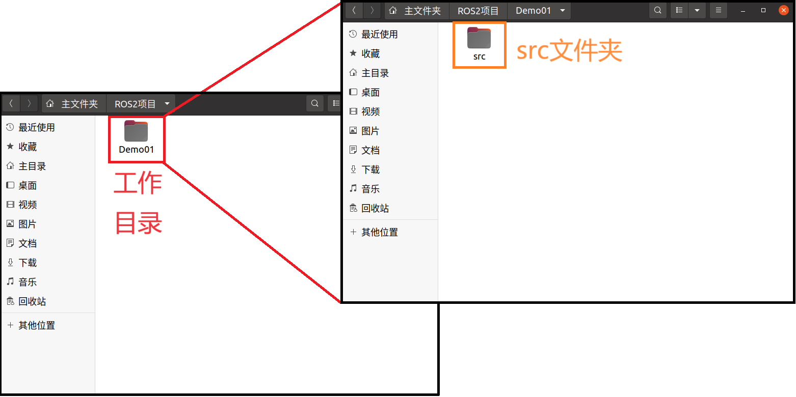


### 1.1.2 创建功能包

> [!NOTE]
>
> 该演示中使用的编译类型是**ament_cmake**

- 在**src文件夹**里面打开**终端**，输入

  ```bash	
  ros2 pkg create 包名 --build-type 编译类型 --dependencies 功能包的依赖
  ```

  **参数：**

  - **包名**：要创建的功能包的包名。自定义。名字要唯一。
  
  
    - **编译类型**：
      - **ament_cmake**：这是**最常用的编译类型**，它使用CMake作为构建系统。
  
      - **ament_python**：如果你的包**只包含Python代码**，可以使用这个类型。
  
      - **cmake**：不常用，通常用于**不遵循ament构建系统**的包。
  
  
  - **功能包的依赖**：指定你的功能包依赖的其他功能包。依赖之间用空格分隔。常见的有```rclcpp```(用于C++)、```rclpy```(用于Python)、```std_msgs```(用于标准消息定义)
  

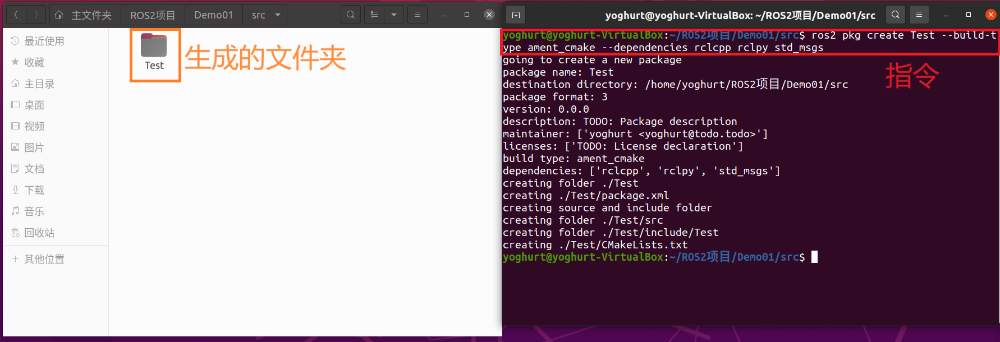


### 1.1.3 创建并编写C++文件

- 在**工作目录**下打开**终端**，进入 **工作目录/src/功能包/src** 中创建一个**.cpp文件**，并在里面写**C++代码**

  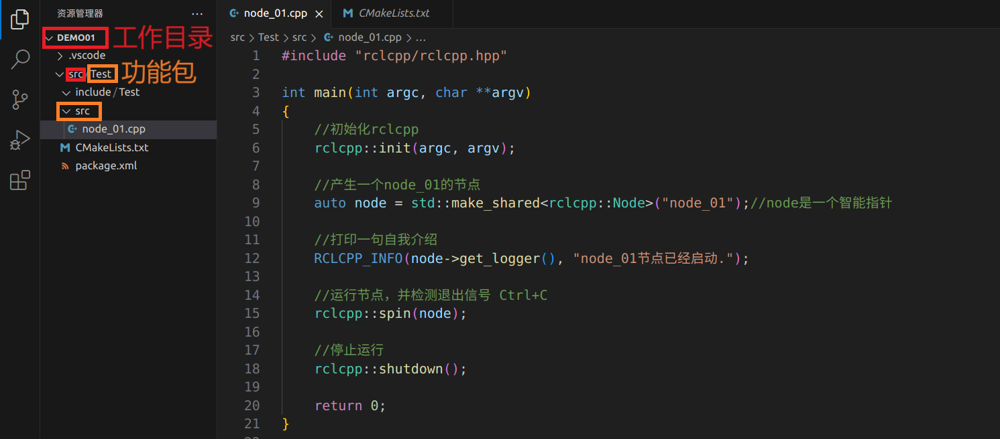


### 1.1.4 配置CMakeLists.txt

> [!IMPORTANT]
>
> 因为现在普遍使用ament_cmake_auto形式，所以这里也使用ament_cmake_auto

- 在CMakeLists.txt最下面添加这几行代码：

  ```cmake
  ament_auto_add_executable(
  	my_node				# .cpp文件的映射名
      src/my_node.cpp		# .cpp文件存放的位置
  )
  ```

- 整个cmake文件采用ament_cmake_auto形式：

  ```cmake
  cmake_minimum_required(VERSION 3.10)
  
  # 定义包名（必须与 package.xml 中一致）
  project(my_auto_pkg)
  
  # 找到 ament_cmake_auto
  # 它是 ament_cmake 的“自动化封装版本”
  find_package(ament_cmake_auto REQUIRED)
  
  # 自动查找 package.xml 中声明的所有 build / exec 依赖
  # 等价于一堆 find_package(xxx REQUIRED)
  ament_auto_find_build_dependencies()
  
  # =========================
  # 添加可执行程序（node）
  # =========================
  ament_auto_add_executable(talker_node
    src/talker.cpp
  )
  
  # =========================
  # 生成 ament 包
  # =========================
  ament_auto_package()
  ```

  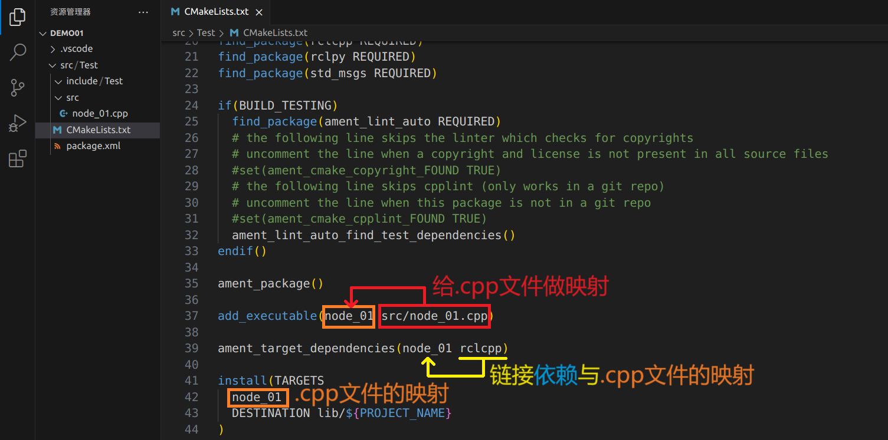


### 1.1.5 编写package.xml

- 因为这里没有使用其他的依赖，所以不需要添加额外的`<depend>`标签，即使用默认模板就可以

  ```xml
  <?xml version="1.0"?>
  <?xml-model href="http://download.ros.org/schema/package_format3.xsd" schematypens="http://www.w3.org/2001/XMLSchema"?>
  <package format="3">
    <name>1-1-2target_link_libraries</name>
    <version>0.0.0</version>
    <description>TODO: Package description</description>
    <maintainer email="amiya@todo.todo">amiya</maintainer>
    <license>TODO: License declaration</license>
  	
    <!-- 注意这里改为ament_cmake_auto -->
    <buildtool_depend>ament_cmake_auto</buildtool_depend>
  
    <depend>rclcpp</depend>
  
    <test_depend>ament_lint_auto</test_depend>
    <test_depend>ament_lint_common</test_depend>
  
    <export>
      <build_type>ament_cmake</build_type>
    </export>
  </package>
  ```

  

### 1.1.6 编译运行

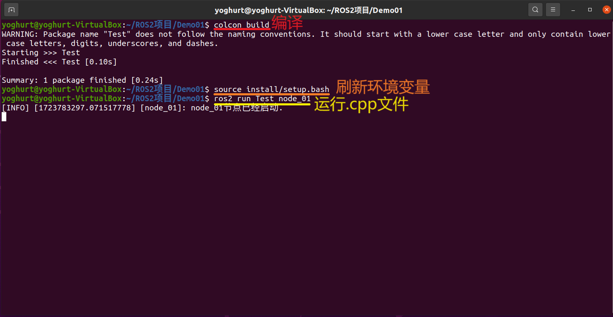


## 1.3 使用RCLPY编写节点

### 1.3.1 创建工作空间

- 创建**工作空间**，并在工作空间中创建**名为src的文件夹**

  

### 1.3.2 创建功能包

> [!NOTE] 
>
> 该演示中使用的编译类型是**ament_python**

- 在**src文件夹**里面打开**终端**，输入

  ```bash
  ros2 pkg create 包名 --build-type 编译类型 --dependencies 功能包的依赖
  ```

  **参数：**

  - **包名**：要创建的功能包的包名。自定义。名字要唯一。


  - **编译类型**：

    - **ament_cmake**：这是**最常用的编译类型**，它使用CMake作为构建系统。
    
    - **ament_python**：如果你的包**只包含Python代码**，可以使用这个类型。
    
    - **cmake**：不常用，通常用于**不遵循ament构建系统**的包。


  - **功能包的依赖**：指定你的功能包依赖的其他功能包。依赖之间用空格分隔。常见的有`rclcpp`(用于C++)、`rclpy`(用于Python)、`std_msgs`(用于标准消息定义)

  

### 1.3.3 创建并编写Python文件

- 在 **工作目录/src/功能包/功能包** 下创建**Python文件**

  


### 1.3.4 配置setup.py文件

- 在第**21行**上下

  **格式**：

  ```python
  自定义名字=功能包名.Python文件名(没有后缀):入口函数名
  ```

  **(注：程序员习惯直接把节点名称用在自定义名字中)**

  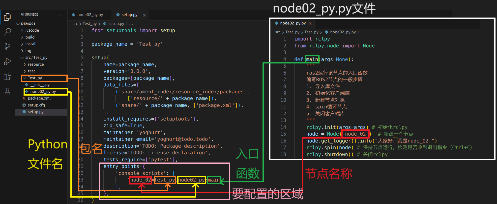


### 1.3.5 编译并运行

- **成功画面**

  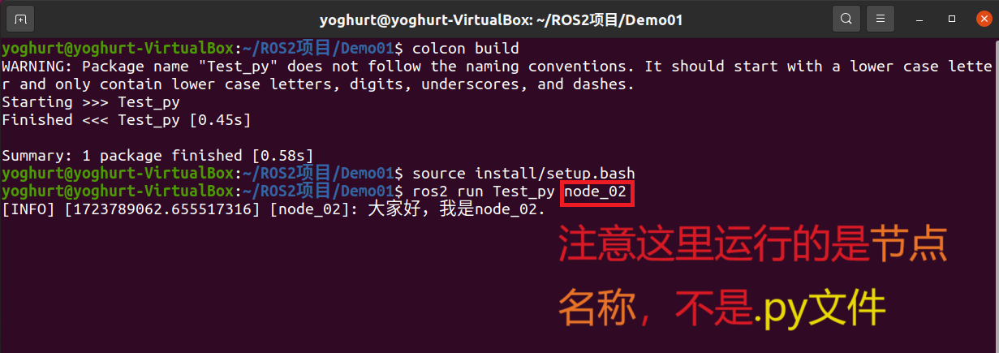


# 2 ROS2四大通信机制

- **`话题通信`**是基于广播的**单向**数据交互模式

- **`服务通信` **是基于**请求响应**的**问答式**交数据互模式

- **`动作通信`**是在**请求响应**的过程中又包含**连续反馈**的数据交互模式

- **`参数服务`**是基于**服务通信**的，用于对**节点内部配置参数**进行**查询**和**修改**，而非用于运行数据的共享

## 2.1 话题通信

### 2.1.1 发布者与订阅者怎么写

#### 发布者

发布者对应的**函数**：`create_publisher`

**参数**（从左到右）：

- **消息类型**：用于说明发布者发送的数据格式。

  消息类型相当于通信双方的“数据协议”，发布者和订阅者必须保持一致。

  可以使用：

  - ROS2 官方提供的消息类型（如 `std_msgs.msg.String`）
  - 按照 ROS2 接口规范自定义并生成的消息类型

- **话题名称**：
   一个字符串，用于指定消息发布到的具体话题。
   话题名称决定了消息的“去向”，只有订阅了相同话题名称的订阅者才能接收到该消息。

- **QoS 策略**：

  用于描述消息传输的服务质量。
  常见写法中默认值为 **10**，表示**发布者内部最多缓存 10 条尚未被订阅者接收的消息**，也称为队列深度。

  当发布速度快于订阅者处理速度时：

  - **队列未满**：新消息会被正常缓存
  - **队列已满**：最早的消息会被丢弃，为新消息让出空间

> [!NOTE]
>
> 当一个话题没有订阅者时，发布者仍然会发布消息，但这些消息不会被任何订阅者接收。


#### 订阅者

发布者对应的**函数**：`create_subscription`

**参数**（从左到右）：

- **消息类型**：用于说明订阅者接收的数据格式。

  消息类型相当于通信双方的“数据协议”，订阅者必须与对应发布者的消息类型保持一致，否则无法正确解析消息内容。

  可以使用：

  - ROS2 官方提供的消息类型（如 `std_msgs.msg.String`）
  - 按照 ROS2 接口规范自定义并生成的消息类型

- **话题名称**：
   一个字符串，用于指定订阅者监听的具体话题。
   只有当话题名称与发布者发布的话题完全一致时，订阅者才能接收到该话题上的消息。

- **回调函数**：
   用于描述当订阅者接收到新消息时所执行的处理逻辑。
   每当有新消息到达，该函数都会被自动调用，用于对消息进行解析、处理或触发后续行为。

- **QoS 策略**：

  用于描述订阅者接收消息时的服务质量要求。
   常见写法中默认值为 **10**，表示**订阅者内部最多缓存 10 条尚未被处理的消息**，也称为队列深度。

  当消息到达速度快于订阅者处理速度时：

  - **队列未满**：新消息会被正常缓存
  - **队列已满**：最早接收到但尚未处理的消息会被丢弃


### 2.1.2 C++实现

#### 节点之间单向传输（发布者单向传输给订阅者）

**节点框架图为：**


```mermaid
graph LR
    SayHello["节点: PubHello<br/>(里面有一个Publisher)"] -->|话题：HelloWorld| SubHello["节点: SubHello<br />(里面有一个Subscriber)"]
```


##### 1.发布者实现 

- 这里的发布者节点名字为 **PubHello**

  ```c++
  #include <rclcpp/rclcpp.hpp>
  #include <std_msgs/msg/string.hpp>
  #include <chrono>
  #include <rclcpp/node.hpp>
  #include <rclcpp/publisher.hpp>
  #include <rclcpp/timer.hpp>
  
  class SayHello : public rclcpp::Node{
  public:
      // 构造函数
      SayHello(std::string name):rclcpp::Node(name){
          // 创建发布者
          say_hello = this->create_publisher<std_msgs::msg::String>("/HelloWorld",10);
  
          // 创建定时器，用于定时发布信息
          say_hello_timer = this->create_wall_timer(std::chrono::milliseconds(500), std::bind(&SayHello::PubHello,this));
      }
  
  private:
      /*
          函数
      */
      void PubHello(){
          // 创建消息
          std_msgs::msg::String msg;
          msg.data = "你好世界";      // 我们可以发现std_msgs::msg::String有一个属性data，而data刚好是C++的std::string类型
  
          // 发布者发布消息
          say_hello->publish(msg);
  
          // DEBUG，输出一些东西到终端，让我们知道这个PubHello函数确实被执行了
          RCLCPP_INFO(this->get_logger(),"发布者发布了：%s",msg.data.c_str());    // c_str()表示转换字符串为c语言风格，这是ros2中输出日志的函数需要的
      }
  
      /*
          声明变量
      */
      // 声明一个发布者指针（其实我们理解为发布者就可以了）
      rclcpp::Publisher<std_msgs::msg::String>::SharedPtr say_hello;
      
      // 声明一个定时器指针（其实我们理解为定时器就可以了）
      // 定时器用于根据一定的频率来执行某一个回调函数，我们通过这个回调函数来使Publisher发布消息，就实现发布者按某个频率一直发布消息
      rclcpp::TimerBase::SharedPtr say_hello_timer;
  
  };
  
  int main(int argc, char ** argv){
      rclcpp::init(argc, argv);
      auto node = std::make_shared<SayHello>("PubHello");
      rclcpp::spin(node);
      rclcpp::shutdown();
      return 0;
  }
  ```


##### 2.订阅者实现

- 这里的订阅者节点名字为 **SubHello**

  ```c++
  #include <std_msgs/msg/string.hpp>
  #include <functional>
  #include <rclcpp/logging.hpp>
  #include <rclcpp/node.hpp>
  #include <rclcpp/rclcpp.hpp>
  #include <rclcpp/subscription.hpp>
  #include <std_msgs/msg/string.hpp>
  #include <string>
  
  class GetHello : public rclcpp::Node{
  public:
      GetHello(std::string name) : rclcpp::Node(name){
          // 创建一个订阅者
          get_hello = this->create_subscription<std_msgs::msg::String>("/HelloWorld",10,std::bind(&GetHello::SubHello,this,std::placeholders::_1));
      }
  
  private:
      // 订阅者所需的回调函数
      void SubHello(std_msgs::msg::String msg){
          RCLCPP_INFO(this->get_logger(),"订阅者接收到消息：%s",msg.data.c_str());
      }
  
      // 声明一个订阅者指针
      rclcpp::Subscription<std_msgs::msg::String>::SharedPtr get_hello;
  };
  
  int main(int argc, char ** argv){
      rclcpp::init(argc, argv);
      auto node = std::make_shared<GetHello>("SubHello");
      rclcpp::spin(node);
      rclcpp::shutdown();
      return 0;
  }
  ```


##### 3.配置CMakeLists.txt

```cmake
cmake_minimum_required(VERSION 3.8)
project(one-way_topic_communication_cpp)


if(CMAKE_COMPILER_IS_GNUCXX OR CMAKE_CXX_COMPILER_ID MATCHES "Clang")
  add_compile_options(-Wall -Wextra -Wpedantic)
endif()

find_package(ament_cmake_auto REQUIRED)
ament_auto_find_build_dependencies()

# 添加发布者节点
ament_auto_add_executable(PubHello src/SayHello.cpp)

# 添加订阅者节点
ament_auto_add_executable(SubHello src/GetHello.cpp)

# 测试与代码规范检查相关【不必理会】
if(BUILD_TESTING)
  find_package(ament_lint_auto REQUIRED)
  set(ament_cmake_copyright_FOUND TRUE)
  set(ament_cmake_cpplint_FOUND TRUE)
  ament_lint_auto_find_test_dependencies()
endif()

ament_auto_package()
```


##### 4.配置package.xml

```xml
<?xml version="1.0"?>
<?xml-model href="http://download.ros.org/schema/package_format3.xsd" schematypens="http://www.w3.org/2001/XMLSchema"?>
<package format="3">
  <name>one-way_topic_communication_cpp</name>
  <version>0.0.0</version>
  <description>TODO: Package description</description>
  <maintainer email="1310946137@qq.com">amiya</maintainer>
  <license>TODO: License declaration</license>

  <buildtool_depend>ament_cmake</buildtool_depend>

  <!-- 只需要添加这两个依赖，其他都不用变 -->
  <depend>rclcpp</depend>
  <depend>std_msgs</depend>

  <test_depend>ament_lint_auto</test_depend>
  <test_depend>ament_lint_common</test_depend>

  <export>
    <build_type>ament_cmake</build_type>
  </export>
</package>
```


##### 5.效果图

- 左边为**发布者**，右边为**接收者**

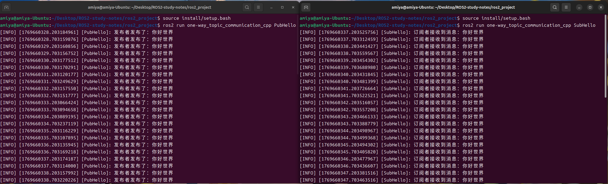


#### 节点之间双向传输

- 两个节点既有**发布者**也有**接收者**

- **节点图**：

  ```mermaid
  graph LR
      SayHello["节点: Lisi<br/>(Publisher+Subscriber)"]
      SubHello["节点: LaoWang<br/>(Publisher+Subscriber)"]
  
      SayHello -->|话题：/novel| SubHello
      SubHello -->|话题：/novel_money| SayHello
  
  ```

  

##### 1.节点1实现（节点名为Lisi）

- **代码**：

  ```c++
  #include "rclcpp/rclcpp.hpp"
  #include "std_msgs/msg/string.hpp"
  #include "std_msgs/msg/u_int32.hpp"
  #include <functional>
  
  class TopicPublisher : public rclcpp::Node
  {
  public:
      // 构造函数，有一个参数为节点名称
      TopicPublisher(std::string name) : Node(name) // 有参构造函数
      {
          // 先来个自我介绍吧（打印日志）
          RCLCPP_INFO(this->get_logger(), "大家好，我是%s。", name.c_str());
  
          // 创建发布者
          pub_novel = this->create_publisher<std_msgs::msg::String>("novel", 10);
          pub_novel_timer = this->create_wall_timer(std::chrono::milliseconds(500), std::bind(&TopicPublisher::PubNovel, this)); // 创建定时器，500ms为周期，定时发布
  
          // 创建订阅者
          money.data = 80; // 声明初始的稿费
          sub_money = this->create_subscription<std_msgs::msg::UInt32>("novel_money", 10, std::bind(&TopicPublisher::SubMoney, this, std::placeholders::_1));
      }
  
  private:
      // 声明话题发布者指针
      rclcpp::Publisher<std_msgs::msg::String>::SharedPtr pub_novel;
      // 声明定时器指针
      rclcpp::TimerBase::SharedPtr pub_novel_timer;
  
      // 声明总的稿费
      std_msgs::msg::UInt32 money;
      // 声明一个订阅者
      rclcpp::Subscription<std_msgs::msg::UInt32>::SharedPtr sub_money;
  
      // 计时器回调函数（里面写发布内容）
      void PubNovel()
      {
          // 创建消息
          std_msgs::msg::String novel;
          novel.data = "小说";
  
          // 日志打印
          RCLCPP_INFO(this->get_logger(), "我已经发布了：%s", novel.data.c_str());
  
          // 发布消息
          pub_novel->publish(novel);
      }
  
      // 收钱的回调函数（接收者）
      void SubMoney(const std_msgs::msg::UInt32::SharedPtr sub_money)
      {
          money.data += sub_money->data;
          RCLCPP_INFO(this->get_logger(), "我已经收到%d元稿费，现在我的稿费总共有%d元", sub_money->data, money.data);
      }
  };
  
  int main(int argc, char **argv)
  {
      rclcpp::init(argc, argv);                               // 初始化 rclcpp
      auto node = std::make_shared<TopicPublisher>("Lisi");   // 新建一个节点
      rclcpp::spin(node);                           // 保持节点运行，检测到接收时退出指令
      rclcpp::shutdown();                                    // rcl 关闭
      return 0;
  }
  ```
  
- **注释**：

  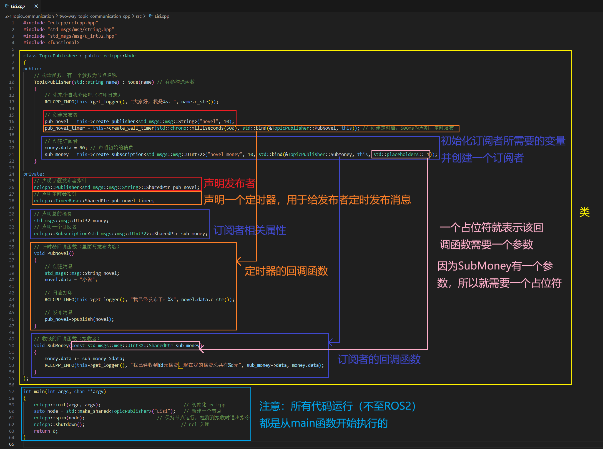


##### 2.节点2实现（节点名为Laowang）

- **代码**：

  ```c++
  #include "rclcpp/rclcpp.hpp"
  #include "std_msgs/msg/string.hpp"
  #include "std_msgs/msg/u_int32.hpp"
  #include <functional>
  
  // 创建一个类节点，名字叫做SingleDogNode，继承自Node
  class SingleDogNode : public rclcpp::Node
  {
  public:
      // 构造函数，有一个参数为节点名称
      SingleDogNode(std::string name) : Node(name) // 有参构造函数
      {
          // 打印一句自我介绍
          RCLCPP_INFO(this->get_logger(), "大家好，我是单身狗%s。", name.c_str());
  
          // 创建一个订阅者来订阅李四的小说，话题名为novel
          sub_novel = this->create_subscription<std_msgs::msg::String>("novel", 10, std::bind(&SingleDogNode::topic_callback, this, std::placeholders::_1));
  
          // 创建一个发布者来给稿费，话题名为novel_money
          pub_money = this->create_publisher<std_msgs::msg::UInt32>("novel_money", 10);
      }
  
  private:
      // 声明一个订阅者（成员变量），用于订阅小说
      rclcpp::Subscription<std_msgs::msg::String>::SharedPtr sub_novel;
  
      // 声明一个发布者（成员变量），用于订阅完小说后付钱
      rclcpp::Publisher<std_msgs::msg::UInt32>::SharedPtr pub_money;
  
      // 收到话题数据的回调函数
      void topic_callback(const std_msgs::msg::String::SharedPtr msg)
      {
          // 1. 订阅者接收数据（接收数据后发布消息）
          RCLCPP_INFO(this->get_logger(), "朕已阅：'%s'", msg->data.c_str());
  
          // 2. 订阅者发布数据（这里是订阅者看完小说，给发布者打钱，其实就是发布者）
          // 逻辑贯通：老王接收到李四的小说后，就应该给他稿费
        std_msgs::msg::UInt32 money;
          money.data = 10;
          pub_money->publish(money);
          RCLCPP_INFO(this->get_logger(), "我已经发送%d元稿费", money.data);
      }
  };
  
  int main(int argc, char **argv)
  {
      rclcpp::init(argc, argv);                                   // 初始化rclcpp
      auto node = std::make_shared<SingleDogNode>("LaoWang");     // 新建一个节点
      rclcpp::spin(node);                                					// 保持节点运行，检测时候收到退出指令
      rclcpp::shutdown();                                         // rcl关闭
      return 0;
  }
  ```
  
- **注释**：

  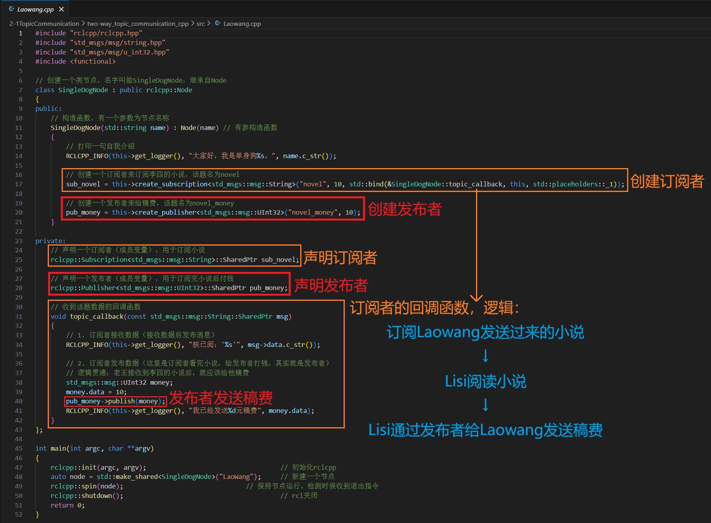


##### 3.配置CMakeLists.txt

```cmake
cmake_minimum_required(VERSION 3.8)
project(one-way_topic_communication_cpp)

if(CMAKE_COMPILER_IS_GNUCXX OR CMAKE_CXX_COMPILER_ID MATCHES "Clang")
  add_compile_options(-Wall -Wextra -Wpedantic)
endif()

find_package(ament_cmake_auto REQUIRED)
ament_auto_find_build_dependencies()

# 添加发布者节点
ament_auto_add_executable(Lisi src/Lisi.cpp)

# 添加订阅者节点
ament_auto_add_executable(LaoWang src/LaoWang.cpp)

# 测试与代码规范检查相关【不必理会】
if(BUILD_TESTING)
  find_package(ament_lint_auto REQUIRED)
  set(ament_cmake_copyright_FOUND TRUE)
  set(ament_cmake_cpplint_FOUND TRUE)
  ament_lint_auto_find_test_dependencies()
endif()

ament_auto_package()
```


##### 4.配置package.xml

```xml
<?xml version="1.0"?>
<?xml-model href="http://download.ros.org/schema/package_format3.xsd" schematypens="http://www.w3.org/2001/XMLSchema"?>
<package format="3">
  <name>one-way_topic_communication_cpp</name>
  <version>0.0.0</version>
  <description>TODO: Package description</description>
  <maintainer email="1310946137@qq.com">amiya</maintainer>
  <license>TODO: License declaration</license>

  <buildtool_depend>ament_cmake</buildtool_depend>

  <!-- 只需要添加这两个依赖，其他都不用变 -->
  <depend>rclcpp</depend>
  <depend>std_msgs</depend>

  <test_depend>ament_lint_auto</test_depend>
  <test_depend>ament_lint_common</test_depend>

  <export>
    <build_type>ament_cmake</build_type>
  </export>
</package>
```


##### 5.效果图

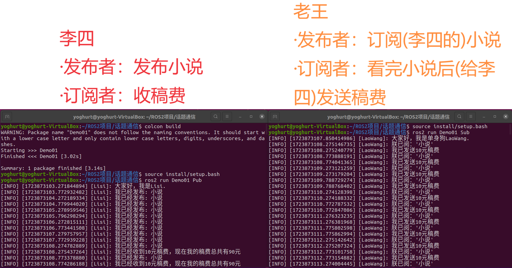


### 2.1.3 Python实现

- 发布者：

  ```python
  self.变量名 = self.create_publisher(消息的类型, 话题名称(自定义), 队列中最大的保存消息数)
  ```

  

- 订阅者：

  ```python
  self.变量名 = self.create_subscription(消息的类型, 话题名称[自定义], 回调函数,队列中最大的保存消息数)
  ```

  

#### 节点之间单向传输

**节点框架图为：**


```mermaid
graph LR
    SayHello["节点: PubHello<br/>(里面有一个Publisher)"] -->|话题：HelloWorld| SubHello["节点: SubHello<br />(里面有一个Subscriber)"]
```


##### 1.发布者实现

- **代码**：

  ```python
  import rclpy
  from rclpy.node import Node
  from std_msgs.msg import String
  
  class PubHello(Node):
      # 构造函数，在每个类对象初始化时都会执行
      def __init__(self,name):
          super().__init__(name)
  
          # 创建一个发布者（Python中不需要声明）
          self.pub_hello = self.create_publisher(String,"/HelloWorld",10)
  
          # 创建一个定时器，用于定时给发布者发布消息（Python中不需要声明）
          self.timer = self.create_timer(0.5,self.timer_callback)
      
      # 定时器的回调函数
      def timer_callback(self):
          # 构建消息并发布
          msg = String()
          msg.data = "你好世界"
          self.pub_hello.publish(msg)
  
          # DEBUG，显示当前函数确实在运行，发布者确实在发布
          self.get_logger().info(f"发布者发布消息:{msg.data}")
  
  def main(args=None):
      rclpy.init(args=args)       # 初始化rclpy
      node = PubHello("SayHello") # 新建一个节点
      rclpy.spin(node)            # 保持节点运行，检测是否收到退出指令(Ctrl+C)
      rclpy.shutdown()            # 当接收到退出指令时，退出spin函数，执行shutdown函数来关闭rclpy
  ```

- **注释**：

  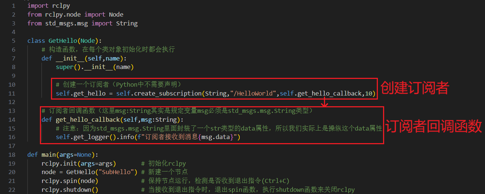


##### 2.订阅者实现

- **代码**：

  ```python
  import rclpy
  from rclpy.node import Node
  from std_msgs.msg import String
  
  class GetHello(Node):
      # 构造函数，在每个类对象初始化时都会执行
      def __init__(self,name):
          super().__init__(name)
  
          # 创建一个订阅者（Python中不需要声明）
          self.get_hello = self.create_subscription(String,"/HelloWorld",self.get_hello_callback,10)
  
      # 订阅者回调函数（这里msg:String其实是规定变量msg必须是std_msgs.msg.String类型）
      def get_hello_callback(self,msg:String):
          # 注意：因为std_msgs.msg.String里面封装了一个str类型的data属性，所以我们实际上是操纵这个data属性
          self.get_logger().info(f"订阅者接收到消息{msg.data}")
  
  def main(args=None):
      rclpy.init(args=args)       # 初始化rclpy
      node = GetHello("SubHello") # 新建一个节点
      rclpy.spin(node)            # 保持节点运行，检测是否收到退出指令(Ctrl+C)
      rclpy.shutdown()            # 当接收到退出指令时，退出spin函数，执行shutdown函数来关闭rclpy
  
  ```

- **注释**：

  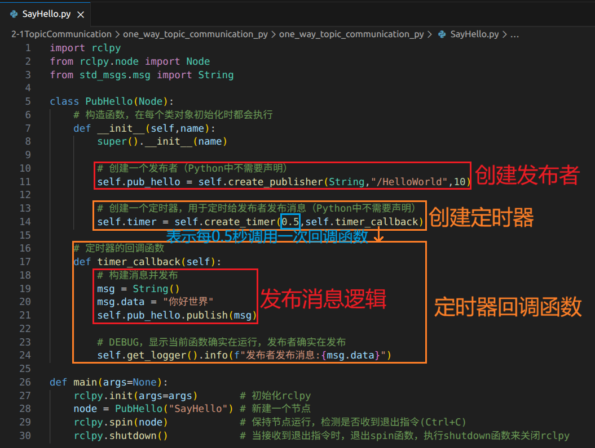


##### 3.配置setup.py

```python
from setuptools import find_packages, setup

package_name = 'one_way_topic_communication_py'

setup(
    name=package_name,
    version='0.0.0',
    packages=find_packages(exclude=['test']),
    data_files=[
        ('share/ament_index/resource_index/packages',
            ['resource/' + package_name]),
        ('share/' + package_name, ['package.xml']),
    ],
    install_requires=['setuptools'],
    zip_safe=True,
    maintainer='miku',
    maintainer_email='1310946137@qq.com',
    description='TODO: Package description',
    license='TODO: License declaration',
    extras_require={
        'test': [
            'pytest',
        ],
    },
    entry_points={
        'console_scripts': [
            # 在这里添加可执行文件
            'SayHello=one_way_topic_communication_py.SayHello:main',
            'GetHello=one_way_topic_communication_py.GetHello:main',
        ],
    },
)
```


##### 4.效果

- 左 发布者，右 接收者

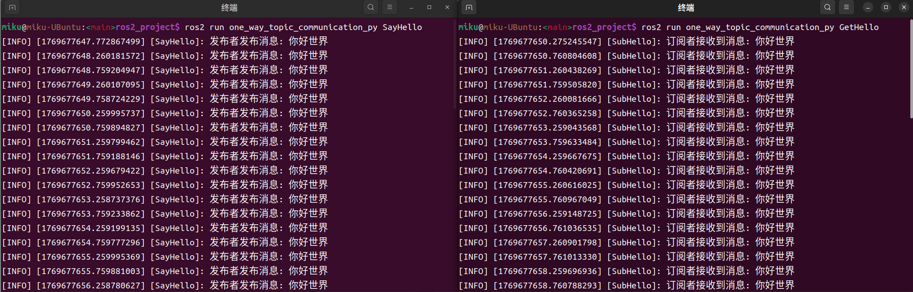


#### 节点之间双向传输

##### 1.节点1实现（节点名为Lisi）

- **代码**：

  ```python
  import rclpy
  from rclpy.node import Node
  from std_msgs.msg import String
  from std_msgs.msg import UInt32
  
  class WriterLisi(Node):
      def __init__(self,name):
          super().__init__(name)
  
          # 输出日志，让我们知道节点启动了
          self.get_logger().info(f"作家节点{name}启动")
  
          # 创建发布者
          self.pub_novel = self.create_publisher(String,"novel",10)
          self.timer = self.create_timer(0.5,self.PubNovel)
  
          # 创建订阅者
          self.money = UInt32()   # 声明全局变量money
          self.money.data = 80    # 声明初始的稿费
          self.sub_money = self.create_subscription(UInt32,"novel_money",self.SubMoney,10)
  
      # 计时器回调函数（里面写发布内容）
      def PubNovel(self):
          # 创建消息
          novel = String()
          novel.data = "小说"
          # 发布消息
          self.pub_novel.publish(novel)
  
          # 日志打印
          self.get_logger().info(f"我发布了{novel.data}")
  
      # 收钱的回调函数（接收者）
      def SubMoney(self,sub_money:UInt32):
          # 处理逻辑
          self.money.data += sub_money.data
  
          # 日志打印
          self.get_logger().info(f"我已经收到{sub_money.data}元稿费，现在我的稿费总共有{self.money.data}元")
  
  def main(args=None):
      rclpy.init(args=args)               # 初始化rclpy
      node = WriterLisi("LiSi")           # 新建一个节点
      rclpy.spin(node)                    # 保持节点运行，检测是否收到退出指令(Ctrl+C)
      rclpy.shutdown()                    # 当接收到退出指令时，退出spin函数，执行shutdown函数来关闭rclpy
  ```

- **效果**：

  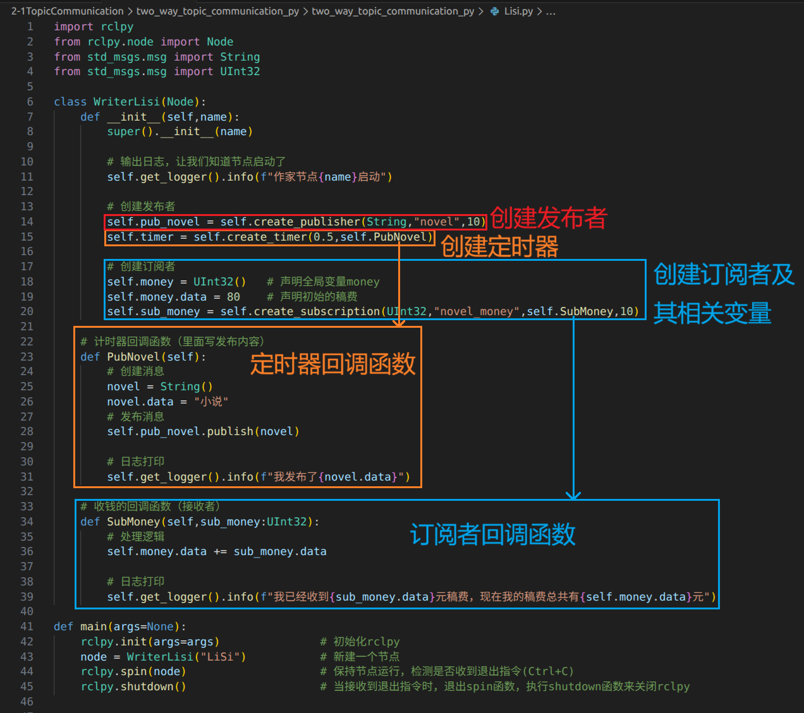


##### 2.节点2实现（节点名为Laowang）

- **代码**：

  ```python
  import rclpy
  from rclpy.node import Node
  from std_msgs.msg import String
  from std_msgs.msg import UInt32
  
  class SingleDogNode(Node):
  
      # 构造函数
      def __init__(self,name):
          super().__init__(name)
  
          # 输出日志，让我们知道节点启动了
          self.get_logger().info(f"单身狗节点{name}启动")
          
          # 创建一个订阅者来订阅李四的小说，话题名为novel
          self.sub_novel = self.create_subscription(String,"novel",self.sub_novel_callback,10)
  
          # 创建一个发布者来给稿费，话题名为novel_money
          self.pub_money = self.create_publisher(UInt32,"novel_money",10)
  
      # 订阅者(小说)的回调函数
      def sub_novel_callback(self,msg:String):
          # 1. 订阅者接收数据（接收数据后发布消息）
          self.get_logger().info(f"我收到小说：{msg.data}")
          
          # 2. 订阅者发布数据（这里是订阅者看完小说，给发布者打钱，其实就是发布者）
          # 逻辑贯通：老王接收到李四的小说后，就应该给他稿费
          money = UInt32()
          money.data = 10 # 表示10元
          self.pub_money.publish(money)
          self.get_logger().info(f"我已经发送{money.data}元稿费")
      
  
  def main(args=None):
      rclpy.init(args=args)               # 初始化rclpy
      node = SingleDogNode("LaoWang")     # 新建一个节点
      rclpy.spin(node)                    # 保持节点运行，检测是否收到退出指令(Ctrl+C)
      rclpy.shutdown()                    # 当接收到退出指令时，退出spin函数，执行shutdown函数来关闭rclpy
  
  ```

- **效果**：

  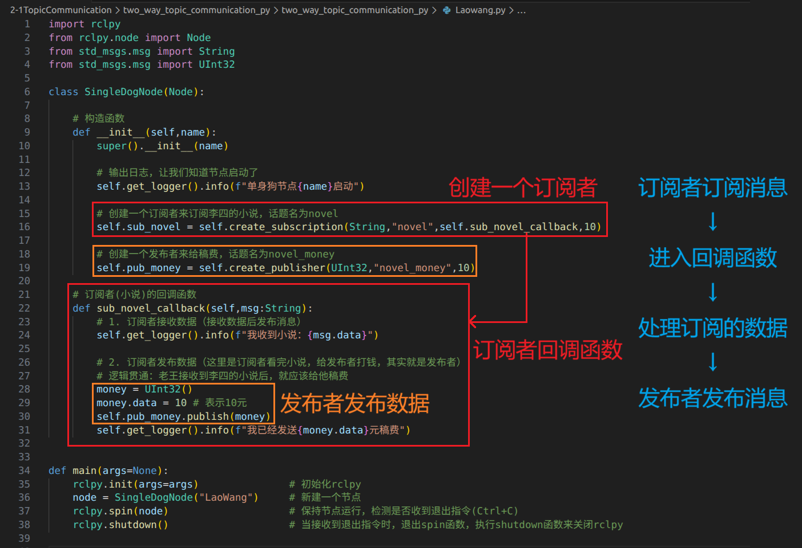


##### 3.配置setup.py

```python
from setuptools import find_packages, setup

package_name = 'two_way_topic_communication_py'

setup(
    name=package_name,
    version='0.0.0',
    packages=find_packages(exclude=['test']),
    data_files=[
        ('share/ament_index/resource_index/packages',
            ['resource/' + package_name]),
        ('share/' + package_name, ['package.xml']),
    ],
    install_requires=['setuptools'],
    zip_safe=True,
    maintainer='miku',
    maintainer_email='1310946137@qq.com',
    description='TODO: Package description',
    license='TODO: License declaration',
    extras_require={
        'test': [
            'pytest',
        ],
    },
    entry_points={
        'console_scripts': [
            # 在这里添加可执行文件
            'LaoWang=two_way_topic_communication_py.Laowang:main',
            'LiSi=two_way_topic_communication_py.Lisi:main'
        ],
    },
)
```


##### 4.效果

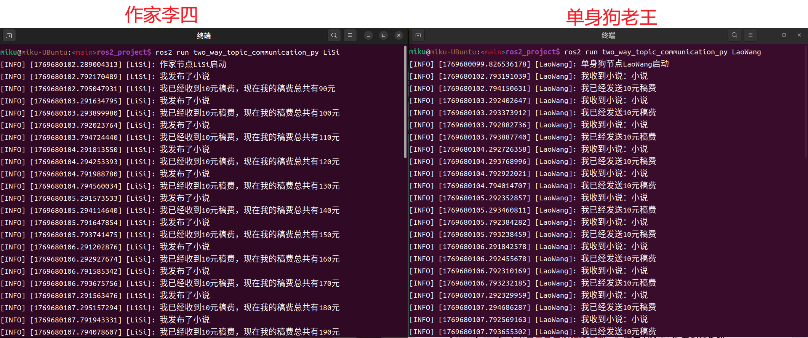


## 2.2 服务通信

### 2.2.1 什么是服务通信？

- 在上面我们学习了话题通信，我们知道话题通信是一种信息流的单向传输（即Publisher向Subscriber发送信息），而且Publisher按某个频率对Subscriber发送信息
- 假设现在我们有一个**NodeA**里面有一个Publisher，有一个**NodeB**里面有一个Subscriber
  - 那么NodeA就会有一定的频率发送信息给NodeB
  - 但是如果说NodeB不需要这么高频率的信息流呢？NodeB只需要在某个特定时刻获取NodeA的信息。
  - 那么这个时候如果还是使用`Topic通信`的话，NodeA在大部分时间给NodeB传输**无用数据**，NodeB要**对这些无用数据做处理**，就会造成`性能浪费`
  - 所以就引入了`服务通信(Service)`，使得NodeB在需要获取数据时向NodeA发送请求，然后NodeA向NodeB发送数据
- 从服务的实现机制上来看，这种你问我答的形式叫做**客户端/服务器模型**，简称为CS模型，客户端在需要某些数据的时候，针对某个具体的服务，发送请求信息，服务器端收到请求之后，就会进行处理并反馈应答信息。

> `服务通信`：**客户端**发送请求给**服务端**，**服务端**可以根据**客户端的请求**做一些处理，然后返回结果给**客户端**。


### 2.2.2 一对一服务通信

- 如图中有两个节点，假设左边的节点为NodeA，右边的节点为NodeB。NodeA里面有一个Client，NodeB里面有一个Service
- NodeA首先发送`请求信息(Request Message)`给NodeB
- 然后NodeB处理`请求信息`(这是NodeB的内部处理)，得到`响应信息(Response Meassage)`
- 然后NodeB把`响应信息(Response Meassage)`发送给NodeA


#### C++实现

> 我们要实现 a+b = c
>
> 客户端准备整数a和b，发送给服务端，服务端得到整数c并发送给客户端

- **自定义话题接口**`Novel.srv`

  ```
  # 客户端发送给服务端的消息
  int64 a
  int64 b
  ---
  # 服务端返回给客户端的消息
  int64 sum
  ```


- **服务端实现**`test_custom_srv_server.cpp`

  步骤：

  - 导入服务接口
  - 创建服务端回调函数
  - 声明并创建服务端
  - 编写回调函数逻辑处理请求

  ```c++
  #include "rclcpp/rclcpp.hpp"
  #include "custom_srv_interfaces/srv/novel.hpp"
  
  class AddTwoIntsServer : public rclcpp::Node
  {
  public:
    AddTwoIntsServer() : Node("add_two_ints_server")
    {
      // 创建一个服务端
      service_ = this->create_service<custom_srv_interfaces::srv::Novel>("add_two_ints",std::bind(&AddTwoIntsServer::handle_service, this, std::placeholders::_1, std::placeholders::_2));
  
      RCLCPP_INFO(this->get_logger(), "AddTwoInts服务准备就绪！");
    }
  
  private:
    // 服务端回调函数
    void handle_service(
      const std::shared_ptr<custom_srv_interfaces::srv::Novel::Request> request,
      std::shared_ptr<custom_srv_interfaces::srv::Novel::Response> response)
    {
      // 日志
      RCLCPP_INFO(this->get_logger(),"接收到客户端发来的请求: a=%ld, b=%ld",request->a, request->b);
  
      // 处理逻辑
      response->sum = request->a + request->b;
    }
  
    // 声明一个服务端
    rclcpp::Service<custom_srv_interfaces::srv::Novel>::SharedPtr service_;
  };
  
  int main(int argc, char **argv)
  {
    rclcpp::init(argc, argv);
    rclcpp::spin(std::make_shared<AddTwoIntsServer>());
    rclcpp::shutdown();
    return 0;
  }
  ```

  

- **客户端实现**`test_custom_srv_client.cpp`

  步骤：

  - 导入服务接口


  - 创建请求结果接收回调函数


  - 声明并创建客户端


  - 编写结果接收逻辑


  - 调用客户端发送请求

  ```c++
  #include "rclcpp/rclcpp.hpp"
  #include "custom_srv_interfaces/srv/novel.hpp"
  #include <memory>
  #include <rclcpp/client.hpp>
  #include <rclcpp/node.hpp>
  
  using namespace std::chrono_literals;
  
  class AddTwoIntsClient : public rclcpp::Node{
  public:
      AddTwoIntsClient():rclcpp::Node("add_two_ints_client")
      {
          // 创建一个客户端
          client = this->create_client<custom_srv_interfaces::srv::Novel>("/add_two_ints");
  
          // 发送请求
          int a=3;
          int b=5;
          this->async_send_request(a,b);
      }
  
  private:
      // 声明一个客户端
      rclcpp::Client<custom_srv_interfaces::srv::Novel>::SharedPtr client;
  
      // 客户端发送请求的函数（注意这个不是回调函数）
      void async_send_request(int a,int b)
      {
          // 等待服务端上线
          while (!client->wait_for_service(1s)) 
          {
              if (!rclcpp::ok()) 
              {
                  RCLCPP_ERROR(this->get_logger(), "等待服务端上线时，客户端被中断");
                  return;
              }
              RCLCPP_INFO(this->get_logger(), "正在等待服务端上线");
          }
  
          // 构建请求消息
          auto request = std::make_shared<custom_srv_interfaces::srv::Novel::Request>();
          request->a = a;
          request->b = b;
  
          // 客户端发送服务请求给服务端
          auto future = client->async_send_request(request);
          
          // 等待服务端响应
          if (rclcpp::spin_until_future_complete(this->get_node_base_interface(), future) == rclcpp::FutureReturnCode::SUCCESS)
          {
              RCLCPP_INFO(this->get_logger(),"服务端响应: %ld + %ld = %ld",request->a, request->b, future.get()->sum);
          }
          else
          {
              RCLCPP_ERROR(this->get_logger(), "呼叫服务失败！");
          }
      }
  };
  
  
  int main(int argc, char **argv)
  {
    rclcpp::init(argc, argv);
    auto node = std::make_shared<AddTwoIntsClient>();
    rclcpp::spin(node);
    rclcpp::shutdown();
    return 0;
  }
  ```


#### Python实现

- **自定义话题接口**`Novel.srv`

  ```
  # 客户端发送给服务端的消息
  int64 a
  int64 b
  ---
  # 服务端返回给客户端的消息
  int64 sum
  ```


- **服务端实现**`test_custom_srv_server.py`

  步骤：

  - 导入服务接口
  - 创建服务端回调函数
  - 声明并创建服务端
  - 编写回调函数逻辑处理请求

  ```python
  import rclpy
  from rclpy.node import Node
  from custom_srv_interfaces.srv import Novel
  
  class AddTwoIntsServer(Node):
  
      def __init__(self):
          super().__init__('add_two_ints_server')
  
          # 创建服务端
          self.service = self.create_service(Novel,'add_two_ints',self.handle_service)
  
          self.get_logger().info('AddTwoInts 服务准备就绪！')
  
      # 服务端回调函数
      def handle_service(self, request, response):
          self.get_logger().info(f'接收到客户端请求: a={request.a}, b={request.b}')
  
          response.sum = request.a + request.b
          return response
  
  
  def main(args=None):
      rclpy.init(args=args)
      node = AddTwoIntsServer()
      rclpy.spin(node)
      rclpy.shutdown()
  
  
  if __name__ == '__main__':
      main()
  ```

  

- **客户端实现**`test_custom_srv_client.cpp`

  步骤：

  - 导入服务接口

  - 创建请求结果接收回调函数

  - 声明并创建客户端

  - 编写结果接收逻辑

  - 调用客户端发送请求

  ```python
  import rclpy
  from rclpy.node import Node
  from custom_srv_interfaces.srv import Novel
  
  class AddTwoIntsClient(Node):
  
      def __init__(self):
          super().__init__('add_two_ints_client')
  
          # 创建客户端
          self.client = self.create_client(Novel, 'add_two_ints')
  
          # 等待服务端上线
          while not self.client.wait_for_service(timeout_sec=1.0):
              self.get_logger().info('正在等待服务端上线...')
              if not rclpy.ok():
                  self.get_logger().error('等待服务端时被中断')
                  return
  
          # 构建请求
          request = Novel.Request()
          request.a = 3
          request.b = 5
  
          # 发送请求（异步）
          future = self.client.call_async(request)
  
          # 等待响应
          rclpy.spin_until_future_complete(self, future)
  
          if future.done():
              response = future.result()
              self.get_logger().info(f'服务端响应: {request.a} + {request.b} = {response.sum}')
          else:
              self.get_logger().error('服务调用失败')
  
  def main(args=None):
      rclpy.init(args=args)
      node = AddTwoIntsClient()
      rclpy.shutdown()
  
  if __name__ == '__main__':
      main()
  ```


### 2.2.3 一对多服务通信

> 其实就是一个`服务端`和多个`客户端`通信


- 其实一对多通信的代码跟一对一通信的代码是一样的，不同的是多了一个client节点


### 2.2.4 同步通信与异步通信

- `同步通信`就是：客户端发送请求后阻塞等待服务端返回结果，拿到响应之前不会继续执行后续逻辑。

- `异步通信`就是：客户端发送请求后立即返回不阻塞，服务端处理完成后再通过回调或 future 通知客户端结果。

- **同步通信**与**异步通信**的对比

  | 对比项    | 同步       | 异步     |
  | --------- | ---------- | -------- |
  | 是否阻塞  | ✅ 阻塞     | ❌ 不阻塞 |
  | 实时性    | ❌ 差       | ✅ 好     |
  | 多 client | ❌ 容易卡死 | ✅ 友好   |


#### 基础概念：spin状态、future、executor 

- 其实`同步通信`和`异步通信`的差别就是：`spin_until_future_complete函数`

- `spin_until_future_complete`是什么意思呢？

  让客户端节点进入 `spin状态`，持续处理回调，直到某个 `future` 完成为止（本质是“阻塞等待结果”）。

##### 什么是 spin状态

> `spin 状态`就是：节点把控制权交给 ROS2 executor，持续运行事件循环，专门用来处理各种回调。

- **事件循环**

  我们可以把 `spin` 理解成一个 **while 死循环**：

  ```
  while rclpy.ok():
      检查有没有事件
      有 → 执行回调
      没 → 等待
  ```

  👉 这个“循环在跑”的状态，就叫 **spin 状态**

- **在 ROS 2 里，`spin` 在处理什么？**

  当节点处于 spin 状态时，会处理：

  - topic 的订阅回调
  - service 的请求 / 响应回调
  - timer 回调
  - action 的反馈 / 结果
  - 参数事件
  - future 的完成回调

  > [!NOTE]
  >
  > 只要是 ROS 通信相关的`回调`，都靠 spin 才能执行

- **如果没有spin，会发生什么？**

  - 发得出 topic，收不到 topic

  - service 永远没响应

- **几种常见的spin形式**

  - `spin()`

    ```python
    rclpy.spin(node)
    ```

    **含义**：

    - 进入**持续 spin 状态**
    - 一直处理回调
    - 直到 `Ctrl+C` 或 shutdown 时退出

  - `spin_once()`（单步）

    ```python
    rclpy.spin_once(node)
    ```

    含义：

    - 只处理 **一次** 可用回调
    - 不阻塞或短暂阻塞

  - `spin_until_future_complete（）`

    ```python
    rclpy.spin_until_future_complete(node, future)
    ```

    含义：

    - 临时进入 spin
    - **直到某个 future 完成**
    - 完成后立刻退出 spin

##### 什么是 future

> **`future` 表示一个“尚未完成、但未来一定会完成的异步结果”。**

- 在 ROS 2 中，`future` 通常用于：

  - service 调用结果

  - action 结果

  - 异步任务返回值

- **future 从哪来？**

  ```
  future = client.call_async(request)
  ```

  含义是：

  - 请求已经发出，还没有得到结果
  - 将来某个时刻，服务端返回响应，`Future` 变为 **完成**

- **future 的状态**

  一个 future 主要有两种状态：

  - ❌ **未完成（pending）**
  - ✅ **已完成（complete）**

  ```
  future.done()   # True / False
  future.result() # 只有完成后才能取
  ```

- **future 和回调的关系**

  future 本身**不会主动完成**，它依赖：

  > **spin 状态下，executor 处理 service 响应回调**

  ```mermaid
  flowchart TD
      A["Service 响应到达 DDS（中间件）"] --> B["节点处于 spin 状态"]
      B --> C["Executor 轮询到可处理事件"]
      C --> D["Executor 调度并执行 service 响应回调"]
      D --> E["Future 被填充结果"]
      E --> F["Future 状态变为 complete"]
  ```

  👉 **没有 spin，就没有 future complete**

- **future 的两种用法**

  - **同步用法（阻塞）**

    ```python
    rclpy.spin_until_future_complete(node, future)
    result = future.result()
    ```

  - **异步用法（非阻塞，推荐）**

    ```python
    future.add_done_callback(callback)
    ```

##### 什么是 executor

> **`executor` 是 ROS 2 中负责“调度和执行回调”的组件。**

```
Node 是回调的“注册者”和“容器”，负责“定义回调”
Executor 是“调度器”，负责“执行回调”
```

- **executor 在系统中的位置**

  ```
  Node定义回调  →  Executor调度回调  →  Callback具体执行逻辑
         				   ↑
                     spin 事件循环驱动
  ```

- `spin()`：驱动 executor 运行
- `executor`：决定 **什么时候、用哪个线程** 执行回调


- **executor 具体做什么？**

  当 executor 运行时，会不断：

  - 检查哪些节点有事件

  - 判断哪些回调可以执行

  - 调度回调函数运行

  包括：

  - 订阅回拨

  - 服务回拨

  - 计时器回拨

  - 未来完成回调

- **常见 executor 类型**

  - **SingleThreadedExecutor单线程执行器（默认）**`（1个线程，所有回调串行执行）`

    ```python
    executor = rclpy.executors.SingleThreadedExecutor()
    ```

    图形说明：

    ```mermaid
    flowchart TD
        Node[Node<br/>定义回调]
    
        subgraph T1[Thread（唯一线程）]
            Executor1[Executor]
            Callback1[Callback 执行]
            Executor1 --> Callback1
        end
    
        Node --> Executor1
    
    ```

    特点：

    - 一次只执行一个回调
    - 回调之间是串行的
    - 简单，但容易被阻塞

  - **MultiThreadedExecutor多线程执行器**`（N个线程【线程池】，回调可能并行执行）`

    ```python
    executor = rclpy.executors.MultiThreadedExecutor()
    ```

    图形说明：

    ```mermaid
    flowchart TD
        Node[Node<br/>定义回调]
    
        subgraph T1[Thread 1]
            Executor1[Executor]
            Callback1[Callback A]
            Executor1 --> Callback1
        end
    
        subgraph T2[Thread 2]
            Executor2[Executor]
            Callback2[Callback B]
            Executor2 --> Callback2
        end
    
        Node --> Executor1
        Node --> Executor2
    
    ```

    特点：

    - 可并行执行多个回调
    - 适合 service / action 较多的节点
    - 对实时性更友好


- **executor 和 spin 的关系**

  > [!IMPORTANT]
  >
  > **spin 并不是在“执行回调”，而是在“让 executor 开始工作”。**

  ```
  spin() → executor.run() → 执行回调
  ```

  没有 executor：

  - spin 没意义

  没有 spin：

  - executor 不会运行


##### 三者关系总结

- `spin`：启动事件循环
- `executor`：调度并执行回调
- `future`：异步结果的状态容器

**完整链路：**

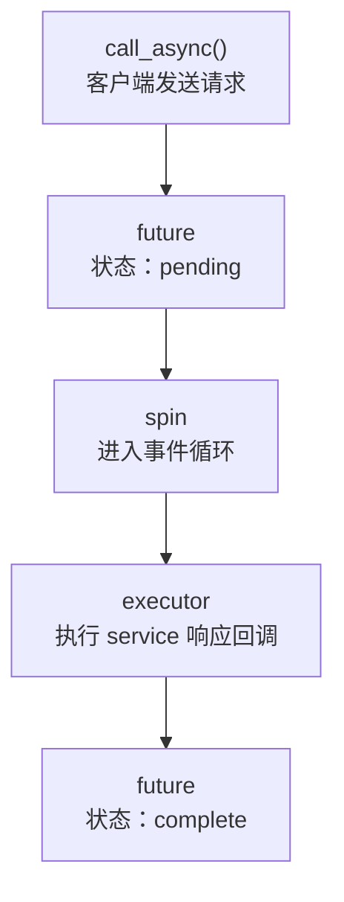
```mermaid
flowchart TD
    A["call_async()<br/>客户端发送请求"] --> B["future <br/>状态：pending"]
    B --> C["spin<br/>进入事件循环"]
    C --> D["executor<br/>执行 service 响应回调"]
    D --> E["future<br/>状态：complete"]

```


#### 同步通信与异步通信的写法

> 因为同步通信和异步通信只是客户端代码改变，所以这里只展示客户端
>
> 这里仅展示C++的写法

- **`同步通信`**

  - **关键代码**：

    ```c++
    // 客户端发送服务请求给服务端
    // async_send_request表示异步发送请求
    auto future = client->async_send_request(request);  
    
    // 阻塞线程，直到服务端响应客户端
    // 虽然发送请求写的是 call_async，但 spin_until_future_complete 让它变成了同步
    auto status = rclcpp::spin_until_future_complete(this->get_node_base_interface(), future);
    ```

  - **完整示例（客户端）**：

    ```c++
    #include "rclcpp/rclcpp.hpp"
    #include <srv_interfaces/srv/add_two_ints.hpp>
    
    using namespace std::chrono_literals;
    
    class AddTwoIntsClient : public rclcpp::Node{
    public:
        AddTwoIntsClient():rclcpp::Node("add_two_ints_client")
        {
            // 创建一个客户端
            client = this->create_client<srv_interfaces::srv::AddTwoInts>("/add_two_ints");
    
            // 发送请求
            int a=3;
            int b=5;
            this->async_send_request(a,b);
        }
    
    private:
        // 客户端发送请求的函数（注意这个不是回调函数）
        void async_send_request(int a,int b)
        {
            // 等待服务端上线
            while (!client->wait_for_service(1s)) 
            {
                if (!rclcpp::ok()) 
                {
                    RCLCPP_ERROR(this->get_logger(), "等待服务端上线时，客户端被中断");
                    return;
                }
                RCLCPP_INFO(this->get_logger(), "正在等待服务端上线");
            }
    
            // 构建请求消息
            auto request = std::make_shared<srv_interfaces::srv::AddTwoInts::Request>();
            request->a = a;
            request->b = b;
    
            // 客户端发送服务请求给服务端
            // async_send_request表示异步发送请求
            auto future = client->async_send_request(request);  
            
            // 阻塞线程，直到服务端响应客户端
            // 虽然发送请求写的是 call_async，但 spin_until_future_complete 让它变成了同步
            auto status = rclcpp::spin_until_future_complete(this->get_node_base_interface(), future);
    
            // 处理服务端响应
            if (status == rclcpp::FutureReturnCode::SUCCESS)
            {
                RCLCPP_INFO(this->get_logger(),"服务端响应: %ld + %ld = %ld",request->a, request->b, future.get()->sum);
            }
            else
            {
                RCLCPP_ERROR(this->get_logger(), "呼叫服务失败！");
            }
        }
    
        // 声明一个客户端
        rclcpp::Client<srv_interfaces::srv::AddTwoInts>::SharedPtr client;
    };
    
    
    int main(int argc, char **argv)
    {
      rclcpp::init(argc, argv);
      auto node = std::make_shared<AddTwoIntsClient>();
      rclcpp::spin(node);
      rclcpp::shutdown();
      return 0;
    }
    ```

- **`异步通信`**

  - **关键代码**：

    ```c++
    // 客户端发送服务请求给服务端
    // 当客户端接收到服务端返回的请求时，才进入回调函数处理服务端发送过来的数据
    client->async_send_request(request,回调函数);
    ```

  - **完整示例（客户端）**：

    ```c++
    #include "rclcpp/rclcpp.hpp"
    #include <srv_interfaces/srv/add_two_ints.hpp>
    
    using namespace std::chrono_literals;
    
    class AddTwoIntsClient : public rclcpp::Node
    {
    public:
        AddTwoIntsClient(): Node("add_two_ints_client")
        {
            client_ = this->create_client<srv_interfaces::srv::AddTwoInts>("/add_two_ints");
            int a = 3;
            int b = 5;
            async_send_request(a, b);
        }
    
    private:
        // 异步发送请求
        void async_send_request(int a, int b)
        {
            // 等待服务端上线（这里是阻塞的，但只发生在构造阶段，一般可接受）
            while (!client_->wait_for_service(1s))
            {
                if (!rclcpp::ok())
                {
                    RCLCPP_ERROR(
                        this->get_logger(),
                        "等待服务端上线时，客户端被中断");
                    return;
                }
                RCLCPP_INFO(this->get_logger(), "正在等待服务端上线");
            }
    
            auto request =std::make_shared<srv_interfaces::srv::AddTwoInts::Request>();
            request->a = a;
            request->b = b;
    
            // 真正的异步：注册回调
            // 当客户端接收到服务端返回的请求时，才进入回调函数处理服务端发送过来的数据
            client_->async_send_request(request,std::bind(&AddTwoIntsClient::response_callback,this,std::placeholders::_1));
        }
    
        // service 响应回调
        void response_callback(rclcpp::Client<srv_interfaces::srv::AddTwoInts>::SharedFuture future)
        {
            auto response = future.get();
            RCLCPP_INFO(this->get_logger(),"服务端响应: %ld",response->sum);
        }
    
    private:
        rclcpp::Client<srv_interfaces::srv::AddTwoInts>::SharedPtr client_;
    };
    
    int main(int argc, char **argv)
    {
        rclcpp::init(argc, argv);
        auto node = std::make_shared<AddTwoIntsClient>();
        rclcpp::spin(node);     // 只 spin，不阻塞等待 future
        rclcpp::shutdown();
        return 0;
    }
    ```


## 2.3 动作通信

### 2.3.1 什么是动作通信


- `动作通信`是建立在`话题通信`和`服务通信`之上的一种高级通信机制，用来处理**目标可取消、可反馈、可返回结果的长时间任务**。

- Action的**三大组成部分**

  - **目标**（客户端->服务端）：是对`服务通信`的封装，即**Action客户端**告诉**服务端**要做什么，服务端针对该目标要有响应。解决了不能确认服务端接收并处理目标问题

  - **反馈**(服务端->客户端)：是对`话题通信`的封装。即**Action服务端**告诉**客户端**此时做的进度如何（类似与工作汇报）。解决了`服务通信`(service)执行过程中没有反馈的问题

  - **结果**(服务端->客户端)：是对`服务通信`的封装，即**Action服务端**最终告诉**客户端**其执行结果，结果最后返回，用于表示任务最终执行情况。

  > 一个Action = 3个服务 + 2个话题
  >
  > - **3个服务**：
  >   - **目标传递服务（Send Goal）**：客户端告诉服务端->“我要你执行这个任务，参数是这些”
  >   - **结果传递服务（Get Result）**：客户端询问服务端->“这个任务最终结果是什么？”
  >   - **取消执行服务（Cancel Goal）**：客户端告诉服务端->“这个任务我不想要了，停掉”
  >
  > - **2个话题**（都是 服务端->客户端）：
  >   - **反馈话题（Feedback Topic）**：服务端在执行过程中不断告诉客户端->“我现在做到哪一步了”
  >   - **状态话题（Status Topic）**：服务端广播所有 Goal 的状态：执行中、成功、失败、被取消


### 2.3.2 实现一个动作通信

- 创建**自定义Action接口**`Fibonacci.action`

  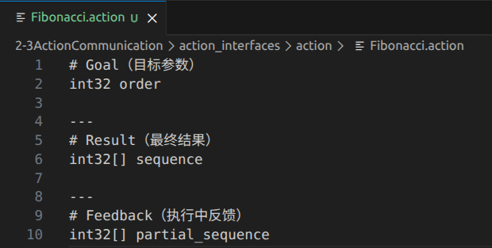

- **`c++`实现**

  - **Action客户端**

    ```c++
    #include <memory>
    
    #include "rclcpp/rclcpp.hpp"
    #include "rclcpp_action/rclcpp_action.hpp"
    
    #include "action_interfaces/action/fibonacci.hpp"
    
    using Fibonacci = action_interfaces::action::Fibonacci;
    using GoalHandleFibonacci = rclcpp_action::ClientGoalHandle<Fibonacci>;
    
    class FibonacciActionClient : public rclcpp::Node
    {
    public:
        // 构造函数
        FibonacciActionClient(): Node("fibonacci_action_client")
        {
            // 创建 Action 客户端
            this->client_ = rclcpp_action::create_client<Fibonacci>(this,"fibonacci");
    
            // 等待 Action 服务端上线
            // 如果 Action 服务端还没启动，这里会阻塞等待
            this->client_->wait_for_action_server();
    
            // 构建一个 Goal 消息
            // Fibonacci::Goal 对应 .action 文件中的 Goal 部分
            Fibonacci::Goal goal_msg;
            goal_msg.order = 10;
    
            // 异步发送 Goal（即 目标传递服务 中 客户端发送请求给服务端）
            rclcpp_action::Client<Fibonacci>::SendGoalOptions options;
            options.feedback_callback =std::bind(&FibonacciActionClient::feedback_callback,this,std::placeholders::_1,std::placeholders::_2);
            options.result_callback =std::bind(&FibonacciActionClient::result_callback,this,std::placeholders::_1);
            this->client_->async_send_goal(goal_msg, options);
        }
    
    private:
        // 反馈话题 的回调函数
        // 当服务端在 execute_callback 中调用 publish_feedback 时触发
        void feedback_callback(GoalHandleFibonacci::SharedPtr goal_handle,const std::shared_ptr<const Fibonacci::Feedback> feedback)
        {
            RCLCPP_INFO(this->get_logger(),"接收服务端反馈: [%d, %d, %d ...]",feedback->partial_sequence[0],feedback->partial_sequence[1],feedback->partial_sequence.back());
        }
    
        // 结果传递服务 中 客户端接收服务端数据的回调函数
        void result_callback(const GoalHandleFibonacci::WrappedResult & result)
        {
            RCLCPP_INFO(this->get_logger(), "结果:");
            for (auto number : result.result->sequence) 
            {
                RCLCPP_INFO(this->get_logger(), "%d", number);
            }
        }
    
        // 声明一个Action服务端
        rclcpp_action::Client<Fibonacci>::SharedPtr client_;
    };
    
    int main(int argc, char ** argv)
    {
      rclcpp::init(argc, argv);
      rclcpp::spin(std::make_shared<FibonacciActionClient>());
      rclcpp::shutdown();
      return 0;
    }
    ```

  - **Action服务端**

    ```c++
    #include <memory>
    #include <thread>
    #include <chrono>
    
    #include "rclcpp/rclcpp.hpp"
    #include "rclcpp_action/rclcpp_action.hpp"
    
    #include "action_interfaces/action/fibonacci.hpp"
    
    using Fibonacci = action_interfaces::action::Fibonacci;
    using GoalHandleFibonacci = rclcpp_action::ServerGoalHandle<Fibonacci>;
    
    class FibonacciActionServer : public rclcpp::Node
    {
    public:
      FibonacciActionServer()
      : Node("fibonacci_action_server")
      {
        // 创建一个 ActionServer
        // 这一行代码内部会自动创建：
        // 1. 目标传递服务（Send Goal）
        // 2. 结果传递服务（Get Result）
        // 3. 取消执行服务（Cancel Goal）
        // 4. 反馈话题（Feedback Topic）
        // 5. 状态话题（Status Topic）
        this->action_server_ =
          rclcpp_action::create_server<Fibonacci>(
            this,
            "fibonacci",
            std::bind(&FibonacciActionServer::goal_callback, this, std::placeholders::_1, std::placeholders::_2),
            std::bind(&FibonacciActionServer::cancel_callback, this, std::placeholders::_1),
            std::bind(&FibonacciActionServer::execute_callback, this, std::placeholders::_1)
          );
      }
    
    private:
      rclcpp_action::Server<Fibonacci>::SharedPtr action_server_;
    
      // 目标传递服务 中 服务端的回调函数
      rclcpp_action::GoalResponse goal_callback(
        const rclcpp_action::GoalUUID &,
        std::shared_ptr<const Fibonacci::Goal> goal)
      {
        RCLCPP_INFO(
          this->get_logger(),
          "收到新的目标请求，order = %d",
          goal->order
        );
    
        // 这里直接无条件接受
        return rclcpp_action::GoalResponse::ACCEPT_AND_EXECUTE;
      }
    
      // 取消执行服务 中 服务端的回调函数
      rclcpp_action::CancelResponse cancel_callback(
        const std::shared_ptr<GoalHandleFibonacci> goal_handle)
      {
        RCLCPP_INFO(this->get_logger(), "收到取消目标的请求");
        return rclcpp_action::CancelResponse::ACCEPT;
      }
    
      // 执行任务的回调函数
      // 这里面包含了 ：
      // - Action执行 结果传递服务 服务端回调
      // - Action执行 反馈话题 发布者发布
      void execute_callback(const std::shared_ptr<GoalHandleFibonacci> goal_handle)
      {
        RCLCPP_INFO(this->get_logger(), "开始执行目标任务");
    
        auto feedback = std::make_shared<Fibonacci::Feedback>();
        auto result = std::make_shared<Fibonacci::Result>();
    
        std::vector<int> sequence;
        sequence.push_back(0);
        sequence.push_back(1);
    
        // 根据 Goal 中的参数决定计算长度
        for (int i = 2; i < goal_handle->get_goal()->order; ++i) {
          // 检查是否有取消请求
          if (goal_handle->is_canceling()) {
            goal_handle->canceled(result);
            RCLCPP_INFO(this->get_logger(), "目标任务已被取消");
            return;
          }
    
          // 任务没有被取消
          sequence.push_back(sequence[i - 1] + sequence[i - 2]);
    
          // 反馈话题（Feedback Topic）
          // 将当前计算进度作为反馈发送给客户端
          feedback->partial_sequence = sequence;
          goal_handle->publish_feedback(feedback);
    
          std::this_thread::sleep_for(std::chrono::seconds(1));
        }
    
        // 结果传递服务（Get Result）
        result->sequence = sequence;
        goal_handle->succeed(result);
        RCLCPP_INFO(this->get_logger(), "目标任务执行完成，返回最终结果");
      }
    };
    
    int main(int argc, char ** argv)
    {
      rclcpp::init(argc, argv);
      rclcpp::spin(std::make_shared<FibonacciActionServer>());
      rclcpp::shutdown();
      return 0;
    }
    ```

    

- **`Python`实现**

  - **Action客户端**

    ```python
    import rclpy
    from rclpy.node import Node
    from rclpy.action import ActionClient
    
    from action_interfaces.action import Fibonacci
    
    class FibonacciActionClient(Node):
        # 构造函数
        def __init__(self):
            super().__init__('fibonacci_action_client')
    
            # 创建Action客户端
            self._client = ActionClient(self, Fibonacci, 'fibonacci')
    
            # 等待 Action 服务端上线
            # 如果Action服务端还没启动，这里会阻塞等待
            self._client.wait_for_server()
    
            # 构建一个Goal消息
            # Fibonacci.Goal 对应 .action 文件中的 Goal 部分
            goal_msg = Fibonacci.Goal()
            goal_msg.order = 10
            
            # 异步发送 Goal（即 目标传递服务 中 客户端发送请求给服务端）
            self._send_goal_future = self._client.send_goal_async(
                goal_msg,                                           # 请求的内容
                feedback_callback=self.feedback_callback            # 注册反馈回调函数（反馈话题的回调函数）
            )
    
            # 注册 目标传递服务 响应回调函数
            # 当 Action 服务端对 Goal 作出“是否接受”的决定后，该 future 完成，并自动调用 goal_response_callback
            self._send_goal_future.add_done_callback(self.goal_response_callback)
    
        # 反馈话题 的回调函数
        # 当服务端在 execute_callback 中调用 publish_feedback 时触发
        def feedback_callback(self, feedback_msg):
            self.get_logger().info(f'接受服务端反馈: {feedback_msg.feedback.partial_sequence}')
    
        # 目标传递服务 中 客户端接收服务端数据的回调函数
        def goal_response_callback(self, future):
            # 获取futre中的内容
            goal_handle = future.result()
            if not goal_handle.accepted:
                self.get_logger().info('目标被拒绝！')
                return
            else:
                self.get_logger().info('目标被接受！')
    
                # 结果传递服务（Get Result）
                # 向 结果传递服务 发送请求，请求该 Goal 的最终执行结果
                self._get_result_future = goal_handle.get_result_async()                # 向 结果传递服务 发出请求（异步调用），get_result_async函数会返回一个future对象
                self._get_result_future.add_done_callback(self.get_result_callback)     # 注册 结果传递服务 的响应回调函数。当服务端处理完毕后的结果返回时，自动调用 get_result_callback函数
    
        # 结果传递服务 中 客户端接收服务端数据的回调函数
        def get_result_callback(self, future):
            result = future.result().result
            self.get_logger().info(f'结果: {result.sequence}')
    
    
    def main():
        rclpy.init()
        node = FibonacciActionClient()
        rclpy.spin(node)
        rclpy.shutdown()
    
    if __name__ == '__main__':
        main()
    ```

  - **Action服务端**

    ```python
    import time
    
    import rclpy
    from rclpy.node import Node
    
    # ActionServer：Action 服务端封装
    # GoalResponse：是否接受目标
    # CancelResponse：是否接受取消请求
    from rclpy.action import ActionServer, GoalResponse, CancelResponse
    
    # 引入自定义的Action接口
    from action_interfaces.action import Fibonacci
    
    
    class FibonacciActionServer(Node):
        """
        Fibonacci Action 服务端节点
    
        这个节点的职责是：
        - 接收客户端发送的 Goal（目标）
        - 执行任务（这里是计算斐波那契数列）
        - 在执行过程中发布 Feedback（反馈）
        - 在结束时返回 Result（结果）
        - 支持任务取消
        """
    
        def __init__(self):
            super().__init__('fibonacci_action_server')
    
            # 创建一个 ActionServer
            # 这一行代码内部会自动创建：
            # 1. 目标传递服务（Send Goal）
            # 2. 结果传递服务（Get Result）
            # 3. 取消执行服务（Cancel Goal）
            # 4. 反馈话题（Feedback Topic）
            # 5. 状态话题（Status Topic）
            self._action_server = ActionServer(
                self,
                Fibonacci,                                  # Action 类型
                'fibonacci',                                # Action 名称
                execute_callback=self.execute_callback,     # 执行任务回调
                goal_callback=self.goal_callback,           # 目标传递服务回调
                cancel_callback=self.cancel_callback        # 取消任务回调
            )
    
        # 执行任务的回调函数
        # 这里面包含了 ：
        # - Action执行 结果传递服务 服务端回调
        # - Action执行 反馈话题 发布者发布
        async def execute_callback(self, goal_handle):
            """
            Action 的核心执行函数
    
            这个函数：
            - 运行在服务端
            - 执行耗时任务
            - 通过 goal_handle 发布反馈
            - 最终返回 Result
            """
            self.get_logger().info('开始执行目标任务')
    
            feedback_msg = Fibonacci.Feedback() # 构造 Feedback 消息对象
            result = Fibonacci.Result()         # 构造 Result 消息对象
            sequence = [0, 1]                   # 初始化斐波那契数列
    
            # 根据 Goal 中的参数决定计算长度
            for i in range(2, goal_handle.request.order):
                # 检查是否有取消请求
                if goal_handle.is_cancel_requested:
                    goal_handle.canceled()                  # 标记该 Goal 已被取消
                    self.get_logger().info('目标任务已被取消')
                    return Fibonacci.Result()               # 返回一个空结果
                
                # 任务没有被取消
                else:
                    # 计算下一个斐波那契数
                    sequence.append(sequence[i - 1] + sequence[i - 2])
    
                    # 反馈话题（Feedback Topic）
                    # 将当前计算进度作为反馈发送给客户端
                    feedback_msg.partial_sequence = sequence    # 构造Feedback类型的消息
                    goal_handle.publish_feedback(feedback_msg)  # 发布者发布反馈信息
                    time.sleep(1)                               # 模拟耗时操作
    
            # 结果传递服务（Get Result）
            goal_handle.succeed()                                   # 任务正常完成，标记为成功
            result.sequence = sequence                              # 构造Result类型的消息
            self.get_logger().info('目标任务执行完成，返回最终结果')
            return result                                           # 返回 Result（客户端通过 get_result_async() 获取）
    
        # 目标传递服务 中 服务端的回调函数
        def goal_callback(self, goal_request):
            """
            当客户端发送 Goal 时调用
    
            参数：
              - goal_request：客户端发送的目标参数（Goal）
            返回值：
              - GoalResponse.ACCEPT：接受该目标
              - GoalResponse.REJECT：拒绝该目标
            """
            self.get_logger().info(f'收到新的目标请求，order = {goal_request.order}')
    
            # 这里直接无条件接受
            return GoalResponse.ACCEPT
    
        # 取消执行服务服务 中 服务端的回调函数
        def cancel_callback(self, goal_handle):
            """
            当客户端请求取消 Goal 时调用
    
            参数：
              - goal_handle：当前正在执行的目标句柄
            返回值：
              - CancelResponse.ACCEPT：接受取消
              - CancelResponse.REJECT：拒绝取消
            """
            self.get_logger().info('收到取消目标的请求')
            return CancelResponse.ACCEPT                # 允许客户端取消任务，此时goal_handle中的is_cancel_requested属性会变为true
            #return CancelResponse.REJECT               # 拒绝客户端取消任务，此时goal_handle中的is_cancel_requested属性不会变
    
    def main():
        rclpy.init()
        node = FibonacciActionServer()
        rclpy.spin(node)
        rclpy.shutdown()
    
    
    if __name__ == '__main__':
        main()
    ```


## 2.5 接口介绍与自定义接口

### 2.5.1 ROS2通信接口介绍

#### 什么是接口

> `接口`就是不同程序之间使用什么**具体的消息类型**来进行通讯

例如：

```
std_msgs/msg/String
```

```
std_msgs/msg/UInt32
```

如果用图来表示接口怎么用：

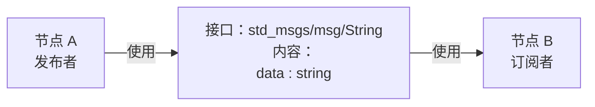
```mermaid
flowchart LR
    A[节点 A<br/>发布者] -->|使用| I
    I -->|使用| B[节点 B<br/>订阅者]

    I[接口：std_msgs/msg/String<br/>内容：<br/>data : string]

```


**使用接口对做机器人有什么好处？**

> 接口的作用，是把`算法`和`硬件`隔离开来。

**以激光雷达为例**

- **机器人做导航，需要什么？**

  当机器人进行导航时，算法需要的不是“某品牌雷达的数据”，而是：

  - 障碍物距离

  - 每个角度对应的测距值

  👉 **算法真正关心的是“扫描结果”，不是雷达型号。**

- **如果没有统一的接口，会发生什么？**

  假设你用了三种不同的激光雷达：

  | 雷达   | 数据格式     |
  | ------ | ------------ |
  | 雷达 A | 自定义结构 A |
  | 雷达 B | 自定义结构 B |
  | 雷达 C | 自定义结构 C |

  那么结果就是：每换一个雷达，**导航程序就要改一次**，而且每个厂家提供的API不同，所以注定要修改不同的程序

- **雷达厂商需要做什么？**

  不同厂商的雷达：硬件不同、通信协议不同、原始数据格式不同

  但它们**只需要做一件事**：

  > **把自己的雷达数据，转换成 `LaserScan` 接口格式**

  ```
  厂家驱动节点
  原始雷达数据  ->  sensor_msgs/msg/LaserScan
  ```

- 算法程序需要做什么？**（这里的算法程序就是我们需要写的）**

  - 导航算法只做一件事：订阅sensor_msgs/msg/LaserScan`，接收里面的数据进行处理

  - 它不需要关心：
    - 雷达是 2D 还是 3D
    - 是哪家厂商
    - 驱动怎么写


#### ROS2接口介绍

> 哎呀，上面讲的东西都太抽象了，来点具体的玩意👇

- **我们来拿一个具体的ROS2接口来作为例子**

  ```bash
  std_msgs/msg/Bool
  ```

  这个看似**目录结构**的接口（如果这里是目录，那就有三个层次），代表了ROS2中的**三个接口层次**：

  | 层级                      | 示例                     | 是什么                                                       |
  | ------------------------- | ------------------------ | ------------------------------------------------------------ |
  | **ROS2功能包（package）** | `std_msgs`               | 装接口的“文件夹”                                             |
  | **接口类型**              | `msg` / `srv` / `action` | 接口的分类，其中：<br />- `msg`代表`话题通信`的接口<br />- `srv`代表`服务通信`的接口<br />- `action`代表`动作通信`的接口 |
  | **具体接口**              | `Bool`                   | 具体的数据结构，比如这里的Bool里面有一个属性data，这个data是C++的bool类型的 |


- **怎么查看ROS2中有什么接口？**

  - 先在终端source一下ros2**（如果通过小鱼一键安装ros2的话，就可以不用自己source，因为我们一开终端就会自动帮我们source ros2工作目录）**

  - **在终端输入**

    ```bash
    ros2 interface list			# 这个代码表示把ros2的接口列举出来
    ```

    > [!NOTE]
    >
    > 其实可以把ros2理解为一个ros2工作目录，我们还可以source我们自己写的ros2工作目录，如果里面有自定义ros2接口，那么自定义的ros2接口也会显示出来

  - **终端显示**

    ```bash
    Messages:											# 这个是话题通信(Topic)的接口
        std_msgs/msg/Bool
        std_msgs/msg/Byte
        ....
    Services:											# 这个是服务通信(Service)的接口
        rosbag2_interfaces/srv/Burst
        rosbag2_interfaces/srv/GetRate
    	....
    Actions:											# 这个是动作通信(Action)的接口
        action_tutorials_interfaces/action/Fibonacci
        tf2_msgs/action/LookupTransform
    	....
    ```

  

- **怎么查看某个功能包下有什么接口？**

  - 先在终端source一下ros2

  - 在终端输入：

    ```bash
    ros2 interface package ros2功能包
    ```

  - 举个例子：

    我在终端输入：

    ```bash
    ros2 interface package std_msgs
    ```

    终端打印：

    ```bash
    # 这些都是std_msgs这个功能包下的接口
    # 因为std_msgs功能包只有msg文件夹，所以打印出来只有msg（话题通信的接口）
    std_msgs/msg/Int64
    std_msgs/msg/Float64MultiArray
    std_msgs/msg/MultiArrayDimension
    std_msgs/msg/UInt16MultiArray
    std_msgs/msg/Header
    std_msgs/msg/MultiArrayLayout
    std_msgs/msg/Int64MultiArray
    std_msgs/msg/ByteMultiArray
    std_msgs/msg/Char
    std_msgs/msg/Float64
    std_msgs/msg/UInt64
    std_msgs/msg/Bool
    std_msgs/msg/Int8
    std_msgs/msg/Int8MultiArray
    std_msgs/msg/Empty
    std_msgs/msg/Float32MultiArray
    std_msgs/msg/String
    std_msgs/msg/UInt8MultiArray
    std_msgs/msg/Int32
    std_msgs/msg/Byte
    std_msgs/msg/UInt16
    std_msgs/msg/ColorRGBA
    std_msgs/msg/Int32MultiArray
    std_msgs/msg/UInt32
    std_msgs/msg/UInt32MultiArray
    std_msgs/msg/UInt8
    std_msgs/msg/Int16MultiArray
    std_msgs/msg/UInt64MultiArray
    std_msgs/msg/Float32
    std_msgs/msg/Int16
    ```


- **怎么查看某个接口的定义？**

  - 先在终端source一下ros2

  - 在终端输入：

    ```bash
    ros2 interface show 具体的某个接口
    ```

  - 举个例子：

    我在终端输入：

    ```bash
    ros2 interface show std_msgs/msg/Bool
    ```

    终端打印：

    ```bash
    # 这里是一些警告信息
    # This was originally provided as an example message.
    # It is deprecated as of Foxy
    # It is recommended to create your own semantically meaningful message.
    # However if you would like to continue using this please use the equivalent in example_msgs.
    
    bool data	# 这是std_msgs/msg/Bool所拥有的属性
    ```


- 接口指令表

  | 你想干什么         | 命令                                    |
  | ------------------ | --------------------------------------- |
  | 列出所有接口       | `ros2 interface list`                   |
  | 看某个包有哪些接口 | `ros2 interface package std_msgs`       |
  | 看某个接口的定义   | `ros2 interface show std_msgs/msg/Bool` |


#### ROS2自定义接口

ROS2提供4种通信方式：

- `话题-Topics`

- `服务-Services`

- `动作-Action`

- `参数-Parameters`


所定义的接口也被分为

- **话题接口**

  - **命名格式**：`xxx.msg`

  - **内容**（示例）：

    ```int64 num
    int64 num
    ```

- **服务接口**

  - **命名格式**：`xxx.srv`

  - **内容**（示例）：

    ```
    int64 a
    int64 b
    ---
    int64 sum
    ```


- **动作接口**

  - **命名格式**：`xxx.action`

  - **内容**（示例）：

    ```
    int32 order
    ---
    int32[] sequence
    ---
    int32[] partial_sequence
    ```


- **参数服务器没有独立的接口**


#### ROS2接口常用CLI命令

##### 查看接口列表（当前环境下）

```bash
ros2 interface list
```

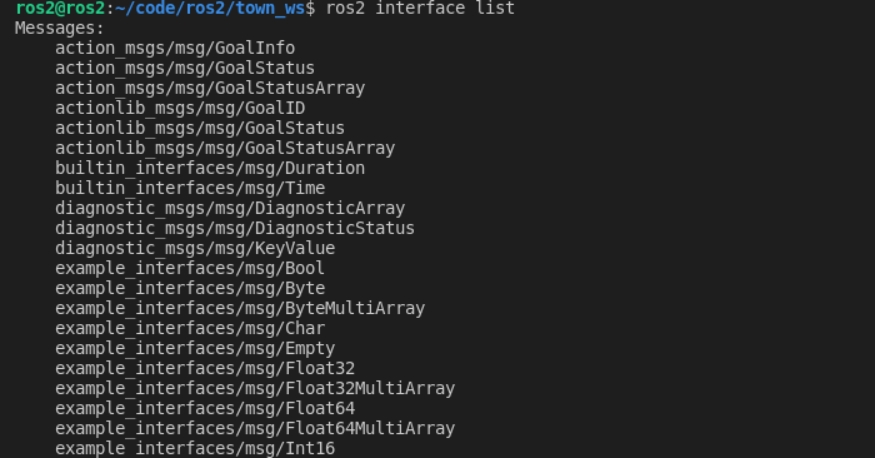

##### 查看所有接口包

```bash
ros2 interface packages
```

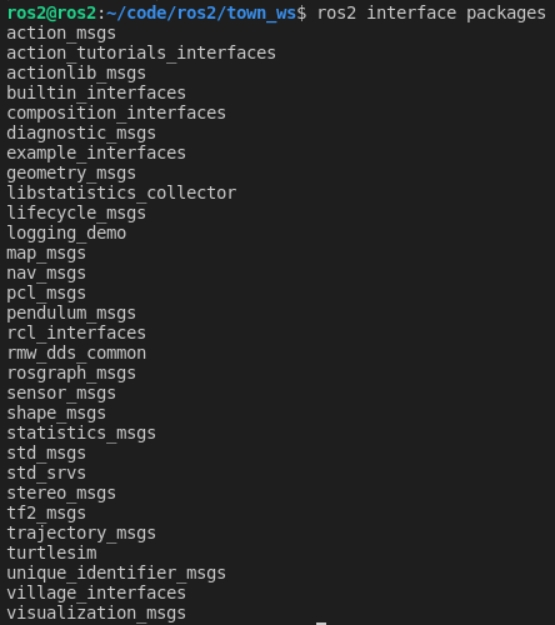

##### 查看某一个包下的所有接口

```bash
ros2 interface package 接口包
```

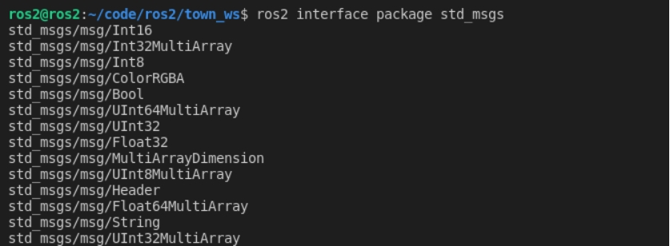


##### 查看某一个接口详细的内容

```bash
ros2 interface show std_msgs/msg/String
```

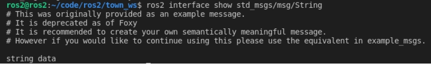


##### 输出某一个接口所有属性

```bash
ros2 interface proto sensor_msgs/msg/Image
```

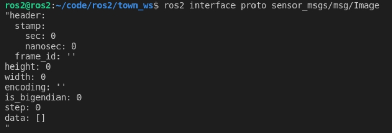


### 2.5.2 ROS2自定义通信接口

> [!NOTE]
>
> - 一般ROS2自定义通信接口的ROS2功能包是使用`ament_cmake`创建的
>
> - 在以下示例中，都是用`ament_cmake_auto`

<p align="center" style="color: red;">【教训：路径不能有中文！！！】</p>
<p align="center" style="color: red;">【教训：路径不能有中文！！！】</p>
<p align="center" style="color: red;">【教训：路径不能有中文！！！】</p>

#### 自定义msg接口

##### 定义msg接口的流程

- **大致流程**：

  - 新建一个`ROS2功能包`

  - 在这个**ROS2功能包**中新建`msg文件夹`，并在文件夹下新建`xxx.msg`

  - 在`xxx.msg`下编写消息内容并保存

  - 在`CmakeLists.txt`添加msg文件目录

  - 在`package.xml`中添加xxx.msg所需的依赖

  - 编译功能包即可生成python与c++头文件

- **具体流程实现**：

  - **新建ROS2功能包**

    在**工作空间**的**src文件夹**下**打开终端**，运行下面的指令：

    ```bash
    ros2 pkg create 功能包名字(自定义) --build-type ament_cmake
    ```

    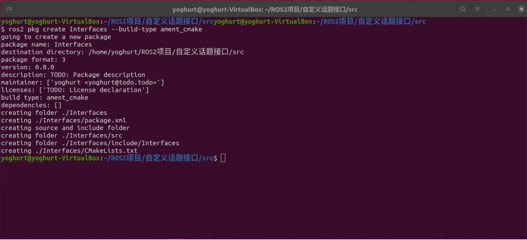

  - **新建msg文件夹和.msg文件**

    - 在功能包目录下**新建msg文件夹**

      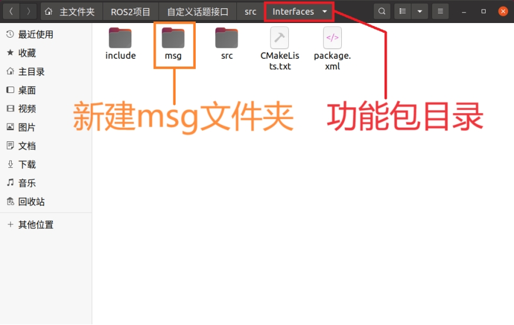

    - 在**msg文件夹**里面新建**.msg文件**

      > [!WARNING] 
      >
      > `.msg文件`**开头首字母**一定要**大写**，这是ROS2的强制要求

      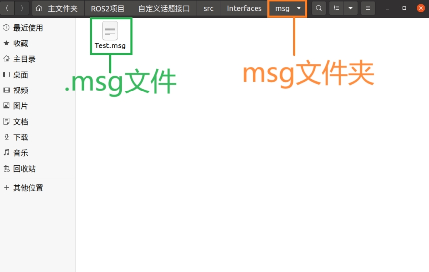

  - **编辑`.msg文件`**

    ```
    # 消息头，包含时间戳和坐标系信息
    std_msgs/Header header
    
    # 一个布尔状态量，注意这是C++里面的bool，也就是说自定义接口可以使用C++自带类型
    bool flag
    ```

  - **修改`CMakeLists.txt`**

    - 需要添加的

      > [!NOTE]
      >
      > 注意添加的位置

      ```cmake
      # 生成 ROS 2 接口（msg / srv / action）
      rosidl_generate_interfaces(
        ${PROJECT_NAME}        # 接口所属的包名，一般使用当前工程名
        "msg/Test.msg"         # 要生成的消息文件路径（相对于包根目录）
        DEPENDENCIES std_msgs  # 该消息中使用到的其他消息包依赖
      )
      ```

    - 具体代码展示

      ```cmake
      cmake_minimum_required(VERSION 3.8)
      project(custom_msg_interfaces)
      
      # 如果使用 GCC 或 Clang 编译器，开启常用的警告选项【不必理会】
      if(CMAKE_COMPILER_IS_GNUCXX OR CMAKE_CXX_COMPILER_ID MATCHES "Clang")
        add_compile_options(-Wall -Wextra -Wpedantic)
      endif()
      
      find_package(ament_cmake_auto REQUIRED)
      ament_auto_find_build_dependencies()
      
      # 生成 ROS 2 接口（msg / srv / action）
      rosidl_generate_interfaces(
        ${PROJECT_NAME}        # 接口所属的包名，一般使用当前工程名
        "msg/Test.msg"         # 要生成的消息文件路径（相对于包根目录）
        DEPENDENCIES std_msgs  # 该消息中使用到的其他消息包依赖
      )
      
      # 测试与代码规范检查相关【不必理会】
      if(BUILD_TESTING)
        find_package(ament_lint_auto REQUIRED)
        set(ament_cmake_copyright_FOUND TRUE)
        set(ament_cmake_cpplint_FOUND TRUE)
        ament_lint_auto_find_test_dependencies()
      endif()
      
      ament_auto_package()
      ```

  - **修改`package.xml`**

    - 要添加的

      ```xml
      <!-- 必须要添加这个 -->
      <member_of_group>rosidl_interface_packages</member_of_group>
      
      <!-- 添加查找生成接口所需的依赖包 -->
      <buildtool_depend>rosidl_default_generators</buildtool_depend>
      <exec_depend>rosidl_default_runtime</exec_depend>
      
      <!-- 添加.msg文件要依赖的 -->
      <depend>std_msgs</depend>
      ```

    - 具体代码展示

      ```xml
      <?xml version="1.0"?>
      <?xml-model href="http://download.ros.org/schema/package_format3.xsd" schematypens="http://www.w3.org/2001/XMLSchema"?>
      <package format="3">
        <name>custom_msg_interfaces</name>
        <version>0.0.0</version>
        <description>TODO: Package description</description>
        <maintainer email="1310946137@qq.com">miku</maintainer>
        <license>TODO: License declaration</license>
      
        <buildtool_depend>ament_cmake</buildtool_depend>
        
        <!-- 必须要添加这个 -->
        <member_of_group>rosidl_interface_packages</member_of_group>
      
        <!-- 添加查找生成接口所需的依赖包 -->
        <buildtool_depend>rosidl_default_generators</buildtool_depend>
        <exec_depend>rosidl_default_runtime</exec_depend>
      
        <!-- 添加.msg文件要依赖的 -->
        <depend>std_msgs</depend>
      
        <test_depend>ament_lint_auto</test_depend>
        <test_depend>ament_lint_common</test_depend>
      
        <export>
          <build_type>ament_cmake</build_type>
        </export>
      </package>
      ```


##### 如何在别的ROS2功能包使用自定义msg接口

> [!NOTE]
>
> 当别的ROS2功能包的编译类型使用的是：
>
> - ament_cmake：假设别的ROS2功能包使用的是`ament_cmake_auto`
> - ament_python：保持不变，不用修改setup.py

- 如果编译类型是`ament_cmake`：

  - 因为使用的是`ament_cmake_auto`，所以我们只需要在`package.xml`中添加自定义消息所在的功能包的名字作为依赖

    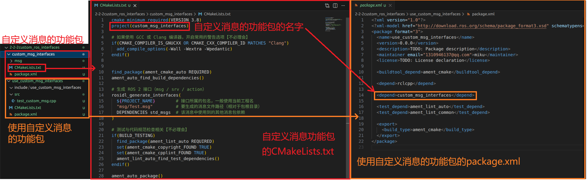

  - 在C++文件调用自定义消息

    ```c++
    #include <rclcpp/logging.hpp>
    #include <string>
    #include <rclcpp/rclcpp.hpp>
    #include <rclcpp/node.hpp>
    #include <custom_msg_interfaces/msg/test.hpp>
    
    class TestCustomMsgNode : public rclcpp::Node
    {
    public:
        TestCustomMsgNode(std::string name):rclcpp::Node(name)
        {
            // 构建一个自定义消息类型的变量
            custom_msg_interfaces::msg::Test test_msg;
            test_msg.header.frame_id = "base_link";
            test_msg.header.stamp = this->get_clock()->now();
            test_msg.flag = true;
    
            // 日志输出 自定义消息
            RCLCPP_INFO(this->get_logger(),"测试自定义消息：\ntest_msg.header.frame_id: %s\ntest_msg.header.stamp: %d\ntest_msg.flag: %d",test_msg.header.frame_id.c_str(),test_msg.header.stamp.sec,test_msg.flag);
        }
    };
    
    int main(int argc, char ** argv){
        rclcpp::init(argc, argv);
        auto node = std::make_shared<TestCustomMsgNode>("TestCustomMsgNode");
        rclcpp::spin(node);
        rclcpp::shutdown();
        return 0;
    }
    ```

  - 效果演示

    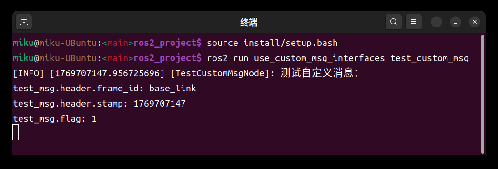

- 如果编译类型是`ament_python`

  - 因为使用的是`ament_python`，所以我们只需要在`package.xml`中添加自定义消息所在的功能包的名字作为依赖

    

  - 在python文件中调用自定义消息

    ```python
    import rclpy
    from rclpy.node import Node
    from custom_msg_interfaces.msg import Test
    
    class TestCustomMsgNode(Node):
        # 构造函数，在每个类对象初始化时都会执行
        def __init__(self,name):
            super().__init__(name)
    
            # 构建一个自定义消息类型的变量
            msg = Test()
            msg.header.frame_id="base_link"
            msg.header.stamp=self.get_clock().now().to_msg()
            msg.flag=True
            
            # 日志输出，debug自定义消息
            self.get_logger().info(f"测试自定义消息：\ntest_msg.header.frame_id: {msg.header.frame_id}\ntest_msg.header.stamp: {msg.header.stamp}\ntest_msg.flag: {msg.flag}")
    
    def main(args=None):
        rclpy.init(args=args)                           # 初始化rclpy
        node = TestCustomMsgNode("TestCustomMsgNode")   # 新建一个节点
        rclpy.spin(node)                                # 保持节点运行，检测是否收到退出指令(Ctrl+C)
        rclpy.shutdown()                                # 当接收到退出指令时，退出spin函数，执行shutdown函数来关闭rclpy
    ```

  - 效果演示

    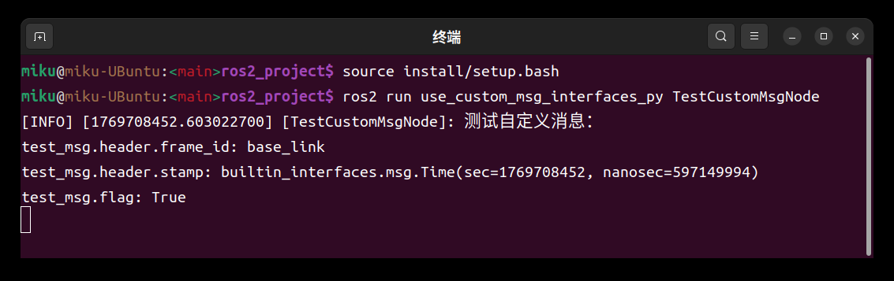


#### 自定义srv接口

##### 定义srv接口的流程

- **大致流程**：

  - 新建**`srv文件夹`**，并在文件夹下新建**`xxx.srv`**

  - 在**`xxx.srv`**下编写消息内容并保存

  - 在**`CmakeLists.txt`**添加依赖和srv文件目录

  - 在**`package.xml`**中添加xxx.srv所需的依赖

  - **编译功能包**即可生成**python**与**c++头文件**

- **具体流程实现**：

  - **新建ROS2功能包**

    在**工作空间**的**src文件夹**下**打开终端**，运行下面的指令：

    ```bash
    ros2 pkg create 功能包名字(自定义) --build-type ament_cmake
    ```

    

  - **新建srv文件夹和.srv文件**

    - **在功能包目录下新建`srv文件夹`**

      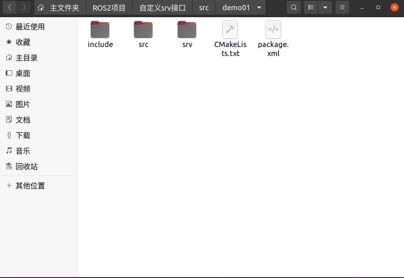

    - **在srv文件夹里面新建`.srv文件`**

      > [!WARNING]
      >
      > .srv文件开头首字母一定要大写，这是ROS2强制要求的

      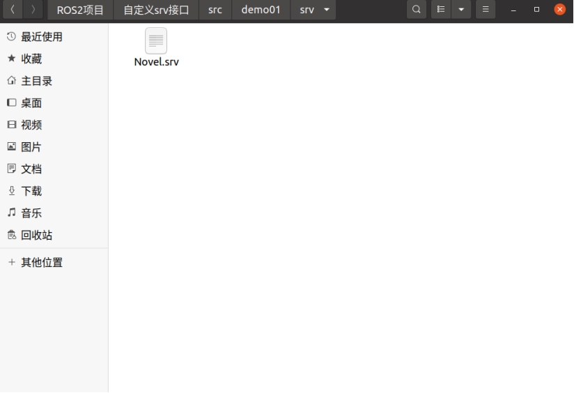

  - **编辑`.srv文件`**

    - ---上面的是 `客户端`发送给`服务端`的消息
    - ---下面的是 `服务端`返回给`客户端`的消息

    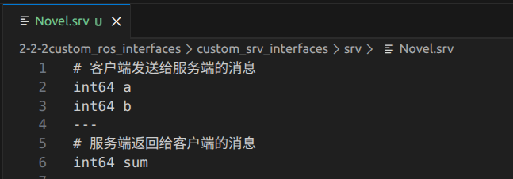

  - **修改`CMakeLists.txt`**

    - 需要添加的

      > [!NOTE] 
      >
      > 注意添加的位置

      ```cmake
      # 生成 ROS 2 接口（msg / srv / action）
      rosidl_generate_interfaces(
        ${PROJECT_NAME}        # 接口所属的包名，一般使用当前工程名
        "msg/Test.msg"         # 要生成的消息文件路径（相对于包根目录）
        DEPENDENCIES std_msgs  # 该消息中使用到的其他消息包依赖
      )
      ```

    - 具体代码展示

      ```cmake
      cmake_minimum_required(VERSION 3.8)
      project(custom_msg_interfaces)
      
      # 如果使用 GCC 或 Clang 编译器，开启常用的警告选项【不必理会】
      if(CMAKE_COMPILER_IS_GNUCXX OR CMAKE_CXX_COMPILER_ID MATCHES "Clang")
        add_compile_options(-Wall -Wextra -Wpedantic)
      endif()
      
      find_package(ament_cmake_auto REQUIRED)
      ament_auto_find_build_dependencies()
      
      # 生成 ROS 2 接口（msg / srv / action）
      rosidl_generate_interfaces(
        ${PROJECT_NAME}        # 接口所属的包名，一般使用当前工程名
        "msg/Test.msg"         # 要生成的消息文件路径（相对于包根目录）
        DEPENDENCIES std_msgs  # 该消息中使用到的其他消息包依赖
      )
      
      # 测试与代码规范检查相关【不必理会】
      if(BUILD_TESTING)
        find_package(ament_lint_auto REQUIRED)
        set(ament_cmake_copyright_FOUND TRUE)
        set(ament_cmake_cpplint_FOUND TRUE)
        ament_lint_auto_find_test_dependencies()
      endif()
      
      ament_auto_package()
      ```

    - **修改`package.xml`**

      - 要添加的

        ```xml
        <!-- 必须要添加这个 -->
        <member_of_group>rosidl_interface_packages</member_of_group>
        
        <!-- 添加查找生成接口所需的依赖包 -->
        <buildtool_depend>rosidl_default_generators</buildtool_depend>
        <exec_depend>rosidl_default_runtime</exec_depend>
        
        <!-- 添加.msg文件要依赖的 -->
        <depend>std_msgs</depend>
        ```

      - 具体代码展示

        ```xml
        <?xml version="1.0"?>
        <?xml-model href="http://download.ros.org/schema/package_format3.xsd" schematypens="http://www.w3.org/2001/XMLSchema"?>
        <package format="3">
          <name>custom_msg_interfaces</name>
          <version>0.0.0</version>
          <description>TODO: Package description</description>
          <maintainer email="1310946137@qq.com">miku</maintainer>
          <license>TODO: License declaration</license>
        
          <buildtool_depend>ament_cmake</buildtool_depend>
          
          <!-- 必须要添加这个 -->
          <member_of_group>rosidl_interface_packages</member_of_group>
        
          <!-- 添加查找生成接口所需的依赖包 -->
          <buildtool_depend>rosidl_default_generators</buildtool_depend>
          <exec_depend>rosidl_default_runtime</exec_depend>
        
          <!-- 添加.msg文件要依赖的 -->
          <depend>std_msgs</depend>
        
          <test_depend>ament_lint_auto</test_depend>
          <test_depend>ament_lint_common</test_depend>
        
          <export>
            <build_type>ament_cmake</build_type>
          </export>
        </package>
        ```


##### 如何在别的ROS2功能包使用自定义srv接口

> [!NOTE] 
>
> 当别的ROS2功能包的编译类型使用的是：
>
> - ament_cmake：假设别的ROS2功能包使用的是`ament_cmake_auto`
> - ament_python：保持不变，不用修改setup.py

- 如果编译类型是`ament_cmake`：

  - 因为使用的是`ament_cmake_auto`，所以我们只需要在`package.xml`中添加自定义消息所在的功能包的名字作为依赖**（参照自定义msg接口）**

  - 在C++文件调用自定义消息

    - **客户端**

      ```c++
      #include "rclcpp/rclcpp.hpp"
      #include "custom_srv_interfaces/srv/novel.hpp"
      #include <memory>
      #include <rclcpp/client.hpp>
      #include <rclcpp/node.hpp>
      
      using namespace std::chrono_literals;
      
      class AddTwoIntsClient : public rclcpp::Node{
      public:
          AddTwoIntsClient():rclcpp::Node("add_two_ints_client")
          {
              // 创建一个客户端
              client = this->create_client<custom_srv_interfaces::srv::Novel>("/add_two_ints");
      
              // 发送请求
              int a=3;
              int b=5;
              this->async_send_request(a,b);
          }
      
      private:
          // 声明一个客户端
          rclcpp::Client<custom_srv_interfaces::srv::Novel>::SharedPtr client;
      	
          // 客户端发送请求的函数（注意这个不是回调函数）
          void async_send_request(int a,int b)
          {
              // 等待服务端上线
              while (!client->wait_for_service(1s)) 
              {
                  if (!rclcpp::ok()) 
                  {
                      RCLCPP_ERROR(this->get_logger(), "等待服务端上线时，客户端被中断");
                      return;
                  }
                  RCLCPP_INFO(this->get_logger(), "正在等待服务端上线");
              }
      
              // 构建请求消息
              auto request = std::make_shared<custom_srv_interfaces::srv::Novel::Request>();
              request->a = a;
              request->b = b;
      
              // 客户端发送服务请求给服务端
              auto future = client->async_send_request(request);
              
              // 等待服务端响应
              if (rclcpp::spin_until_future_complete(this->get_node_base_interface(), future) == rclcpp::FutureReturnCode::SUCCESS)
              {
                  RCLCPP_INFO(this->get_logger(),"服务端响应: %ld + %ld = %ld",request->a, request->b, future.get()->sum);
              }
              else
              {
                  RCLCPP_ERROR(this->get_logger(), "呼叫服务失败！");
              }
          }
      };
      
      int main(int argc, char **argv)
      {
        rclcpp::init(argc, argv);
        auto node = std::make_shared<AddTwoIntsClient>();
        rclcpp::spin(node);
        rclcpp::shutdown();
        return 0;
      }
      

    - **服务端**

      ```c++
      #include "rclcpp/rclcpp.hpp"
      #include "custom_srv_interfaces/srv/novel.hpp"
      
      class AddTwoIntsServer : public rclcpp::Node
      {
      public:
        AddTwoIntsServer() : Node("add_two_ints_server")
        {
          // 创建一个服务端
          service_ = this->create_service<custom_srv_interfaces::srv::Novel>("add_two_ints",std::bind(&AddTwoIntsServer::handle_service, this, std::placeholders::_1, std::placeholders::_2));
      
          RCLCPP_INFO(this->get_logger(), "AddTwoInts服务准备就绪！");
        }
      
      private:
        // 服务端回调函数
        void handle_service(
          const std::shared_ptr<custom_srv_interfaces::srv::Novel::Request> request,
          std::shared_ptr<custom_srv_interfaces::srv::Novel::Response> response)
        {
          // 日志
          RCLCPP_INFO(this->get_logger(),"接收到客户端发来的请求: a=%ld, b=%ld",request->a, request->b);
      
          // 处理逻辑
          response->sum = request->a + request->b;
        }
      
        // 声明一个服务端
        rclcpp::Service<custom_srv_interfaces::srv::Novel>::SharedPtr service_;
      };
      
      int main(int argc, char **argv)
      {
        rclcpp::init(argc, argv);
        rclcpp::spin(std::make_shared<AddTwoIntsServer>());
        rclcpp::shutdown();
        return 0;
      }
      
      ```

  - **效果展示**：左 客户端，右 服务端

    

- **如果编译类型是`ament_python`**

  - 因为使用的是`ament_python`，所以我们只需要在`package.xml`中添加自定义消息所在的功能包的名字作为依赖**（参照自定义msg接口）**

  - 在python文件中调用自定义srv文件

    - **客户端**

      ```python
      import rclpy
      from rclpy.node import Node
      from custom_srv_interfaces.srv import Novel
      
      class AddTwoIntsClient(Node):
      
          def __init__(self):
              super().__init__('add_two_ints_client')
      
              # 创建客户端
              self.client = self.create_client(Novel, 'add_two_ints')
      
              # 等待服务端上线
              while not self.client.wait_for_service(timeout_sec=1.0):
                  self.get_logger().info('正在等待服务端上线...')
                  if not rclpy.ok():
                      self.get_logger().error('等待服务端时被中断')
                      return
      
              # 构建请求
              request = Novel.Request()
              request.a = 3
              request.b = 5
      
              # 发送请求（异步）
              future = self.client.call_async(request)
      
              # 等待响应
              rclpy.spin_until_future_complete(self, future)
      
              if future.done():
                  response = future.result()
                  self.get_logger().info(f'服务端响应: {request.a} + {request.b} = {response.sum}')
              else:
                  self.get_logger().error('服务调用失败')
      
      
      def main(args=None):
          rclpy.init(args=args)
          node = AddTwoIntsClient()
          rclpy.shutdown()
      
      if __name__ == '__main__':
          main()
      ```

    - **服务端**

      ```python
      import rclpy
      from rclpy.node import Node
      from custom_srv_interfaces.srv import Novel
      
      class AddTwoIntsServer(Node):
      
          def __init__(self):
              super().__init__('add_two_ints_server')
      
              # 创建服务端
              self.service = self.create_service(Novel,'add_two_ints',self.handle_service)
      
              self.get_logger().info('AddTwoInts 服务准备就绪！')
      
          # 服务端回调函数
          def handle_service(self, request, response):
              self.get_logger().info(f'接收到客户端请求: a={request.a}, b={request.b}')
      
              response.sum = request.a + request.b
              return response
      
      
      def main(args=None):
          rclpy.init(args=args)
          node = AddTwoIntsServer()
          rclpy.spin(node)
          rclpy.shutdown()
      
      if __name__ == '__main__':
          main()
      ```
    
  - **效果演示**：左 客户端，右 服务端

    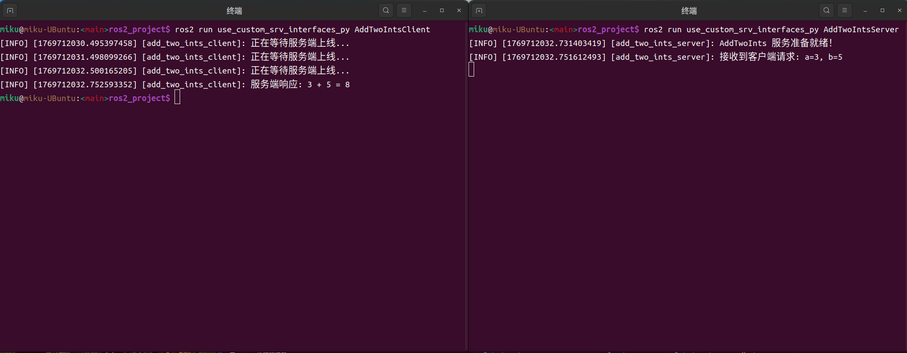


#### 自定义action接口

##### 定义action接口的流程

- **大致流程**：

  - 新建**`action文件夹`**，并在文件夹下新建**`xxx.action`**

  - 在**`xxx.action`**下编写消息内容并保存

  - 在**`CmakeLists.txt`**添加依赖和action文件目录

  - 在**`package.xml`**中添加xxx.action所需的依赖

  - **编译功能包**即可生成**python**与**c++头文件**

- **具体流程实现**：

  - **新建ROS2功能包**

    在**工作空间**的**src文件夹**下**打开终端**，运行下面的指令：

    ```bash
    ros2 pkg create 功能包名字(自定义) --build-type ament_cmake
    ```

    

  - **新建action文件夹和.action文件**

    - **在功能包目录下新建`action文件夹`**

      - 如果该**ROS2工作目录**只存放通讯用的信息的话，就可以删除该**ROS2工作目录**下的`include文件夹`和`src文件夹`

      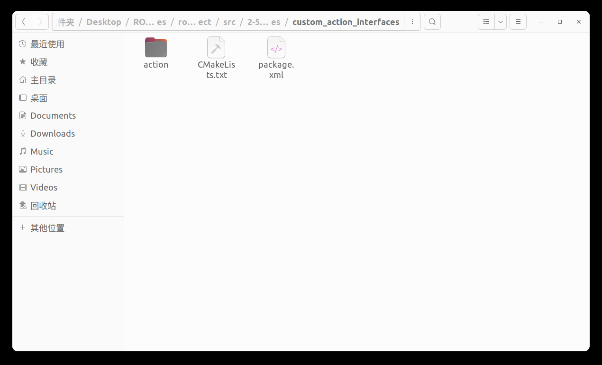

    - **在action文件夹里面新建`.action文件`**

      > [!WARNING] 
      >
      > .action文件开头首字母一定要大写，这是ROS2强制要求的

      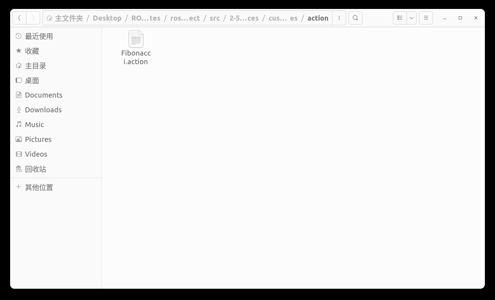

  - **编辑`.action文件`**

    **以 --- 分层：**

    - **第一层**：`客户端`发送给`服务端`的目标请求**（目标传递服务）**
    - **第二层**：`服务端`返回给`客户端`的反馈信息**（反馈话题）**
    - **第三层**：`服务端`返回给`客户端`的最终结果**（结果传递服务）**

    

  - **修改`CMakeLists.txt`**

    - 需要添加的

      > [!NOTE]  
      >
      > 注意添加的位置

      ```cmake
      # 生成 ROS 2 接口（msg / srv / action）
      rosidl_generate_interfaces(
        ${PROJECT_NAME}        # 接口所属的包名，一般使用当前工程名
        "action/Test.action"         # 要生成的消息文件路径（相对于包根目录）
        DEPENDENCIES std_msgs  # 该消息中使用到的其他消息包依赖
      )
      ```

    - 具体代码展示

      ```cmake
      cmake_minimum_required(VERSION 3.8)
      project(custom_msg_interfaces)
      
      # 如果使用 GCC 或 Clang 编译器，开启常用的警告选项【不必理会】
      if(CMAKE_COMPILER_IS_GNUCXX OR CMAKE_CXX_COMPILER_ID MATCHES "Clang")
        add_compile_options(-Wall -Wextra -Wpedantic)
      endif()
      
      find_package(ament_cmake_auto REQUIRED)
      ament_auto_find_build_dependencies()
      
      # 生成 ROS 2 接口（msg / srv / action）
      rosidl_generate_interfaces(
        ${PROJECT_NAME}        # 接口所属的包名，一般使用当前工程名
        "msg/Test.msg"         # 要生成的消息文件路径（相对于包根目录）
        DEPENDENCIES std_msgs  # 该消息中使用到的其他消息包依赖
      )
      
      # 测试与代码规范检查相关【不必理会】
      if(BUILD_TESTING)
        find_package(ament_lint_auto REQUIRED)
        set(ament_cmake_copyright_FOUND TRUE)
        set(ament_cmake_cpplint_FOUND TRUE)
        ament_lint_auto_find_test_dependencies()
      endif()
      
      ament_auto_package()
      ```

    - **修改`package.xml`**

      - 要添加的

        ```xml
        <!-- 必须要添加这个 -->
        <member_of_group>rosidl_interface_packages</member_of_group>
        
        <!-- 添加查找生成接口所需的依赖包 -->
        <buildtool_depend>rosidl_default_generators</buildtool_depend>
        <exec_depend>rosidl_default_runtime</exec_depend>
        
        <!-- 添加.msg文件要依赖的 -->
        <depend>std_msgs</depend>
        ```

      - 具体代码展示

        ```xml
        <?xml version="1.0"?>
        <?xml-model href="http://download.ros.org/schema/package_format3.xsd" schematypens="http://www.w3.org/2001/XMLSchema"?>
        <package format="3">
          <name>custom_msg_interfaces</name>
          <version>0.0.0</version>
          <description>TODO: Package description</description>
          <maintainer email="1310946137@qq.com">miku</maintainer>
          <license>TODO: License declaration</license>
        
          <buildtool_depend>ament_cmake</buildtool_depend>
          
          <!-- 必须要添加这个 -->
          <member_of_group>rosidl_interface_packages</member_of_group>
        
          <!-- 添加查找生成接口所需的依赖包 -->
          <buildtool_depend>rosidl_default_generators</buildtool_depend>
          <exec_depend>rosidl_default_runtime</exec_depend>
        
          <!-- 添加.msg文件要依赖的 -->
          <depend>std_msgs</depend>
        
          <test_depend>ament_lint_auto</test_depend>
          <test_depend>ament_lint_common</test_depend>
        
          <export>
            <build_type>ament_cmake</build_type>
          </export>
        </package>
        ```


## 2.6 参数系统

### 2.6.1 什么是参数系统

- **参数系统解决的是什么问题？**

  在一个 ROS2 节点中，通常会存在两类数据：

  | 类型         | 举例                     | 特点               |
  | ------------ | ------------------------ | ------------------ |
  | **运行数据** | 传感器数据、控制指令     | 高频、实时、变化快 |
  | **配置数据** | 串口名、波特率、控制增益 | 低频、启动前确定   |

  > ROS2提供了一个机制，来帮助我们把**配置数据**传入节点中，这就是`参数系统`

- **举一个具体的例子：`串口通讯`**

  假设你有一个串口节点 `serial_node`：

  ```
  serial_node
  ├── port: "/dev/ttyUSB0"
  ├── baudrate: 115200
  └── timeout_ms: 10
  ```

  这些参数的特点是：

  - 节点启动前就应该确定
  - 运行中几乎不变
  - 不属于任何其他节点

  👉那么这些参数就应该使用`参数系统`


### 2.6.2 在代码中声明参数

#### C++节点的写法

- **函数写法**：

  - **声明参数**：

    ```c++
    this->declare_parameter<参数类型>("参数名", 默认值);
    ```

    - **参数类型**：通常是C++中的变量类型（不是ROS2），但是需要注意的是ROS2不支持stl的嵌套，如`vector<vector<double>>`

    - **参数名**：这个参数涉及到了launch文件和config文件，节点中声明的每一个参数的名字必须要和launch文件或config文件中的名字相同

    - **默认值(可选)**：如果ROS2在传入节点的参数中都找不到对应的参数，那么就使用默认值，一般建议添加以防止节点崩溃

  - **获取参数**:

    ```c++
    变量 = this->get_parameter("参数名").as_string();
    ```

    - **变量**：节点里面预先定义变量，用来存储参数
    - **参数名**：要跟`declare_parameter`中使用的参数名一致
    - **as_string()**：根据参数的`参数类型`来确定，还可以是as_int(), as_bool()等

- **具体示例**：

  ```c++
  #include <rclcpp/rclcpp.hpp>
  
  class SerialNode : public rclcpp::Node
  {
  public:
    SerialNode() : Node("serial_node")
    {
      // 声明参数并设置默认值
      this->declare_parameter<std::string>("port", "/dev/ttyUSB0");
      this->declare_parameter<int>("baudrate", 115200);
      this->declare_parameter<int>("timeout_ms", 10);
  
      // 获取参数
      port = this->get_parameter("port").as_string();
      baudrate = this->get_parameter("baudrate").as_int();
      timeout_ms = this->get_parameter("timeout_ms").as_int();
  
      // 打印日志
      RCLCPP_INFO(this->get_logger(),"获取到参数: port:%s, baudrate:%d, timeout_ms:%d",port.c_str(),baudrate,timeout_ms);
    }
  
  private:
    // 存储参数用的变量
    std::string port;
    int baudrate;
    int timeout_ms;
  };
  
  int main(int argc, char ** argv){
      rclcpp::init(argc, argv);
      auto node = std::make_shared<SerialNode>();
      rclcpp::spin(node);
      rclcpp::shutdown();
      return 0;
  }
  ```


#### python节点的写法：

- **函数写法**：

  - **声明参数**：

    ```c++
    self.declare_parameter("参数名", 默认值)
    ```

    - **参数名**：这个参数涉及到了launch文件和config文件，节点中声明的每一个参数的名字必须要和launch文件或config文件中的名字相同

    - **默认值(可选)**：如果ROS2在传入节点的参数中都找不到对应的参数，那么就使用默认值，一般建议添加以防止节点崩溃

  - **获取参数**:

    ```c++
    变量 = self.get_parameter_value("参数名").get_parameter_value().string_value
    ```

    - **变量**：节点里面预先定义变量，用来存储参数
    - **参数名**：要跟`declare_parameter`中使用的参数名一致
    - **string_value**：根据参数的`参数类型`来确定，还可以是integer_value, bool_value等

- **具体示例**：

  ```python
  import rclpy
  from rclpy.node import Node
  
  class SerialNode(Node):
      def __init__(self):
          super().__init__('serial_node')
  
          # 声明参数并设置默认值
          self.declare_parameter('port', '/dev/ttyUSB0')
          self.declare_parameter('baudrate', 115200)
          self.declare_parameter('timeout_ms', 10)
  
          # 获取参数
          self.port = self.get_parameter('port').get_parameter_value().string_value
          self.baudrate = self.get_parameter('baudrate').get_parameter_value().integer_value
          self.timeout_ms = self.get_parameter('timeout_ms').get_parameter_value().integer_value
  
          # 打印日志
          self.get_logger().info(f"获取到参数: port:{self.port}, baudrate:{self.baudrate}, timeout_ms:{self.timeout_ms}")
  
  def main(args=None):
      rclpy.init(args=args)   # 初始化rclpy
      node = SerialNode()     # 新建一个节点
      rclpy.spin(node)        # 保持节点运行，检测是否收到退出指令(Ctrl+C)
      rclpy.shutdown()        # 当接收到退出指令时，退出spin函数，执行shutdown函数来关闭rclpy
  
  if __name__=="__main__":
      main()
  ```


# 3 ROS2 launch文件介绍

## 3.1 启动文件 launch 简介

在实际的 ROS2 系统中，往往需要**同时启动多个节点**，并为它们设置参数、命名空间、重映射规则等。如果每个节点都通过命令行逐个启动，不仅繁琐，而且容易出错。

为了解决这一问题，ROS2 提供了 **启动文件（Launch）机制**。


### 3.1.1 编写launch文件的大致流程

#### 编写launch文件

- 功能包下，创建`launch目录`。

  ```bash
  test_launch_cpp					# 功能包
  ├── CMakeLists.txt
  ├── include
  │   └── test_launch_cpp
  ├── launch						# 新建一个launch目录
  ├── package.xml
  └── src
      ├── test_node1.cpp			# 节点1的可执行文件
      └── test_node2.cpp			# 节点2的可执行文件
  ```

- launch文件可以是`python文件`、`xml文件`或`yaml文件`，不同类型的launch文件可以直接存储在launch目录下。

- 为了方便管理，一般都是在`launch目录`下新建**xxx.launch.py**、**xxx.launch.xml**和**xxx.launch.yaml**

- **launch文件的命名规则**：launch文件必须按照以下命名规则，否则ROS2会识别不到这些命名规则

  ```bash
  xxx_launch.py、xxx_launch.xml、xxx_launch.yaml
  ```

  ```bash
  xxx.launch.py、xxx.launch.xml、xxx.launch.yaml
  ```

> [!IMPORTANT]
>
> 虽然launch文件有三种格式，但是ROS2中基本上都是使用Python格式的launch，所以这里只讲Python格式


#### 在`ament_cmake`中把launch文件安装到install目录

**直接配置`CMakeLists.txt`就可以了**

- **关键代码**：

  ```cmake
  ament_auto_package(
    INSTALL_TO_SHARE
    launch # 在构建并安装包时，把 launch/ 目录一并安装到包的 share 目录中。
  )
  ```

- **完整代码**：

  ```cmake
  cmake_minimum_required(VERSION 3.8)
  project(test_launch_cpp)
  
  # 如果使用 GCC 或 Clang 编译器，开启常用的警告选项【不必理会】
  if(CMAKE_COMPILER_IS_GNUCXX OR CMAKE_CXX_COMPILER_ID MATCHES "Clang")
    add_compile_options(-Wall -Wextra -Wpedantic)
  endif()
  
  find_package(ament_cmake_auto REQUIRED)
  ament_auto_find_build_dependencies()
  
  # 添加可执行文件
  ament_auto_add_executable(
          test_node1
          src/test_node1.cpp
  )
  ament_auto_add_executable(
          test_node2
          src/test_node2.cpp
  )
  
  # 测试与代码规范检查相关【不必理会】
  if(BUILD_TESTING)
    find_package(ament_lint_auto REQUIRED)
    set(ament_cmake_copyright_FOUND TRUE)
    set(ament_cmake_cpplint_FOUND TRUE)
    ament_lint_auto_find_test_dependencies()
  endif()
  
  ament_auto_package(
    INSTALL_TO_SHARE
    launch # 在构建并安装包时，把 launch/ 目录一并安装到包的 share 目录中。
  )
  ```


#### 在`ament_python`中把launch文件安装到install目录

**直接配置`setup.py`就可以了**

- **关键代码**：

  ```python
  # 安装 launch 文件
  (os.path.join('share', package_name, 'launch'), glob('launch/*.launch.py')),
  ```

- **完整代码**：

  ```python
  import os
  from glob import glob
  from setuptools import find_packages, setup
  
  package_name = 'test_launch_py'
  
  setup(
      name=package_name,
      version='0.0.0',
      packages=find_packages(exclude=['test']),
      data_files=[
          # 注册包
          ('share/ament_index/resource_index/packages',
           ['resource/' + package_name]),
  
          # 安装 package.xml
          ('share/' + package_name, ['package.xml']),
  
          # 安装 launch 文件
          (os.path.join('share', package_name, 'launch'), glob('launch/*.launch.py')),
      ],
      install_requires=['setuptools'],
      zip_safe=True,
      maintainer='miku',
      maintainer_email='1310946137@qq.com',
      description='TODO: Package description',
      license='TODO: License declaration',
      extras_require={
          'test': [
              'pytest',
          ],
      },
      entry_points={
          'console_scripts': [
              'test_node1=test_launch_py.test_node1:main',    # 节点1
              'test_node2=test_launch_py.test_node2:main',    # 节点2
          ],
      },
  )
  ```


#### 编译运行

- **编译**：

  ```bash
  colcon build
  ```

- **添加环境变量**：

  ```bash
  source install/setup.bash
  ```

- **启动launch文件**：

  ```bash
  ros2 launch test_launch_cpp test_node.launch.py 
  ```

  ```bash
  ros2 launch test_launch_py test_node.launch.py 
  ```

  - `ros2 launch`：启动launch文件的指令
  - **test_launch_cpp**和**test_launch_py**都是`ROS2功能包`的名字
  - `test_node.launch.py`：launch文件的名字


## 3.2 ROS 2 Python Launch 启动文件教程

### 3.2.1 基础结构
每个 Python Launch 文件都必须包含一个名为 `generate_launch_description` 的函数，该函数返回一个 `LaunchDescription` 对象。

```python
from launch import LaunchDescription
from launch_ros.actions import Node

def generate_launch_description():
    return LaunchDescription([
        # 节点或动作列表
    ])
```

### 3.2.2 核心组件：Node (节点)
> `Node` 是 Launch 文件中最常用的功能，用于启动 ROS 节点。

- **常用参数说明**：

  | 字段         | 类型          | 作用说明                                               | 一句话理解                                 |
  | ------------ | ------------- | ------------------------------------------------------ | ------------------------------------------ |
  | `package`    | `String`      | 指定节点所属的ROS2功能包                               | **这个节点来自哪个ROS2功能包**             |
  | `executable` | `String`      | 要运行的可执行文件名（在CMakeLists.txt或setup.py定义） | **具体启动哪个程序**                       |
  | `name`       | `String`      | 节点在运行时的名称（可覆盖代码中的默认名）             | **给节点起个唯一的名字**                   |
  | `namespace`  | `String`      | 节点所属的命名空间前缀                                 | **给节点分组、加前缀**（可以用于隔离话题） |
  | `remappings` | `List[Tuple]` | 话题重映射关系，如 `('old', 'new')`                    | **把节点用到的话题“改名”**                 |
  | `parameters` | `Dict / YAML` | 启动时设置的参数                                       | **给节点传配置参数**                       |

- 示例代码：

  ```python
  turtle_node = Node(
      package='turtlesim',
      executable='turtlesim_node',
      name='my_turtle',
      namespace='group1',
      remappings=[
          ('/turtle1/cmd_vel', '/cmd_vel') # 将话题/turtle1/cmd_vel改名为/cmd_vel
      ],
      parameters=[
          {'background_r': 255},           # 直接设置参数
          '/path/to/config.yaml'           # 或者加载配置文件（config文件）
      ]
  )
  ```

  

### 3.2.3 执行外部指令：ExecuteProcess
> 有时你需要在launch文件运行非 ROS 节点的命令（如：`ros2 topic echo` 或 `ls`）。

- **常用参数**：

  | 字段     | 类型           | 可选值                                                       | 作用说明             | 一句话理解                 |
  | -------- | -------------- | ------------------------------------------------------------ | -------------------- | -------------------------- |
  | `cmd`    | `List[String]` | —                                                            | 要执行的命令及其参数 | **在终端里真正要跑的命令** |
  | `output` | `String`       | `screen`：程序的**标准输出**和**错误输出**会直接显示在当前终端窗口 <br/>`log`：程序的输出会被写入 **ROS 2 日志文件**，终端中不显示 <br/>`both`：程序的输出**同时显示在终端**，并**写入日志文件**<br />(其中，“标准输出”指的是程序正常打印的信息，例如 C++ 中的 `std::cout` ，错误输出对应 `std::cerr`） | 控制进程输出的位置   | **程序打印的信息显示到哪** |

- **示例代码**：

  ```python
  from launch.actions import ExecuteProcess
  
  echo_topic = ExecuteProcess(
      cmd=['ros2', 'topic', 'echo', '/turtle1/pose'],		# 相当于在终端执行了 ros2 topic echo /turtle1/pose 指令
      output='screen'										# 把 ros2 topic echo /turtle1/pose 得到的信息打印到终端
  )
  ```


### 3.2.4 文件包含：IncludeLaunchDescription
> 在复杂的项目中，一个 Launch 文件可以包含另一个 Launch 文件，实现模块化。

- **常用参数**：

  | 参数                        | 类型                      | 作用说明                       | 一句话理解                   |
  | --------------------------- | ------------------------- | ------------------------------ | ---------------------------- |
  | `launch_description_source` | `LaunchDescriptionSource` | 指定要包含的 launch 文件来源   | **要引入的那个 launch 文件** |
  | `launch_arguments`          | `Iterable[(key, value)]`  | 向被包含的 launch 文件传递参数 | **给“被包含的 launch”传参**  |
  | `condition`                 | `Condition`               | 控制是否包含该 launch 文件     | **满足条件才启动**           |

  - `launch_description_source`：用于指定要包含的 launch 文件

    ```python
    IncludeLaunchDescription(
        PythonLaunchDescriptionSource(other_launch_path)
    )
    ```

  - `launch_arguments`：用于向被包含的 launch 文件传递参数，**前提是被包含的 launch 文件中使用了`LaunchConfiguration`**

    ```python
    IncludeLaunchDescription(
        PythonLaunchDescriptionSource(other_launch_path),
        
        # 向 other_launch_path的launch文件 中传入参数
        launch_arguments={
            'use_sim_time': 'true',
            'map': '/home/user/map.yaml'
        }.items()
    )
    ```

  - `condition`：用于根据条件决定是否加载某个 launch 文件

    ```python
    from launch.conditions import IfCondition
    from launch.substitutions import LaunchConfiguration
    
    IncludeLaunchDescription(
        PythonLaunchDescriptionSource(other_launch_path),
        condition=IfCondition(LaunchConfiguration('enable_nav'))	# 只有当 enable_nav的值true 时，该 launch 才会被启动。
    )
    ```

- **示例代码**：

  ```python
  from launch.actions import IncludeLaunchDescription
  from launch.launch_description_sources import PythonLaunchDescriptionSource
  import os
  from ament_index_python.packages import get_package_share_directory
  
  def generate_launch_description():
      # 获取其他包的路径
      other_launch_path = os.path.join(
          get_package_share_directory('my_package'),'launch','another_launch.py'
      )
      
      # 启动另外一个launch文件
      launch = IncludeLaunchDescription(
          PythonLaunchDescriptionSource(other_launch_path)
      )
  	
      # 返回 LaunchDescription 对象
      return LaunchDescription([
          launch
      ])
  ```


### 3.2.5 节点分组：GroupAction
> 如果你想给一组节点同时添加命名空间或设置，可以使用分组。

- **常用参数**：

  | 参数        | 类型           | 作用说明                | 新手一句话理解           |
  | ----------- | -------------- | ----------------------- | ------------------------ |
  | `actions`   | `List[Action]` | 分组中包含的所有 action | **这个组里都有哪些操作** |
  | `condition` | `Condition`    | 控制整个分组是否生效    | **是否启用这一整组**     |

  - `actions`：分组中要执行的所有 action，**按顺序生效**。

    常见可放入的 action 包括：

    - `Node`（启动节点）
    - `PushRosNamespace`（设置命名空间）
    - `SetParameter` / `SetParametersFromFile`
    - `DeclareLaunchArgument`
    - 其他 `GroupAction`

    ```python
    GroupAction(
        actions=[
            PushRosNamespace('my_robot'),						# 组内所有节点都会加上 /my_robot 前缀
            SetParameter(name='use_sim_time', value=True),		# 组内所有节点的 use_sim_time 参数都设为True
            Node(package='demo', executable='sensor_node'),		# 节点1
            Node(package='demo', executable='actuator_node'),	# 节点2
        ]
    )
    ```

  - `condition`：用于**统一控制一整组节点是否启动**：

    ```python
    GroupAction(
        condition=IfCondition(LaunchConfiguration('enable_robot')),	# 只有当 enable_robot的值true 时，该 GroupAction中的节点 才会被启动。
        actions=[
            PushRosNamespace('my_robot'),
            Node(package='demo', executable='sensor_node'),
        ]
    )
    ```


### 3.2.6 事件处理：RegisterEventHandler

> 用于控制节点的启动顺序。例如：当 **A节点** 启动后，才启动 **B节点**。

- **核心概念**：

  - **Event Handler（事件处理器）**

    - 定义：**监听某个事件是否发生**

    - 回答问题：**什么时候触发？**

  - **Action（动作）**

    - 定义：**事件发生后要执行的操作**

    - 回答问题：**触发后做什么？**


- **核心事件类型（Event Handlers）**

  | 事件处理器            | 触发时机        | 典型用途               |
  | --------------------- | --------------- | ---------------------- |
  | `OnProcessStart`      | 进程成功启动时  | 启动依赖节点、打印提示 |
  | `OnProcessExit`       | 进程退出时      | 清理资源、启动后续节点 |
  | `OnExecutionComplete` | Action 执行完成 | 编排复杂启动流程       |

  - **常用参数说明**（OnProcessStart / OnProcessExit）

    | 参数                 | 类型           | 作用说明                    | 一句话理解             |
    | -------------------- | -------------- | --------------------------- | ---------------------- |
    | `target_action`      | `Action`       | 被监听的目标（通常是 Node） | **监听哪个节点**       |
    | `on_start / on_exit` | `List[Action]` | 事件发生后执行的动作        | **事件发生后要做什么** |

- **常用 Action（事件触发后执行）**

  | Action      | 作用            |
  | ----------- | --------------- |
  | `Node`      | 启动新的节点    |
  | `LogInfo`   | 输出日志信息    |
  | `EmitEvent` | 触发其他事件    |
  | `Shutdown`  | 关闭整个 launch |

- **执行流程**：

  > 当 `target_action` 发生指定事件 → 执行 `on_start / on_exit` 中定义的 Action。

- **示例代码1**：节点 A 启动后打印日志

  当 `turtle_node` 进程启动后，在终端输出一条提示信息。

  **逻辑**：

  - 监听 `turtle_node` 的 **启动事件**
  - 启动成功后，执行 `LogInfo` 这个 Action

  ```python
  from launch.actions import RegisterEventHandler, LogInfo
  from launch.event_handlers import OnProcessStart
  
  RegisterEventHandler(
      event_handler=OnProcessStart(
          target_action=turtle_node,		# 监听 turtle_node
          on_start=[						# 事件发生后执行的动作
              LogInfo(msg='乌龟节点成功1启动！')
          ]                               
      )
  )
  ```

- **示例代码2**：节点 A 启动后，再启动节点 B

  只有当 node_a 成功启动后，node_b 才会被启动。

  **逻辑**：node_a 启动成功 → node_b 才启动

  ```python
  from launch_ros.actions import Node
  from launch.actions import RegisterEventHandler
  from launch.event_handlers import OnProcessStart
  
  node_b = Node(
      package='demo',
      executable='node_b'
  )
  
  RegisterEventHandler(
      event_handler=OnProcessStart(
          target_action=node_a,   # 监听 node_a
          on_start=[node_b]       # 事件发生后执行 node_b
      )
  )
  ```

  


### 3.2.7 综合实战示例

```python
import os
from launch import LaunchDescription
from launch_ros.actions import Node
from launch.actions import ExecuteProcess, RegisterEventHandler, LogInfo
from launch.event_handlers import OnProcessStart


def generate_launch_description():
    # 1. 定义一个 ROS 2 节点（turtlesim）
    # Node 只是“描述一个节点如何启动”，
    # 并不会在这里立刻启动，真正启动发生在 LaunchDescription 中
    turtlesim_node = Node(
        package='turtlesim',           # 节点所在的功能包
        executable='turtlesim_node',   # 可执行文件名
        name='sim_node'                # 运行时节点名称
    )

    # 2. 定义一个外部进程（非 ROS 节点）
    # ExecuteProcess 用于执行普通的系统命令
    # 这里仅作为示例：列出当前系统中的 ROS 话题
    cmd_example = ExecuteProcess(
        cmd=['ros2', 'topic', 'list'], # 要执行的命令及参数
        output='screen'                # 输出显示在当前终端
    )

    # 3. 注册事件处理：当节点启动成功后执行指定动作
    # OnProcessStart：监听某个 action（这里是 turtlesim_node）的启动事件
    # RegisterEventHandler：将“事件”与“要执行的动作”绑定在一起
    log_event = RegisterEventHandler(
        event_handler=OnProcessStart(
            target_action=turtlesim_node,          # 被监听的目标节点
            on_start=[
                LogInfo(msg="乌龟节点成功启动！")  # 节点启动后打印日志
            ]
        )
    )

    # 4. 返回 LaunchDescription
    # LaunchDescription 中的 action 会被统一调度执行
    # 顺序不代表启动顺序，真正的时序由事件机制控制
    return LaunchDescription([
        turtlesim_node,   # 启动 turtlesim 节点
        cmd_example,      # 执行外部命令
        log_event         # 注册事件
        处理器
    ])
```


# 4 录制回放工具——ros2bag

- 在做机器人开发时，**传感器数据**（激光雷达、相机、里程计等）就像机器人“看到”和“感觉到”的世界。

  - 问题来了：
     👉 **这些数据一定要“当场”处理吗？**
  - 答案是：**不一定。**

  > 很多时候，我们更希望先把数据存下来，之后慢慢研究、反复使用。这正是`ros2bag`存在的意义。

- 这就好比生活中，**在教室上课** 与 **用手机上网课** 的区别

  - 在教室上课：只老师一边讲，你一边记笔记。如果听漏了就没了
  - 用手机上网课：可以暂停、后退、快进来记笔记

- 对于**机器人**来说，机器人传感器获取到的信息，有时我们可能需要时时处理，有时可能只是采集数据，事后分析，比如:

  机器人导航实现中，可能需要绘制导航所需的全局地图，地图绘制实现，有**两种方式**

  - **方式1**：可以控制机器人运动，将机器人传感器感知到的数据**时时处理**，生成地图信息。

  - **方式2**：同样是控制机器人运动，将机器人传感器感知到的数据**先保存下载**，事后，再重新读取数据，生成地图信息。

    >  两种方式比较，显然方式2使用上更为灵活方便。


## 4.1 ros2bag终端工具

| 命令      | 功能说明                                                 | 一句话理解                                |
| --------- | -------------------------------------------------------- | ----------------------------------------- |
| `convert` | 给定一个 bag 文件，生成一个**使用不同配置**的新 bag 文件 | 把已有的 bag **换一种格式或配置重新保存** |
| `info`    | 输出 bag 文件的相关信息                                  | 看看这个 bag 里**都录了啥、录了多久**     |
| `list`    | 输出当前系统中可用的插件信息                             | 看看 ros2bag **支持哪些存储/转换插件**    |
| `play`    | 回放 bag 文件中的数据                                    | **像放录像一样**重放机器人数据            |
| `record`  | 录制话题数据并生成 bag 文件                              | 给机器人数据 **按下录像键**               |
| `reindex` | 重建 bag 文件的元数据                                    | bag 损坏或拷贝后，**重新生成索引文件**    |


### 4.1.1 录制数据(序列化)

- **开始录制**

  在命令行输入：

  ```bash
  ros2 bag record 话题名称 -o 输出的文件夹名(自定义，可以不设置)
  ```

  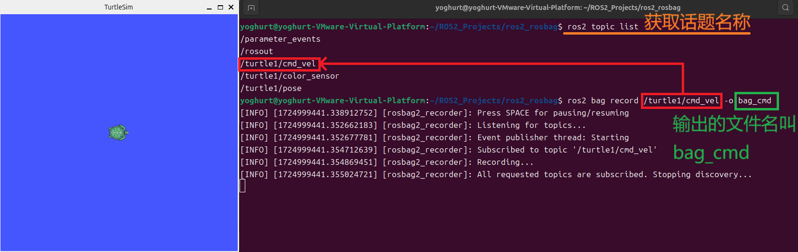


- 用`Ctrl+C`结束录制

  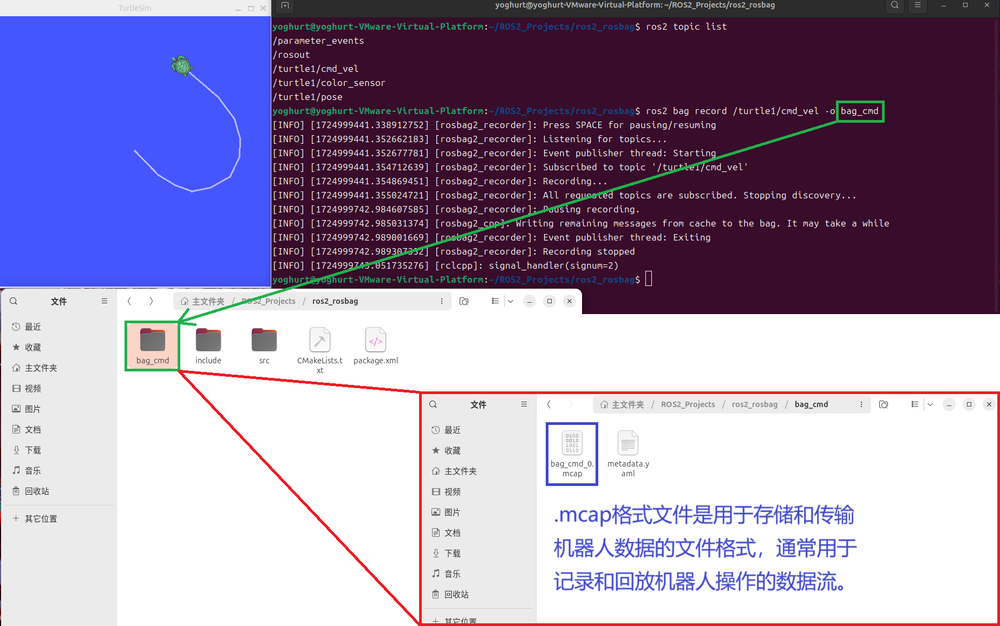


### 4.1.2 回放数据(反序列化)

在终端输入：

```bash
ros2 bag play 录制数据输出的文件夹名
```


## 4.2 ros2bag编程(C++)

#### 创建C++功能包

在终端输入：

```bash
ros2 pkg create 功能包名(自定义) --build-type ament_cmake --dependencies rclcpp rosbag2_cpp geometry_msgs
```

> [!NOTE]
>
> 依旧使用`ament_cmake_auto`


#### 录制数据(序列化)

- **核心API**：

  ```c++
  // 创建创建录制对象
  std::unique_ptr<rosbag2_cpp::Writer> writer_ = std::make_unique<rosbag2_cpp::Writer>();
  // 设置录制数据存放在哪个磁盘文件
  writer_->open("may_bag");	// 这里设置的是may_bag，也可以设置成其他的
  // 向磁盘文件写入数据
  writer_->write(msg, "/turtle1/cmd_vel", "geometry_msgs/msg/Twist", this->now());
  ```

  - `write函数`的**参数**：

    | 参数                        | 含义             | 通俗理解                                              |
    | --------------------------- | ---------------- | ----------------------------------------------------- |
    | `msg`                       | 要写入的消息内容 | **真正要保存的数据本身**（比如速度指令）              |
    | `"/turtle1/cmd_vel"`        | 话题名称         | 这条数据**属于哪个话题**                              |
    | `"geometry_msgs/msg/Twist"` | 消息类型         | 告诉 ros2bag：**这条数据是什么类型的**                |
    | `this->now()`               | 时间戳           | 这条数据在 bag 中**发生的时间点**,this->now()会记录从 |

- **具体示例**：

  ```c++
  /*
      需求：录制控制乌龟运动的速度指令
      流程：
          1. 包含头文件；
          2. 初始化ROS2客户端；
          3. 自定义节点类；
              3-1. 创建录制对象；
              3-2. 设置磁盘文件；
              3-3. 写数据（创建一个速度订阅方，回调函数中执行写出操作）
          4. 调用spin函数，并传入节点对象指针；
          5. 资源释放
  */
  
  // 1. 包含头文件
  #include "rclcpp/rclcpp.hpp"
  #include "geometry_msgs/msg/twist.hpp"
  #include "rosbag2_cpp/writer.hpp"
  
  // 3. 自定义节点类
  class simpleBagWriter : public rclcpp::Node
  {
  public:
      simpleBagWriter(std::string name) : Node(name)
      {
          RCLCPP_INFO(this->get_logger(), "消息录制对象创建！");
          
          // 3-1. 创建录制对象
          writer_ = std::make_unique<rosbag2_cpp::Writer>();
          
          // 3-2. 设置磁盘文件
          writer_->open("may_bag"); // 相对路径，是工作空间的直接子级
          
          // 3-3. 写数据（创建一个速度订阅方，回调函数中执行写出操作）
          // 参数：话题名称，队列中最大保存的数据数，回调函数
          sub_ = this->create_subscription<geometry_msgs::msg::Twist>("/turtle1/cmd_vel", 10, std::bind(&simpleBagWriter::do_writer_msg, this, std::placeholders::_1));
      }
  
  private:
      // 数据写入函数
      void do_writer_msg(std::shared_ptr<rclcpp::SerializedMessage> msg)
      {
          RCLCPP_INFO(this->get_logger(), "数据写出....");
          
          writer_->write(msg, "/turtle1/cmd_vel", "geometry_msgs/msg/Twist", this->now());
          /*
          参数：
          std::shared_ptr<const rclcpp::SerializedMessage> message, // 被写出的消息
          const std::string &topic_name,                            // 话题名称
          const std::string &type_name,                             // 消息类型
          const rclcpp::Time &time                                  // 时间戳
          */
      }
  
      std::unique_ptr<rosbag2_cpp::Writer> writer_; // 声明一个指向rosbag2_cpp::Writer对象的智能指针
      rclcpp::Subscription<geometry_msgs::msg::Twist>::SharedPtr sub_; // 声明一个订阅者指针
  };
  
  // 主函数
  int main(int argc, char *argv[])
  {
      // 2. 初始化ROS2客户端
      rclcpp::init(argc, argv);
  
      // 4. 调用spin函数，并传入节点对象指针
      auto node = std::make_shared<simpleBagWriter>("simple_bag_play_node_cpp"); // 新建一个节点
      rclcpp::spin(node);
  
      // 5. 资源释放
      rclcpp::shutdown(); // 关闭ROS2客户端
      return 0;
  }
  ```

- **注释**：

  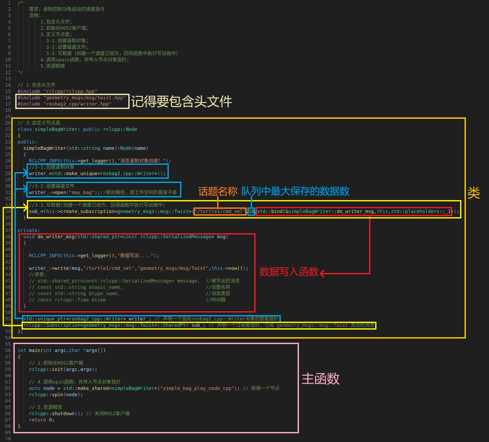


#### 回放数据(反序列化)

- **核心API**

  ```c++
  // 创建回放对象
  std::unique_ptr<rosbag2_cpp::Reader> reader_ = std::make_unique<rosbag2_cpp::Reader>();
  // 设置被读取的文件
  reader_->open("my_bag");
  // 读消息
  while (reader_->has_next()) // 判断是否有下一条，如果有：
  {
      auto twist = reader_->read_next<geometry_msgs::msg::Twist>();
      RCLCPP_INFO(this->get_logger(), "线速度：%.2f, 角速度：%.2f", twist.linear.x, twist.angular.z);
  }
  ```

- **具体示例**

  ```c++
  /*
      需求：回放控制乌龟运动的速度指令
      流程：
          1. 包含头文件；
          2. 初始化ROS2客户端；
          3. 自定义节点类；
              3-1. 创建回放对象；
              3-2. 设置被读取的文件；
              3-3. 读消息；
              3-4. 关闭文件。
          4. 调用spin函数，并传入节点对象指针；
          5. 资源释放
  */
  
  // 1. 包含头文件
  #include "rclcpp/rclcpp.hpp"
  #include "rosbag2_cpp/reader.hpp"
  #include "geometry_msgs/msg/twist.hpp"
  
  // 3. 自定义节点类
  class simpleBagRecorder : public rclcpp::Node
  {
  public:
      simpleBagRecorder(std::string name) : Node(name)
      {
          RCLCPP_INFO(this->get_logger(), "消息录制对象创建！");
  
          // 3-1. 创建回放对象
          reader_ = std::make_unique<rosbag2_cpp::Reader>();
  
          // 3-2. 设置被读取的文件
          reader_->open("my_bag");
  
          // 3-3. 读消息
          while (reader_->has_next()) // 判断是否有下一条，如果有：
          {
              auto twist = reader_->read_next<geometry_msgs::msg::Twist>();
              RCLCPP_INFO(this->get_logger(), "线速度：%.2f, 角速度：%.2f", twist.linear.x, twist.angular.z);
          }
  
          // 3-4. 关闭文件
          reader_->close();
      }
  
  private:
      std::unique_ptr<rosbag2_cpp::Reader> reader_;	// 3-1. 声明一个回放对象
  };
  
  int main(int argc, char *argv[])
  {
      // 2. 初始化ROS2客户端
      rclcpp::init(argc, argv);
  
      // 4. 调用spin函数，并传入节点对象指针
      auto node = std::make_shared<simpleBagRecorder>("simple_bag_play_node_cpp"); // 新建一个节点
      rclcpp::spin(node);
  
      // 5. 资源释放
      rclcpp::shutdown(); // 关闭ROS2客户端
      return 0;
  }
  ```

- **注释**

  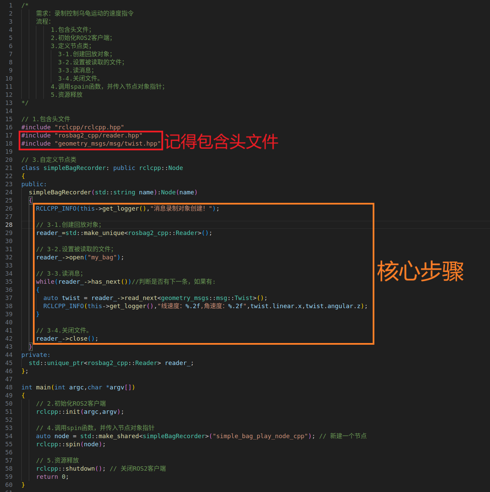

  

## 4.3 ros2bag编程(Python)

#### 创建Python功能包

在终端输入：

```bash
ros2 pkg create 功能包名(自定义) --build-type ament_python --dependencies rclpy rosbag2_py geometry_msgs
```


#### 录制数据(序列化)

- **代码**

  ```python
  import rclpy                                        # ROS 2 Python 客户端库
  from rclpy.node import Node                         # ROS 2 节点类
  from rclpy.serialization import serialize_message   # 用于序列化 ROS 消息
  from geometry_msgs.msg import Twist                 # 导入 Twist 消息类型
  import rosbag2_py                                   # rosbag2 Python 接口库
  
  
  # 3. 定义节点类:
  class SimpleBagRecorder(Node):
      def __init__(self, name):
          super().__init__(name) # 调用父类构造函数
          self.get_logger().info("大家好, 我是 %s" % name) # 打印日志信息, 显示节点名称
  
          # 3-1. 创建写出对象:
          self.writer = rosbag2_py.SequentialWriter() # 创建 SequentialWriter 对象用于写入 bag 文件
  
          # 3-2. 设置写出的目标文件、话题等参数:
          storage_options = rosbag2_py._storage.StorageOptions(uri='my_bag_py', storage_id='sqlite3')  # 指定存储选项, 包括文件路径和存储格式
          converter_options = rosbag2_py._storage.ConverterOptions("", "")                             # 指定转换选项, 这里为空
          self.writer.open(storage_options, converter_options)                                        # 打开 bag 文件进行写入
  
          # 创建话题元数据, 包含话题名称、消息类型和序列化格式
          topic_info = rosbag2_py._storage.TopicMetadata(
              name='/turtle1/cmd_vel',             # 话题名称
              type='geometry_msgs/msg/Twist',      # 消息类型
              serialization_format='cdr'           # 序列化格式, 常见序列化格式有: CDR, Protobuf, JSON, BSON
          )
          self.writer.create_topic(topic_info)     # 创建记录的话题
  
          # 创建订阅者对象, 订阅话题 "/turtle1/cmd_vel", 回调函数为 self.topic_callback
          self.subscription = self.create_subscription(Twist, '/turtle1/cmd_vel', self.topic_callback, 10)
          self.subscription                        # 防止订阅对象被垃圾回收
  
      def topic_callback(self, msg):
          # 3-3. 写出消息。
          self.writer.write(
              '/turtle1/cmd_vel',                  # 话题名称
              serialize_message(msg),              # 序列化后的消息
              self.get_clock().now().nanoseconds   # 当前时间戳
          )
  
  def main(args=None):
      # 2. 初始化 ROS 客户端:
      rclpy.init(args=args)                        # 初始化 ROS 客户端
      # 4. 调用 spin 函数, 并传入对象:
      node = SimpleBagRecorder("Aminuosi")         # 创建 SimpleBagRecorder 节点实例
      rclpy.spin(node)                             # 保持节点运行, 等待回调函数执行
      # 5. 释放资源:
      rclpy.shutdown()                             # 关闭 ROS 客户端
  
  if __name__ == '__main__':
      main()
  ```

  

- **注释**

  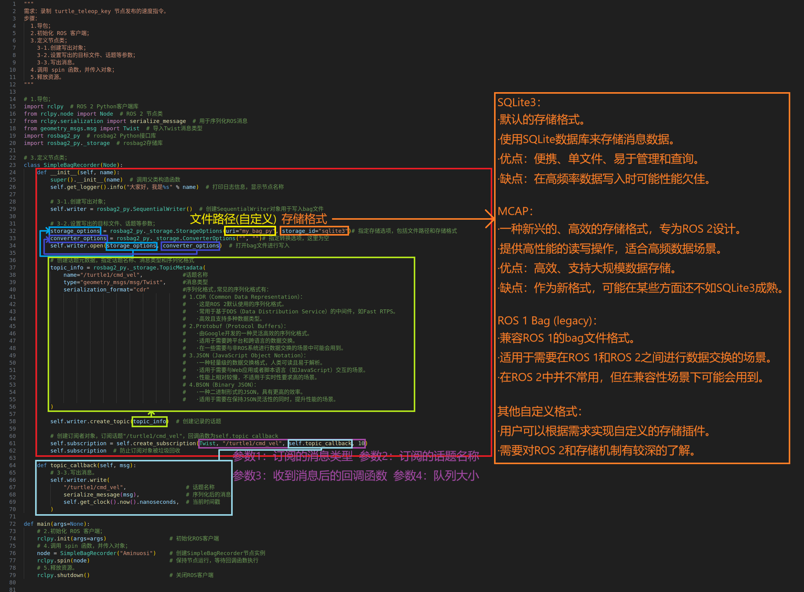


#### 回放数据(反序列化)

- **代码**

  ```python
  # 1. 导包:
  import rclpy                            # 导入 ROS 2 Python 客户端库
  from rclpy.node import Node             # 导入 Node 类, 用于创建节点
  import rosbag2_py                       # 导入 rosbag2_py 库, 用于读取 bag 文件
  from rclpy.logging import get_logger    # 导入日志记录器
  
  # 3. 定义节点类:
  class SimpleBagPlayer(Node):
      def __init__(self):
          super().__init__('simple_bag_player_py') # 调用父类 (Node) 的初始化方法
  
          # 3-1. 创建读取对象:
          self.reader = rosbag2_py.SequentialReader() # 创建 SequentialReader 对象, 用于顺序读取 bag 文件
  
          # 3-2. 设置读取的目标文件、话题等参数:
          # 注意要跟序列化的目标文件一致
          storage_options = rosbag2_py._storage.StorageOptions(uri="my_bag_py", storage_id='sqlite3')  # 配置存储选项, 包括目标文件 (uri) 和存储格式 (storage_id)
          converter_options = rosbag2_py._storage.ConverterOptions('', '')                             # 配置转换选项 (这里为空字符串表示默认设置)
          self.reader.open(storage_options, converter_options)                                        # 打开 bag 文件进行读取, 传入存储选项和转换选项
  
      # 3-3. 读消息:
      def read(self):
          # 使用 while 循环不断读取 bag 文件中的消息
          while self.reader.has_next():
              msg = self.reader.read_next()                                                           # 读取下一条消息, 返回一个元组 (topic name, serialized_msg, timestamp)
              get_logger("rclpy").info("topic = %s, time = %d, value=%s" % (msg[0], msg[2], msg[1]))  # 记录消息的详细信息, 包括话题名称、时间戳和消息内容
  
  # 主函数
  def main(args=None):
      # 2. 初始化 ROS 客户端:
      rclpy.init(args=args)       # 初始化 rclpy 库, 传入命令行参数
  
      # 4. 调用 spin 函数, 并传入对象:
      reader = SimpleBagPlayer()  # 创建 SimpleBagPlayer 对象
      reader.read()               # 调用 read 方法, 开始读取 bag 文件中的消息
      rclpy.spin(reader)          # 使用 rclpy.spin 方法使节点保持活跃, 以便处理回调函数
  
      # 5. 释放资源:
      rclpy.shutdown()            # 关闭 rclpy 库, 释放资源
  
  if __name__ == '__main__':
      main()
  ```

- **注释**

  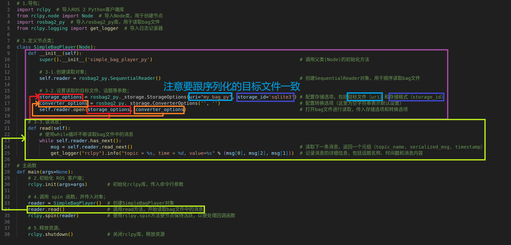


# 5 ROS2通信机制补充

## 5.1 分布式

- **场景**

  在许多机器人相关的应用场景中都涉及到**多台ROS2设备协作**，比如：无人车编队、无人机编队、远程控制等等，那么不同的物理设备之间是如何实现通信的呢？

- **概念**

  - `分布式通信`是指可以通过**网络**在**不同主机**之间实现数据交互的一种通信策略。


  - ROS2本身是一个分布式通信框架，可以很方便的实现不同设备之间的通信，ROS2所基于的中间件是`DDS`，当**处于同一网络中**时，通过DDS的`域ID机制(ROS_DOMAIN_ID)`可以实现分布式通信。


  - **大致流程是**：

    - 首先保证多个节点的都处于**同一**`网络环境`下

      - 如果是同一台设备的多个节点，它们通过`127.0.0.1`进行通讯

      - 如果是不同设备的多个节点，它们通过`局域网`（如192.168.0.0/24）进行通讯

        > [!NOTE]
        >
        > 这个时候你必须具备一些网络相关的知识，如果是着急配置，建议跟着GPT配置

    - 在启动节点，在`终端`设置`域ID`的值，

      - 如果不同节点的`域ID`**相同**，那么可以自由发现并通信，
      - 如果不同节点的`域ID`**不同**，那么不能自由发现并通信
      
      - 默认情况下，**所有节点**启动时所使用的`域ID`为**0**。
      
        > [!NOTE]
        >
        > 也就是说所有装了ROS2的电脑的域ID默认都是0，只要多个电脑处于同一个网络环境下，不同ROS2设备上的不同节点即可实现分布式通信。


- **如何实现？**

  - `方式1`：为**单个节点**设置**域ID**(这里设置为**6**)：

    - 打开终端，然后输入：

      ```bash
      export ROS_DOMAIN_ID=6
      ```

      注意，此时不要关闭终端，因为`export`指令只是给`当前终端`设置`环境变量`，当你退出这个终端时，该环境变量也会消失。

    - 然后我们在当前终端启动我们需要启动的ROS2代码（即ros2 run, ros2 launch）

      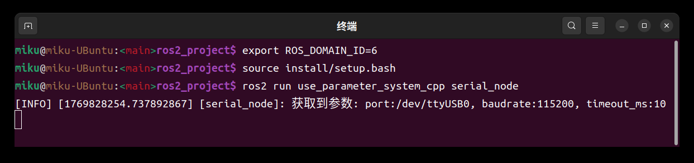

    

  - `方式2`：为**当前设备的所有节点**设置统一的**域ID(**这里设置为**6**)：

    ```bash
    echo "export ROS_DOMAIN_ID=6" >> ~/.bashrc
    ```

    - 这句话的意思是：
      - 向 Ubuntu 用户主目录下的 `.bashrc` 文件（一个**文本文件**）中追加一行export ROS_DOMAIN_ID=6
      - `.bashrc` 文件是 **Bash Shell 的配置脚本**，在**每次打开终端时都会自动执行**
      - 将环境变量写入 `.bashrc` 后，系统在打开终端时会自动设置 `ROS_DOMAIN_ID`，无需每次手动输入


> [!WARNING]
>
> **注意：串话题问题**
>
> - 如果 **不同设备或不同实验环境** 使用了**相同的 `ROS_DOMAIN_ID`**
> - 且**话题名**、**消息类型**也一致
> - 那么这些节点就会被 DDS 认为处于**同一通信域**，从而发生：**本不相关的节点却互相收发数据的情况**
> - 这就导致双方的节点都无法正常运行


- **注意事项**

  在设置ROS_DOMAIN_ID的值时并不是随意的，也是有一定约束的：

  - 建议ROS_DOMAIN_ID的取值在\[0,101\] 之间，包含0和101；


  - 每个域ID内的**节点总数**是有限制的，需要小于等于120个；


  - 如果**域ID为101**，那么**该域的节点总数**需要**小于等于54个**。

  > 这些与域ID值的相关计算规则有关，这里不做介绍


## 5.2 元功能包`(基本用不上)`

### 5.2.1 场景

- **问题**：完成一个系统性的功能，可能涉及到多个功能包，比如实现了机器人导航模块，该模块下有地图、定位、路径规划...等不同的子级功能包。那么调用者安装该模块时，需要逐一的安装每一个功能包吗？

- **回答**：显而易见的，逐一安装功能包的效率低下，在ROS2中，提供了一种方式可以将不同的功能包打包成一个功能包，当安装某个功能模块时，直接调用打包后的功能包即可，该包又称之为**元功能包(**metapackage)。


### 5.2.2 实现

#### 新建一个功能包<sub>(这个功能包是一个虚包)</sub>

```bash
ros2 pkg create 功能包名(自定义)
```


#### 配置package.xml

- **删除**`<test_depend>`标签

  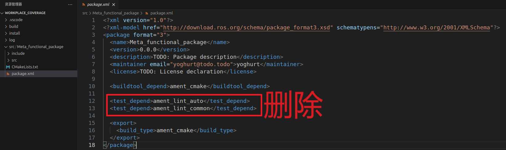

- 添加执行时所**依赖**的`ROS2功能包`

  > [!NOTE]
  >
  > - 可以 依赖自己写的功能包
  > - 也可以 依赖 apt 安装的 ROS 2 官方包

  ```xml
  <!-- 关键：只声明依赖 -->
  <exec_depend>robot_description</exec_depend>
  <exec_depend>robot_control</exec_depend>
  <exec_depend>robot_navigation</exec_depend>
  <exec_depend>robot_vision</exec_depend>
  ```

  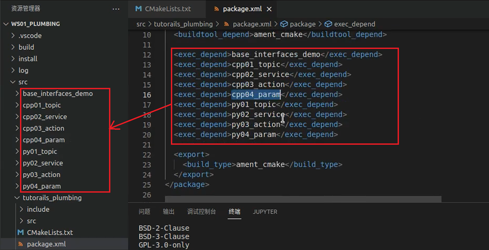


#### 删除include和src文件夹

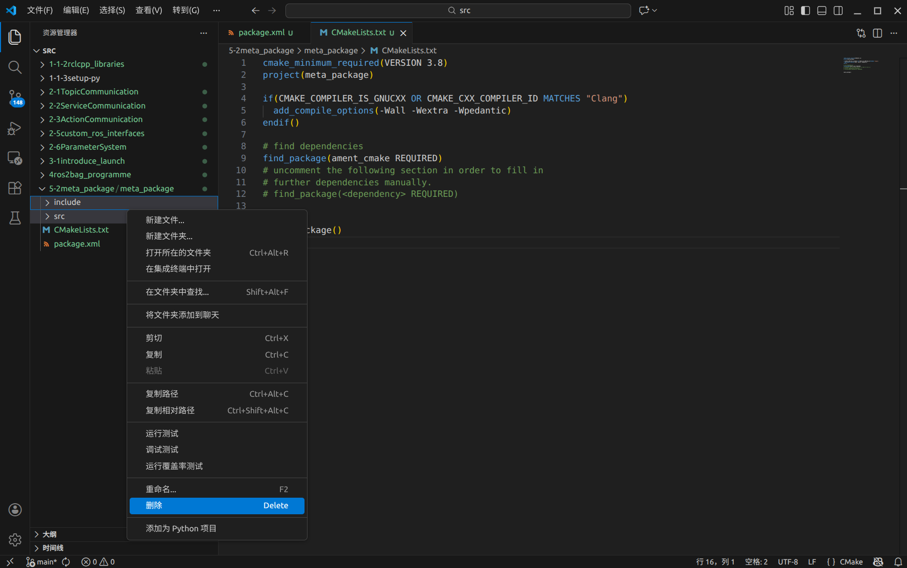


## 5.3 时间相关API

> ROS2 时间相关主要有 **Rate / Time / Duration**
>
> - **Rate**：控制循环频率
> - **Time**：某个具体时刻
> - **Duration**：一段时间长度

### 5.3.1 Rate（频率控制）

#### rclcpp 中的 Rate（C++）

> [!NOTE]
>
> 在C++中，在主线程直接调用 `rate.sleep()` 不会导致主程序 **阻塞**，因为 rclcpp 是“循环驱动模型”，

**作用**：按固定频率执行循环（常用于 while 循环）

**语法**：

```cpp
rclcpp::Rate rate(频率);      // 如：10 -> 10Hz
// 或
rclcpp::Rate rate(周期);      // 周期填写的是rclcpp::Duration类型的变量
```

**示例**：

```cpp
rclcpp::Rate rate(1);  // 1Hz
while (rclcpp::ok()) 
{
  RCLCPP_INFO(this->get_logger(), "Hello");
  rate.sleep();
}
```


#### rclpy 中的 Rate（Python）

> [!WARNING]
>
> 在Python中，在主线程直接调用 `rate.sleep()` 会导致主程序 **阻塞**，就会导致ROS2的excuter被阻塞。
>
> 因为 rclpy 是“事件驱动模型”。

- **方法 1：使用 `time.sleep()`**

  - `time.sleep()` 不阻塞 ROS2 内部调度

  - 但是这样就跟Rate没关系了，但是我还是会给出示例代码：

    ```python
    import rclpy
    from rclpy.node import Node
    import time
    
    class RateTimeDemo(Node):
        def __init__(self):
            super().__init__('rate_time_demo')
    
            while rclpy.ok():
                self.get_logger().info('执行中...')
                time.sleep(1.0)  #睡眠1秒
    ```

    

- **方法 2：创建子线程（推荐）**

  - 在子线程中使用 `rate.sleep()`

  - 避免阻塞 ROS2 主执行线程

  - **示例代码**：

    ```python
    import rclpy
    from rclpy.node import Node
    import threading
    
    class RateThreadDemo(Node):
        def __init__(self):
            super().__init__('rate_thread_demo')
    		
            # 创建一个子线程来运行loop函数
            self.thread = threading.Thread(target=self.loop)
            self.thread.daemon = True
            self.thread.start()
    
        def loop(self):
            rate = self.create_rate(1.0)  # 1Hz
            while rclpy.ok():
                self.get_logger().info('在子线程运行中...')
                rate.sleep()
    
    def main():
        rclpy.init()
        node = RateThreadDemo()
        rclpy.spin(node)
        rclpy.shutdown()
    ```

    

### 5.3.2 Time（时间点）

#### rclcpp 中的 Time（C++）

> [!NOTE]
>
> ROS2中的`Time`表示的是：从 **Unix 纪元（1970-01-01 00:00:00 UTC）**开始算起的某一个时刻。

- **创建 Time 对象**

  - **固定时间**

    ```c++
    rclcpp::Time t1(50L);              // 50ns
    rclcpp::Time t2(2, 50L);           // 2s + 50ns
    ```

  - **当前时间**

    ```c++
    // 这两行代码是一样的
    rclcpp::Time now = this->get_clock()->now();
    rclcpp::Time now = this->now();
    ```

- **Time 成员函数**

  - 转为 **秒（double）**

    ```c++
    Time类型对象.seconds();
    ```

  - 转为 **纳秒（int64）**

    ```c++
    Time类型对象.nanoseconds();
    ```

    

#### rclpy 中的 Time（Python）

- **创建 Time 对象**

  ```python
  from rclpy.time import Time
  
  t = Time(seconds=2, nanoseconds=50)	# 表示为2s + 50ns
  now = self.get_clock().now()
  ```

- **Time 成员函数**

  - **获取 `(秒, 纳秒)`**

    ```python
    t.seconds_nanoseconds()
    ```

  - **获取`秒`（浮点）**

    ```python
    t.seconds_nanoseconds()[0]
    ```

  - **获取 `纳秒`（整型）**

    ```python
    t.seconds_nanoseconds()[1]
    ```


### 5.3.3 Duration（时间段）

**Duration** 用于表示 **一段时间长度（时间间隔）**，而不是某个具体时刻。

在 ROS 2 中，Duration 是时间系统中的**基础类型之一**，主要用于：

- 描述**时间间隔**
- 进行 **Time 的加减运算**
- 控制 **周期、超时、延迟** 等时间相关逻辑

#### rclcpp 中的 Duration（C++）

- **创建 Duration 对象**

  - **chrono 方式（推荐）**

    ```c++
    using namespace std::chrono_literals;
    rclcpp::Duration d = 2s;
    ```

  - **秒 + 纳秒**

    ```c++
    rclcpp::Duration d(2, 500000000);
    ```

- **Duration 成员函数**

- 把Duration转换成`秒`为单位**(double类型)**

```cpp
d.seconds();
```

- 把Duration转换成`纳秒`为单位**(int64_t类型)**

```cpp
d.nanoseconds();
```


#### rclpy 中的 Duration（Python）

- **创建 Duration 对象**

  ```python
  from rclpy.duration import Duration
  d = Duration(seconds=2, nanoseconds=500000000)
  ```

- **Duration 成员函数**

  - 把Duration转换成`纳秒`为单位(int类型)

    ```python
    d.nanoseconds
    ```


### 5.3.4 Time 与 Duration 的区别

| 对象         | 含义         | 举例                  |
| ------------ | ------------ | --------------------- |
| **Time**     | 某个具体时刻 | 1970-01-01 起的时间点 |
| **Duration** | 时间长度     | 持续了多久            |

- **示例说明**

  ```c++
  rclcpp::Time t(2, 500000000L);	// 表示2.5秒
  ```

  - 表示：**1970-01-01 00:00:00 UTC 之后的 2.5 秒**
  - 即：**1970-01-01 00:00:02.500（UTC）**
  - 因为 **东八区(中国标准时间) = UTC + 8 小时**

  - 所以在**东八区**，这个**Time变量**表示为：**1970-01-01 08:00:02.500**

  ```c++
  rclcpp::Duration d(2, 500000000L);
  ```

  - 表示：**持续 2.5 秒**


### 5.3.5 Time 与 Duration 运算

#### rclcpp 中的运算规则（C++）

##### Time 对象

- **比较**

```cpp
t1 > t2
```

- **运算**

```cpp
Time = Time ± Duration
Duration = Time1 - Time2
```

❌ **禁止**

```cpp
Time + Time   // 虽然可行，但是逻辑无意义
```


##### Duration 对象

- **比较**

```cpp
d1 < d2
```

- **运算**

```cpp
d *= 2.5;
d = d1 + d2;
d = d1 - d2;
```


#### rclpy 中的运算（Python）

> [!WARNING]
>
> Duration 不支持算术运算

- **规则与 rclcpp 相同**


好，这一节我帮你**彻底整理成“结构清晰 + 可查可用”的标准笔记版**，命令分组、用途一句话说明，**非常适合期末复习 / 实验报告 / 查命令**。


## 5.4 通信机制工具

ROS 2 提供了一系列 **命令行工具（CLI）** 和 **图形化工具（rqt）**，用于查看、调试和管理节点及其通信关系。

### 5.4.1 ROS 2 常用命令行工具概览

| 命令             | 作用                           |
| ---------------- | ------------------------------ |
| `ros2 node`      | 节点管理与查看                 |
| `ros2 interface` | 接口（msg / srv / action）管理 |
| `ros2 topic`     | 话题通信调试                   |
| `ros2 service`   | 服务通信调试                   |
| `ros2 action`    | 动作通信调试                   |
| `ros2 param`     | 参数管理                       |


### 5.4.2 命令行工具详解

#### `ros2 node` —— 节点管理

- **列出当前运行的节点**

  ```bash
  ros2 node list
  ```

- **查看指定节点的信息**

  ```bash
  ros2 node info 节点名称
  ```

  **可查看**：

  - 发布/订阅的话题

  - 提供/使用的服务

  - 使用的 action

  - 参数信息


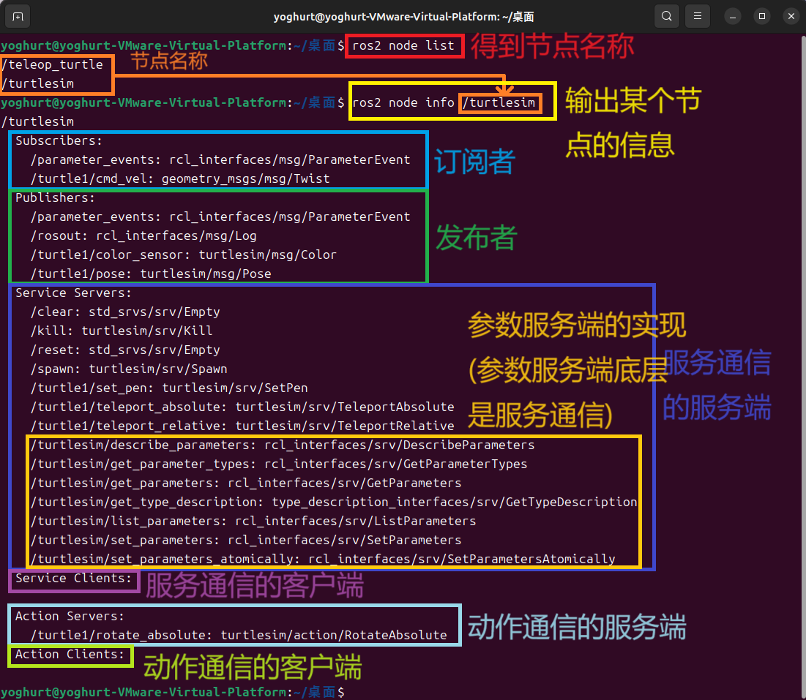


#### `ros2 interface` —— 接口管理

> 用于查看 **消息（msg）/ 服务（srv）/ 动作（action）** 的定义

- **列出所有接口类型**

  ```bash
  ros2 interface list
  ```

  

- **查看某功能包中的接口**

  ```bash
  ros2 interface package 功能包名
  ```

  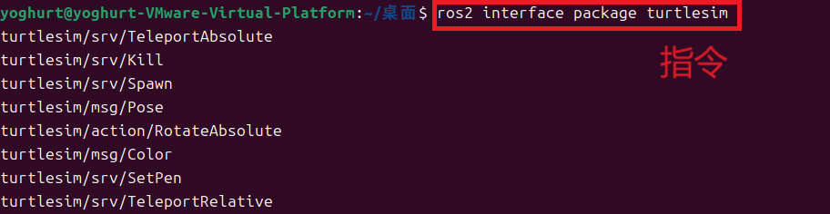

- **列出包含接口的功能包**

  ```bash
  ros2 interface packages
  ```

  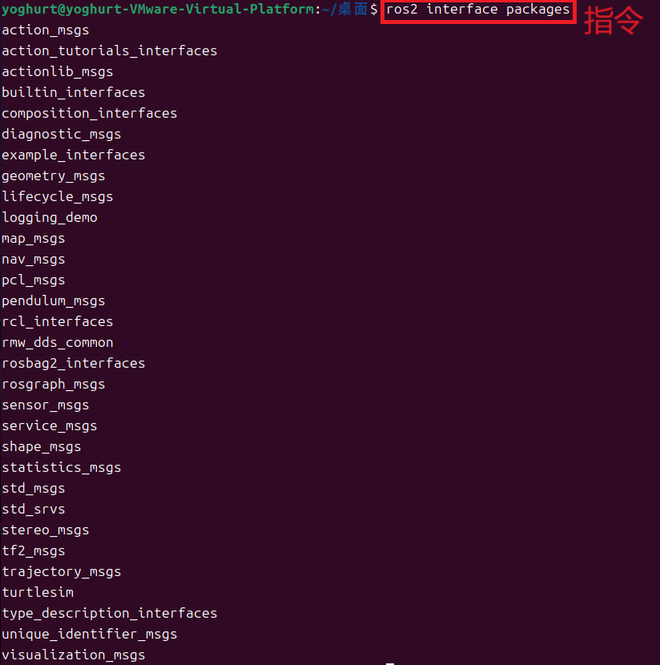

- **查看接口原型**

  ```bash
  ros2 interface proto 消息类型
  ```

- **查看接口定义格式**

  ```bash
  ros2 interface show 消息类型
  ```

  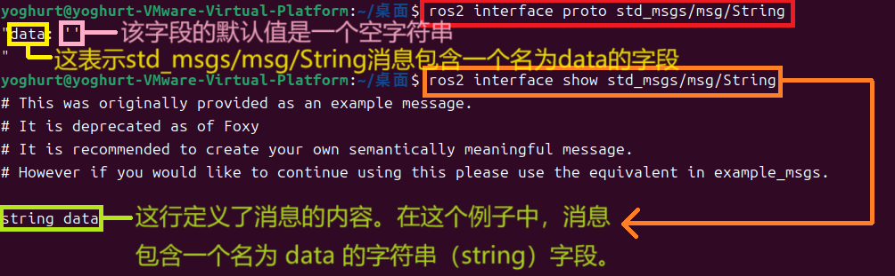


#### `ros2 topic` —— 话题通信工具（最常用）

- **列出当前话题**

  ```bash
  ros2 topic list
  ```

- **查看话题带宽**

  ```bash
  ros2 topic bw 话题名称
  ```

  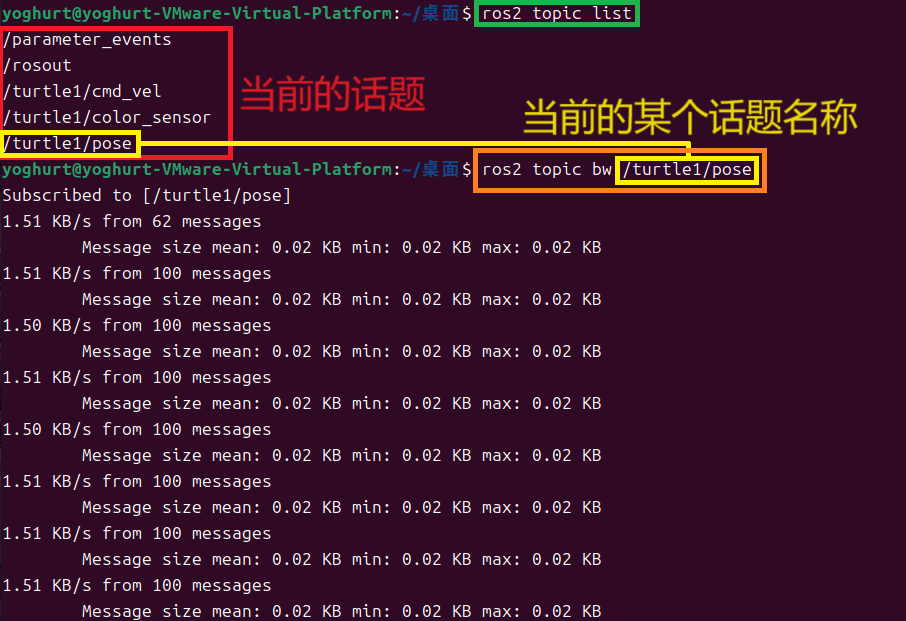

- **查看话题延迟（需包含 Header）**

  ```bash
  ros2 topic delay 话题名称
  ```

  - Header 判断方式：

    ```bash
    ros2 interface show 消息类型
    ```

    若包含 `std_msgs/Header`，则支持 delay 统计。

    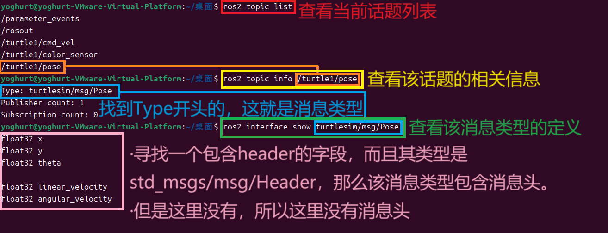

  

- **打印话题消息**

  ```bash
  ros2 topic echo 话题名称
  ```

  

- **查看话题类型**

  ```bash
  ros2 topic type 话题名称
  ```

  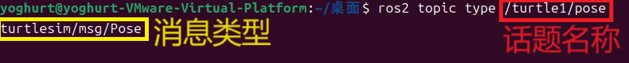

- **根据消息类型查找话题**

  ```bash
  ros2 topic find 消息类型
  ```

  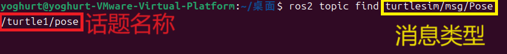

- **查看话题发布频率**

  ```bash
  ros2 topic hz 话题名称
  ```

  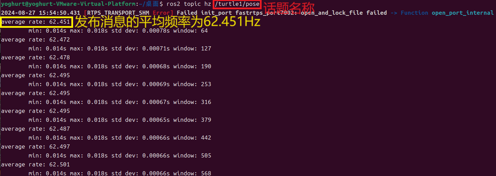

- **查看话题详细信息**

  ```bash
  ros2 topic info 话题名称
  ```

  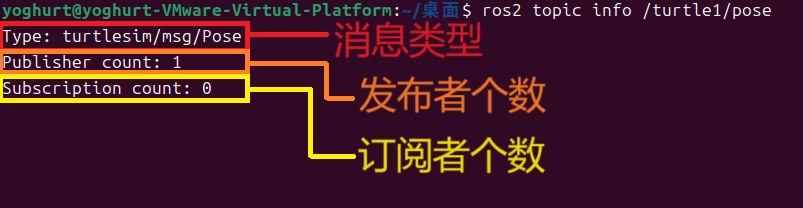

- **向话题发布消息**

  > [!WARNING]
  >
  > **具体数据的字段名**必须与**消息定义**完全一致
  
  ```bash
  ros2 topic pub -r 10 话题名称 消息类型 "具体数据"
  ```
  
  📌 示例（控制乌龟速度）：
  
  ```bash
  ros2 topic pub -r 1 /turtle1/cmd_vel geometry_msgs/msg/Twist \
  "{linear: {x: 2.0}, angular: {z: 1.0}}"
  ```
  
  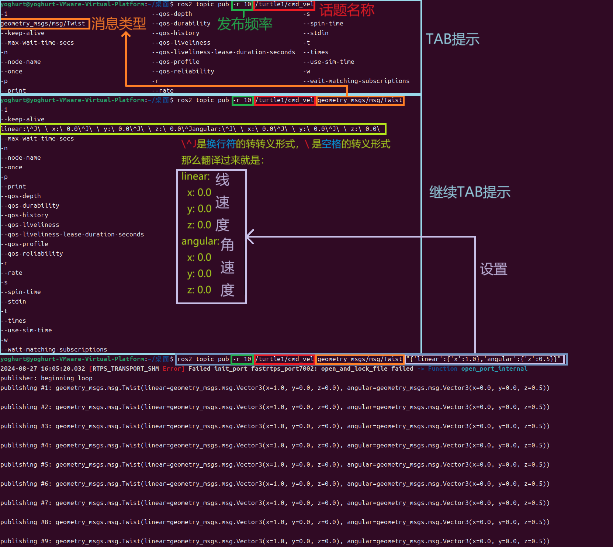


#### `ros2 service` —— 服务通信工具

- **列出服务**

  ```bash
  ros2 service list
  ```

  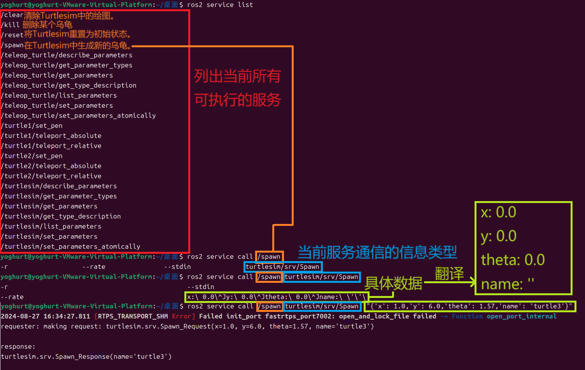

- **查看服务类型**

  ```bash
  ros2 service type 服务名称
  ```

- **根据接口类型查找服务**

  ```bash
  ros2 service find 接口类型
  ```

  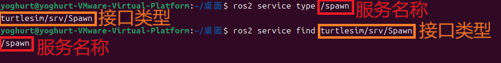

- **调用服务**

  ```bash
  ros2 service call 服务名称 接口类型 "请求数据"
  ```

  📌 示例（生成一只乌龟）：

  ```bash
  ros2 service call /spawn turtlesim/srv/Spawn \
  "{x: 2.0, y: 2.0, theta: 0.0, name: 'turtle2'}"
  ```

  

#### `ros2 action` —— 动作通信工具

- **列出运行中的动作**

  ```bash
  ros2 action list
  ```

  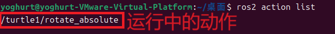

- **查看动作信息**

  ```bash
  ros2 action info 动作名称
  ```

  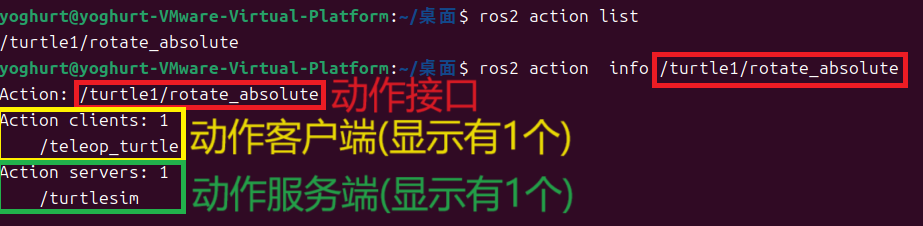

- **发送动作目标**

  ```bash
  ros2 action send_goal 动作名称 动作类型 "目标数据"
  ```

  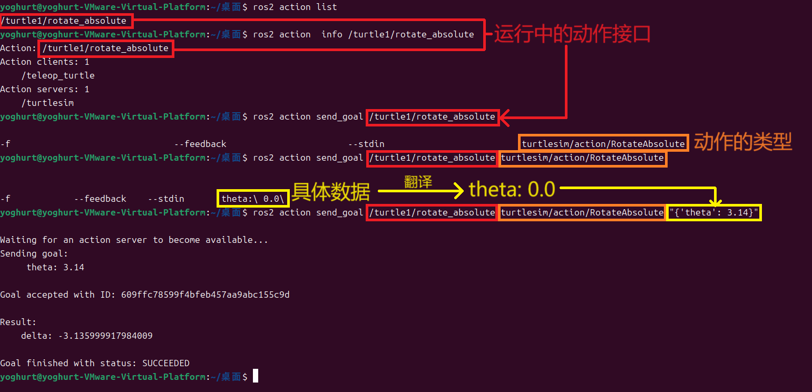


#### `ros2 param` —— 参数管理工具

- **列出参数**

  ```bash
  ros2 param list
  ```

  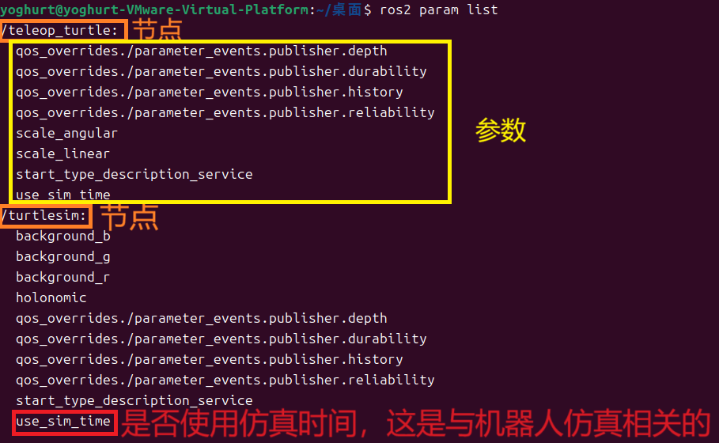

- **获取参数值**

  ```bash
  ros2 param get 节点名称 参数名
  ```

  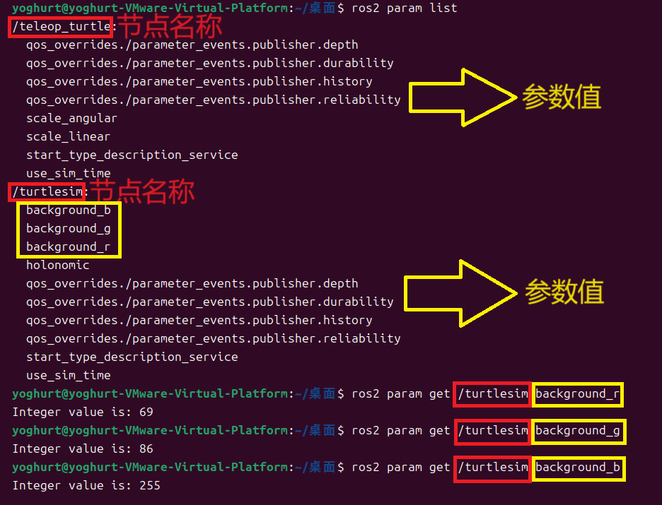

- **设置参数**

  ```bash
  ros2 param set 节点名称 参数名 参数值
  ```

- **删除参数（不一定成功）**

  ```bash
  ros2 param delete 节点名称 参数名
  ```

- **查看参数描述**

  ```bash
  ros2 param describe 节点名称 参数名
  ```

  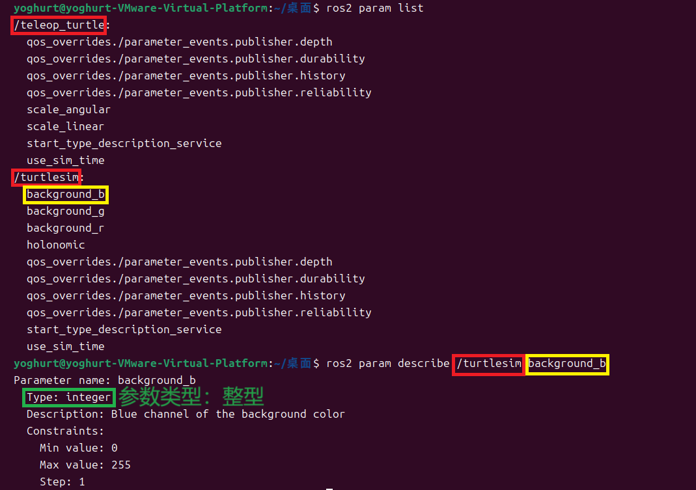

- **导出参数到文件**

  ```bash
  ros2 param dump 节点名称
  ```

  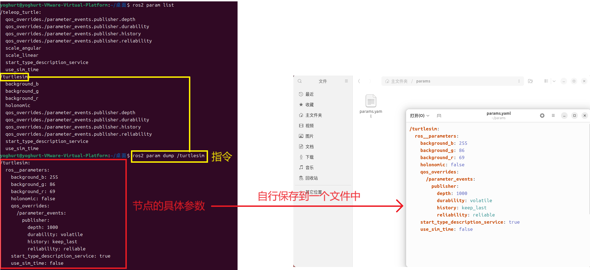

- **从文件加载参数**

  ```bash
  ros2 param load 节点名称 参数文件.yaml
  ```

  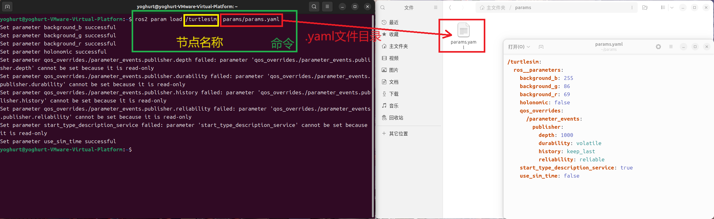


### 5.4.3 rqt 工具箱（图形化调试）

#### Topic 插件

📌 用途：

- 可视化查看话题
- 向话题发送消息

🧪 示例：

- 发送 `/turtle1/cmd_vel`
- 控制乌龟运动

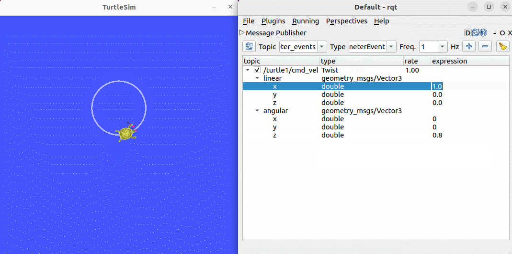


#### Service 插件

📌 用途：

- 可视化调用服务

🧪 示例：

- 调用 `/spawn`
- 在指定位置生成乌龟

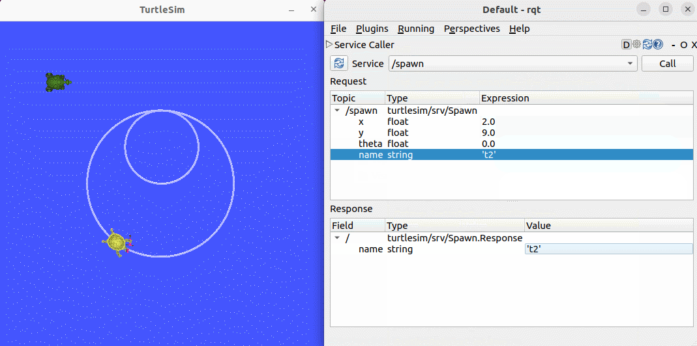


#### 参数插件

> [!IMPORTANT]
>
> 可以进行参数的动态修改

📌 用途：

- **动态修改**节点参数

🧪 示例：

- 修改 turtlesim 背景颜色
- **实时生效，无需重启节点**

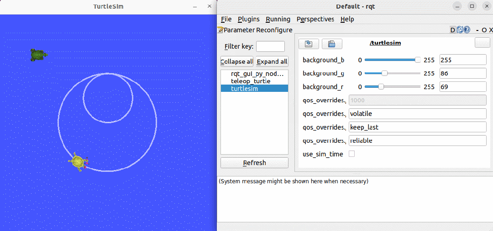


# 6 坐标变换

## 6.1 基础概念

> [!NOTE]
>
> ROS2 中的坐标转换系统以 **URDF 定义结构**，
> 以 **joint_states 描述状态**，
> 由 **robot_state_publisher 生成 tf**，
> 并通过 **tf2 框架统一管理与查询所有坐标关系**。

### 6.1.1 坐标系与坐标变换（基础抽象）

#### 坐标系（Frame）

- ROS 中一切空间信息都**必须依附于某个坐标系**

- 坐标系以字符串唯一标识（frame_id）

- 坐标系之间构成 **有向树结构**

  

**常见坐标系类型：**

- 世界/全局坐标系（`map`）
- 里程计坐标系（`odom`）
- 机器人本体坐标系（`base_link`）
- 传感器坐标系（`camera_link`、`lidar_link`）
- 末端执行器坐标系（`tool0` / `ee_link`）

#### 坐标变换（Transform）

- 描述 **两个坐标系之间的位姿关系**
- 包含：
  - 平移（translation）
  - 旋转（rotation，四元数）
- 具有**方向性**（parent → child）
- 具有**时间戳**

### 6.1.2 tf 坐标变换系统（运行时核心）

#### tf2 框架

- ROS2 中统一的坐标变换管理系统
- 功能：
  - 存储坐标系之间的时序变换
  - 查询任意两个坐标系在指定时刻的变换关系
- 本质：
  - 一棵 **带时间的坐标变换树**

#### 动态 tf 与静态 tf

- **动态 tf**
  - 随时间变化
  - 通常由关节运动或里程计产生
- **静态 tf**
  - 固定不变
  - 典型用于传感器安装关系

二者在 tf2 中统一管理，但**发布机制不同**

#### tf 相关通信角色

- Transform Broadcaster（发布者）
- Transform Listener（监听者）
- TF Buffer（缓存与查询）

👉 支撑 tf2 在分布式系统中的运行


### 6.1.3 机器人运动学描述（结构层）

#### URDF（Unified Robot Description Format）

- 用于描述机器人**运动学结构**
- 定义：
  - **link**（刚体）
  - **joint**（连接关系）
- 本质：
  - 一棵 **运动学树（Kinematic Tree）**
- 决定：
  - 系统中**存在哪些坐标系**
  - 坐标系的拓扑关系

📌 URDF **不包含时间、不包含状态**

#### Xacro

- URDF 的宏与参数化扩展
- 用于：
  - 复杂机器人结构复用
  - 参数配置
- 运行时会被展开为标准 URDF

### 6.1.4 关节状态与运动学计算（状态层）

#### Joint（关节）

- 描述 link 之间的运动约束
- 常见类型：
  - revolute
  - prismatic
  - fixed
- 决定：
  - link 之间如何相对运动

#### joint_states

- 描述机器人 **当前关节状态**
- 内容包括：
  - 关节名称
  - 位置（角度/位移）
  - 速度、力矩（可选）
- 是**机器人运动状态的唯一标准输入**


### 6.1.5 状态到坐标的映射（桥梁层）

#### robot_state_publisher

- 连接 **URDF 与 joint_states**
- **功能**：
  - 根据 URDF 的运动学模型
  - 使用当前 joint_states
  - 计算并发布各 link 之间的 tf

📌 是 **运动学模型 → 坐标变换** 的关键节点


#### joint_state_publisher

- 在无真实硬件时提供 joint_states
- 常用于：
  - 调试
  - 仿真
  - 教学演示
- 不参与坐标计算，仅提供关节数据源

